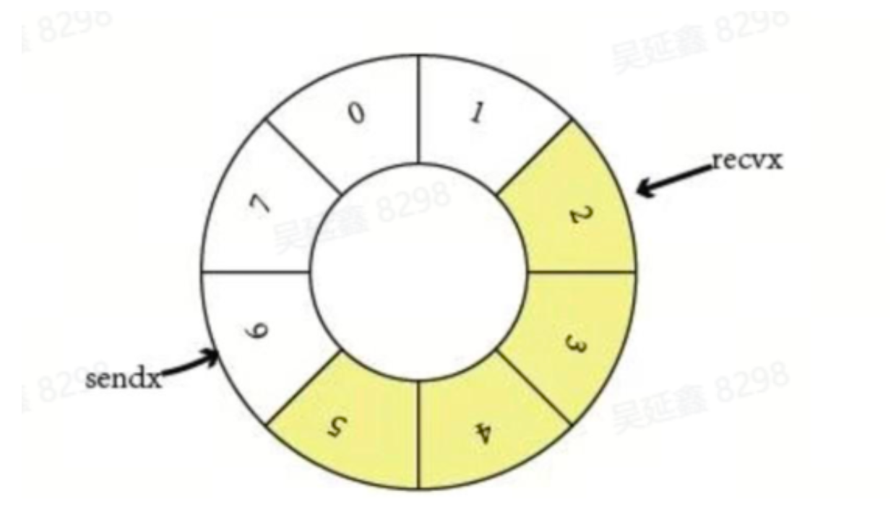
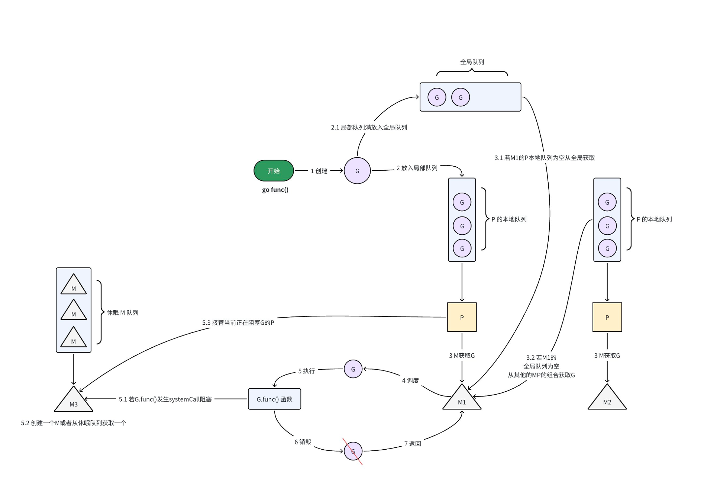
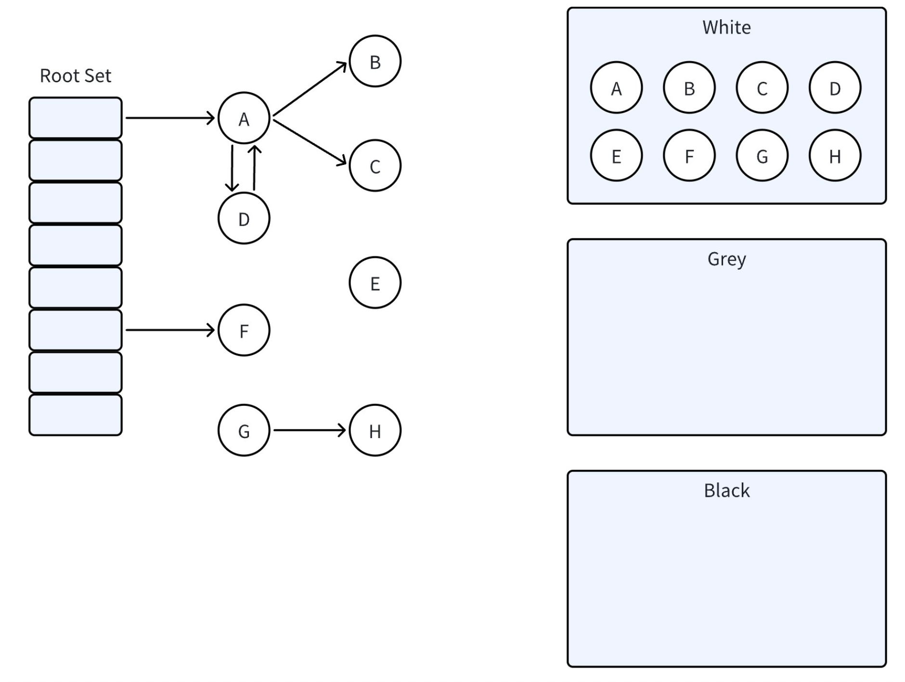
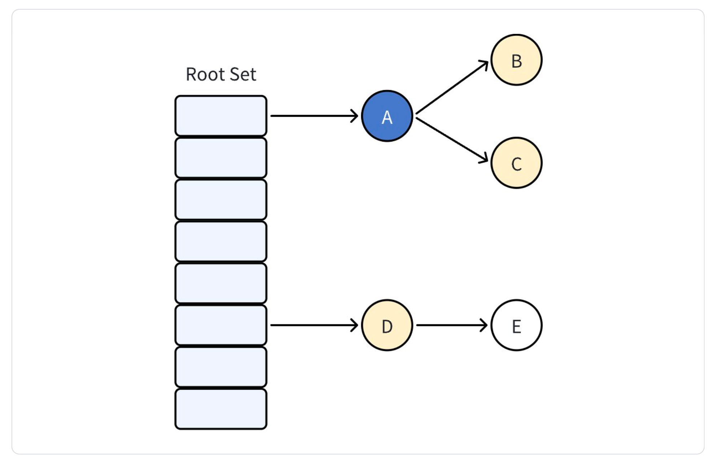
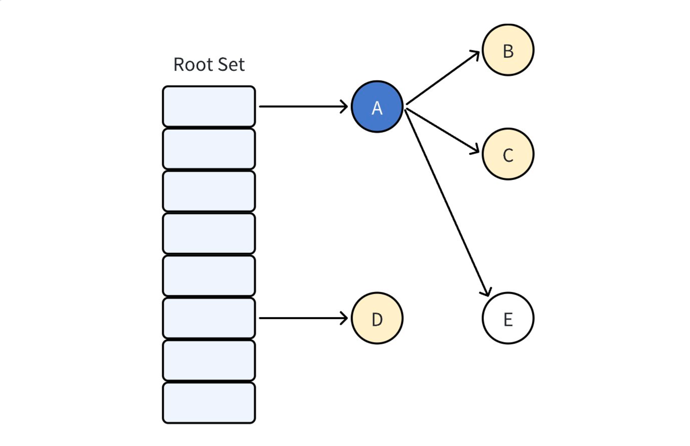
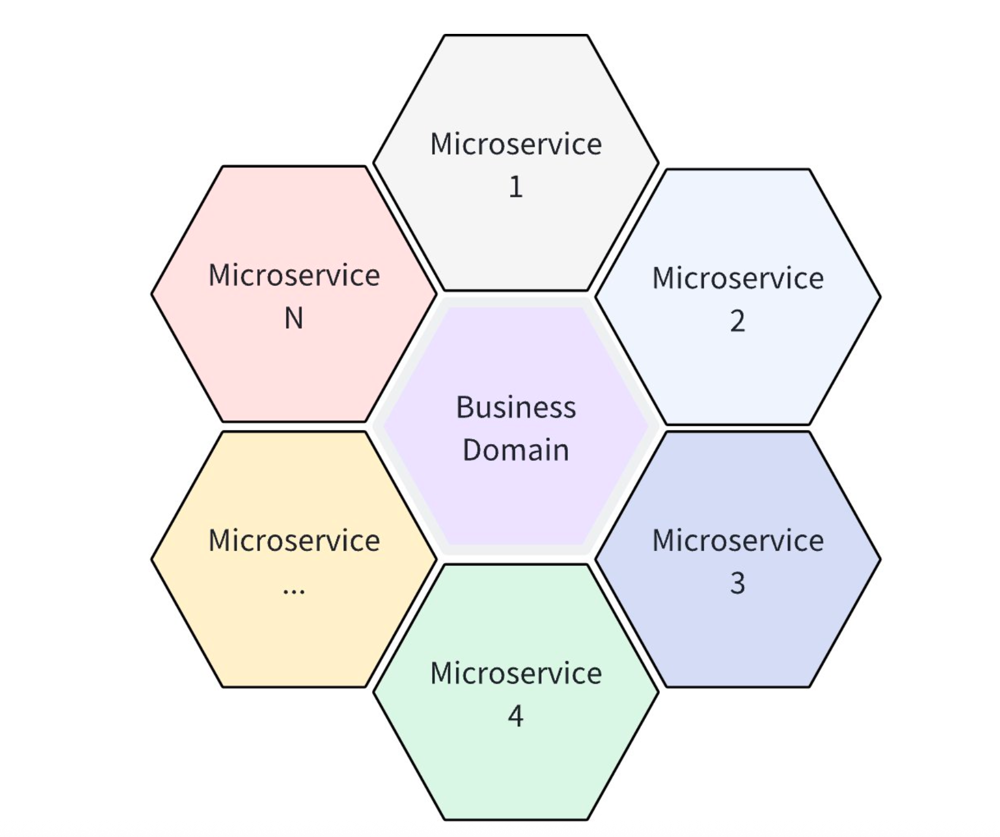
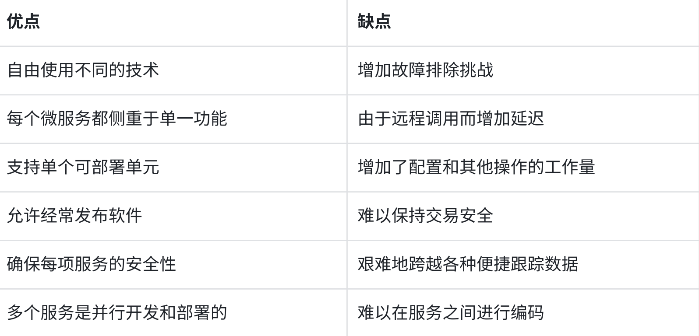
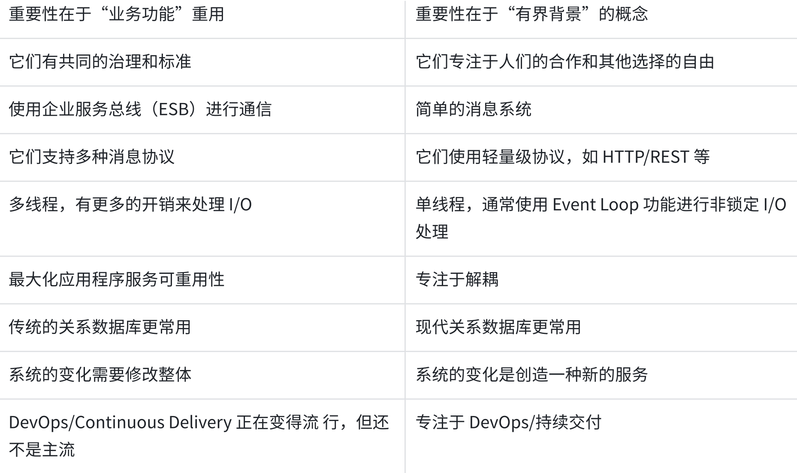

# 看这一篇就够-Go葵花宝典

看这一篇就够-Go葵花宝典

## 一、前言

```
本文意在对Golang面试题进行归纳总结，也欢迎读者进行评论或者留言分享面试题，希望读者看
后能够具备“吊打面试官”的能力。本文中点到为止的知识点望读者可以根据关键词自行查漏补
缺。
本文档会⻓期进行维护更新，建议读者收藏防止迷路。还有就是：知识是温故知新的，常回头看
看，定会有收获！
话不多说直入主题！！！
```
## 二、内容

## 基础篇

### 1. 与其他语言相比，使用Go有什么好处？

- 与其他作为学术实验开始的语言不同，Go代码的设计是务实的。每个功能和语法决策都旨在让程序员的生活更轻松。

- Golang针对并发进行了优化，并且在规模上运行良好。

### 2. Go程序中的包是什么？

包（pkg）是Go工作区中包含Go源文件或其他包的目录。源文件中的每个函数、变量和类型都存储在链接包中。每个Go源文件都属于一个包，该包在文件顶部使用以下命令声明：
```go
1 package <packagename>
```
您可以使用以下方法导入和导出包以重用导出的函数或类型：

```go
1 import <packagename>
```

Golang的标准包是fmt，其中包含格式化和打印功能，如Println()。

### 3. Go支持什么形式的类型转换？将整数转换为浮点数。

Go支持显式类型转换以满足其严格的类型要求。

```go
i := 55 //int
j := 67.8 //float
sum := i + int(j) //j is converted to int
```

### 4. 什么是Goroutine？你如何停止它？

一个Goroutine是一个函数或方法执行同时旁边其他任何够程采用了特殊的Goroutine线程，这里叫做协程。协程比标准线程更轻量级，大多数Golang程序同时使用数千个Goroutine。

要创建Goroutine，请go在函数声明之前添加关键字。

```go
1 go func(x, y, z)
```
您可以通过向Goroutine发送一个信号通道来停止它。Goroutines只能在被告知检查时响应信号，因此您需要在逻辑位置（例如for循环顶部）包含检查。

```go
package main
func main() {
    quit := make(chan bool)
    go func() {
        for {
            select {
                case <- quit: return
                default: // ...
            }
        }
    }()
    // ...
    quit <- true
}
```

### 5. 如何在运行时检查变量类型？

类型开关（Type Switch）是在运行时检查变量类型的最佳方式。类型开关按类型而不是值来评估变量。每个Switch至少包含一个case用作条件语句，如果没有一个case为真，则执行default。


### 6. Go两个接口之间可以存在什么关系？

- 如果两个接口有相同的方法列表，那么他们就是等价的，可以相互赋值。

- 如果接口A的方法列表是接口B的方法列表的子集，那么接口B可以赋值给接口A。接口查询是否成功，要在运行期才能够确定。

### 7. Go当中同步锁有什么特点？作用是什么

当一个Goroutine（协程）获得了Mutex后，其他Goroutine（协程）就只能乖乖的等待，除非该Goroutine释放了该Mutex。RWMutex在读锁占用的情况下，会阻止写，但不阻止读RWMutex。在写锁占用情况下，会阻止任何其他Goroutine（无论读和写）进来，整个锁相当于由该Goroutine独占同步锁的作用是保证资源在使用时的独有性，不会因为并发而导致数据错乱，保证系统的稳定性。

### 8. Go语言当中Channel（通道）有什么特点，需要注意什么？

如果给一个nil的channel发送数据，会造成永远阻塞。

如果从一个nil的channel中接收数据，也会造成永久阻塞。

给一个已经关闭的channel发送数据，会引起panic。

从一个已经关闭的channel接收数据，如果缓冲区中为空，则返回一个零值。

### 9. Go语言当中Channel缓冲有什么特点？

无缓冲的channel是同步的，而有缓冲的channel是非同步的。

### 10. Go语言中cap函数可以作用于哪些内容？

可以作用于的类型有：

- array（数组）

- slice（切片）

- channel（通道）

### 11. Go Convey是什么？一般用来做什么？

- goconvey是一个支持Golang的单元测试框架。

- goconvey能够自动监控文件修改并启动测试，并可以将测试结果实时输出到 Web界面。

- goconvey提供了丰富的断言简化测试用例的编写。

### 12. Go语言当中new的作用是什么？

new创建一个该类型的实例，并且返回指向该实例**的指针**。

new函数是内建函数，函数定义：


```go
1 func new(Type) *Type
```
- 使用new函数来分配空间。

- 传递给new函数的是一个类型，而不是一个值。

- 返回值是指向这个新分配的地址的指针。

### 13. Go语言中make的作用是什么？

make的作用是为：slice、map、chan的初始化然后返回引用。

make函数是内建函数，函数定义：

```go
1 func make(Type, size IntegerType) Type
```
make（T，args）函数的目的和new（T）不同，仅仅用于创建slice、map、channel而且返回类型是实例。

### 14. golang中make和new的区别？

共同点：

- 给变量分配内存。

不同点：

- 作用变量类型不同，new给string，int和数组分配内存，make给切片，map，c hannel分配内存；

- 返回类型不一样，new返回指向变量的指针，make返回变量本身；

- new分配的空间被清零。make分配空间后，会进行初始化；

- 分配的位置，在堆上还是在栈上？Go语言会在两个地方给变量分配内存，虽然 Go也是可以通过new来给变量分配内存，但是分配的这块内存，可能在堆上，也可能在栈上。从性能的⻆度出发，在栈上分配内存和在堆上分配内存，性能差异是非常大的。因此一个变量是在堆上分配内存，还是在栈上分配内存，是需要编译器经过逃逸分析才能得出结论。make需要对对象进行初始化所以是在堆上。

### 15. Printf()，Sprintf()，FprintF()都是格式化输出，有什么不同？

虽然这三个函数，都是格式化输出，但是输出的目标不一样。

- Printf()是标准输出，一般是屏幕，也可以重定向。

- Sprintf()是把格式化字符串输出到指定的字符串中。

- Fprintf()是把格式化字符串输出到文件中。


### 16. Go语言当中数组和切片的区别是什么？

- 数组：

    数组固定⻓度。数组⻓度是数组类型的一部分，所以[3]int和[4]int是两种不同的数组类型数组需要指定大小，不指定也会根据初始化，自动推算出大小，大小不可改变。数组是通过值传递的。

- 切片：

    切片可以改变⻓度。切片是轻量级的数据结构，三个属性，指针，⻓度，容量，不需要指定大小切片是地址传递（引用传递）可以通过数组来初始化，也可以通过内置函数make（）来初始化，初始化的时候len=cap，然后进行扩容。

### 17. Go语言当中值传递和地址传递（引用传递）如何运用？有什么区别？举例说明

- 值传递只会把参数的值复制一份放进对应的函数，两个变量的地址不同，不可相互修改。

- 地址传递（引用传递）会将变量本身传入对应的函数，在函数中可以对该变量进行值内容的修改。

### 18. Go语言当中数组和切片在传递的时候的区别是什么？

- 数组是值传递。

- 切片看上去像是引用传递，但其实是值传递。

### 19. Go语言是如何实现切片扩容的？

```go
func main() {
    arr := make([]int, 0 )
    for i := 0 ; i < 2000 ; i++ {
        fmt.Println("len 为", len(arr), "cap 为", cap(arr))
        arr = append(arr, i)
    }
}
// 我们可以看下结果
依次是 0 , 1 , 2 , 4 , 8 , 16 , 32 , 64 , 128 , 256 , 512 , 1024
但到了 1024 之后，就变成了 1024 , 1280 , 1696 , 2304 每次都是扩容了四分之一左右。
```

### 20. defer的执行顺序是什么？defer的作用和特点是什么？

defer的作用是：

你只需要在调用普通函数或方法前加上关键字defer，就完成了defer所需要的语法。当defer语
句被执行时，跟在defer后面的函数会被延迟执行。直到包含该defer语句的函数执行完毕时，


defer后的函数才会被执行，不论包含defer语句的函数是通过return正常结束，还是由于panic
导致的异常结束。你可以在一个函数中执行多条defer语句，它们的执行顺序与声明顺序相反。

defer的常用场景：

- defer语句经常被用于处理成对的操作，如打开、关闭、连接、断开连接、加锁、释放锁。

- 通过defer机制，不论函数逻辑多复杂，都能保证在任何执行路径下，资源被释放。

- 释放资源的defer应该直接跟在请求资源的语句后。

### 21. Go的defer底层数据结构？

每个defer语句都对应一个_defer实例，多个实例使用指针连接起来形成一个单链表，保存在gotoutine数据结构中，每次插入_defer实例，均插入到链表的头部，函数结束再一次从头部取出，从而形成后进先出的效果。

### 22. Golang Slice的底层实现？

切片是基于数组实现的，它的底层是数组，它自己本身非常小，可以理解为对底层数组的抽象。因为基于数组实现，所以它的底层的内存是连续分配的，效率非常高，还可以通过索引获得数据。切片本身并不是动态数组或者数组指针。它内部实现的数据结构通过指针引用底层数组，设定相关属性将数据读写操作限定在指定的区域内。切片本身是一个只读对象，其工作机制类似数组指针的一种封装。

切片对象非常小，是因为它是只有3个字段的数据结构：

- 指向底层数组的指针
- 切片的⻓度
- 切片的容量

### 23. Golang Slice的扩容机制，有什么注意点？

Go中切片扩容的策略是这样的：

- 首先判断，如果新申请容量大于2倍的旧容量，最终容量就是新申请的容量。

- 否则判断，如果旧切片的⻓度小于1024，则最终容量就是旧容量的两倍。

- 否则判断，如果旧切片⻓度大于等于1024，则最终容量从旧容量开始循环增加原来的1/4，直到最终容量大于等于新申请的容量。

- 如果最终容量计算值溢出，则最终容量就是新申请容量。

### 24. 扩容前后的Slice是否相同？

情况一：

原数组还有容量可以扩容（实际容量没有填充完），这种情况下，扩容以后的数组还是指向原来的数组，对一个切片的操作可能影响多个指针指向相同地址的Slice。


情况二：

原来数组的容量已经达到了最大值，再想扩容，Go默认会先开一片内存区域，把原来的值拷⻉过来，然后再执行append()操作。这种情况丝毫不影响原数组。要复制一个Slice，最好使用Copy函数。

### 25. Golang的参数传递、引用类型

Go语言中所有的传参都是值传递（传值），都是一个副本，一个拷⻉。因为拷⻉的内容有时候是非引用类型（int、string、struct等这些），这样就在函数中就无法修改原内容数据；有的是引用类型（指针、map、slice、chan等这些），这样就可以修改原内容数据。

### 26. GolangMap底层实现

Golang中map的底层实现是一个散列表，因此实现map的过程实际上就是实现散表的过程。在这个散列表中，主要出现的结构体有两个，一个叫hmap（aheaderforagomap），一个叫bmap（abucketforaGomap，通常叫其bucket）。

用链表来解决冲突，出现冲突时，不是每一个key都申请一个结构通过链表串起来，而是以bmap为最小粒度挂载，一个bmap可以放8个kv。

在哈希函数的选择上，会在程序启动时，检测cpu是否支持aes，如果支持，则使用aeshash，否则使用memhash。每个map的底层结构是hmap，是有若干个结构为bmap的 bucket组成的数组。每个bucket底层都采用链表结构。

```go
type hmap struct {
    count int // 元素个数
    flags uint
    B uint8 // 扩容常量相关字段B是buckets数组的⻓度的对数 2^B
    noverflow uint16 // 溢出的bucket个数
    hash0 uint32 // hash seed
    buckets unsafe.Pointer // buckets 数组指针
    oldbuckets unsafe.Pointer // 结构扩容的时候用于赋值的buckets数组
    nevacuate uintptr // 搬迁进度
    extra *mapextra // 用于扩容的指针
}
```
### 27. GolangMap如何扩容

a. 双倍扩容：扩容采取了一种称为“渐进式”的方式，原有的key并不会一次性搬迁完毕，每次最多只会搬迁2个bucket。

b. 等量扩容：重新排列，极端情况下，重新排列也解决不了，map存储就会蜕变成链表，性能大大降低，此时哈希因子hash0的设置，可以降低此类极端场景的发生。

c. 装载因子超过阈值，源码里定义的阈值是6.5。

d. overflow的bucket数量过多map的bucket定位和key的定位高八位用于定位bucket，低八位用于定位key，快速试错后再进行完整对比

### 28. Golang Map查找

Go语言中map采用的是哈希查找表，由一个key通过哈希函数得到哈希值， 6 4位系统中就生成一个64bit的哈希值，由这个哈希值将key对应存到不同的桶（bucket）中，当有多个哈希映射到相同的的桶中时，使用链表解决哈希冲突。

细节：key经过hash后共64位，根据hmap中B的值，计算它到底要落在哪个桶时，桶的数量为2^B，如B=5，那么用64位最后5位表示第几号桶，在用hash值的高 8位确定在bucket中的存储位置，当前bmap中的bucket未找到，则查询对应的overflowbucket，对应位置有数据则对比完整的哈希值，确定是否是要查找的数据。如果当前map处于数据搬移状态，则优先从oldbuckets查找。

### 29. Go的原生map中删除元素，内存会自动释放吗？

- 如果删除的元素是值类型，如int，float，bool，string以及数组和struct，map的内存不会自动释放；

- 如果删除的元素是引用类型，如指针，slice，map，chan等，map的内存会自动释放，但释放的内存是子元素应用类型的内存占用；

- 将map设置为nil后，内存被回收；

### 30. slices能作为map类型的key吗？

在golang规范中，**可比较**的类型都可以作为map key。

不能作为mapkey的类型包括：

- slices

- maps

- functions

### 31. 介绍一下Channel

Go语言中，不通过共享内存来通信，而通过通信来实现内存共享。Go的CSP（Communicating Sequential Process）并发模型，中文可以叫做通信顺序进程，是通过goroutine和channel来实现的。

channel收发遵循先进先出FIFO的原则。分为有缓冲区和无缓冲区，channel中包括buffer、sendx和recvx收发的位置（ringbuffer记录实现）、sendq、recv。当channel因为缓冲区不足而阻塞了队列，则使用双向链表存储。

### 32. Channel是线程安全的吗？

channel是线程安全的，原因是channel内部实现了锁的机制。

### 33. Channel的ring buffer实现

channel中使用了ring buffer（环形缓冲区）来缓存写入的数据。ring buffer有很多好处，而且非常适合用来实现FIFO式的固定⻓度队列。在channel中，ring buffer的实现如下：



上图展示的是一个缓冲区为8的 channel buffer，recvx指向最早被读取的数据，sendx指向再次写入时插入的位置。

### 34. 当Channel通道被close后，读会带来什么问题？

读取没问题，但是写入就会有问题。

``` go
package main

import ("fmt")

func main() {
    ch := make(chan int, 2)// 向通道发送数据
    ch <- 1 ch <- 2 // 关闭通道
    close(ch)// 安全地从通道读取数据
    val, ok := <-chfmt.Println(val, ok) // 输出: 1 true
    val, ok = <-chfmt.Println(val, ok) // 输出: 2 true
    // 当通道中没有数据时，从已关闭的通道读取
    val, ok = <-chfmt.Println(val, ok) // 输出: 0 false
    // 再次尝试向已关闭的通道发送数据将导致 panic
    defer func() {
        if r := recover(); r != nil {
        fmt.Println("Recovered from panic:", r)
        }
    }()
    ch <- 3 // 这将引发 panic
}
```
### 35. for range的时候它的地址会发生变化么？

在for a,b:=rangec{} 遍历中，a和b在内存中只会存在一份，即之后每次循环时遍历到的数据都是以值覆盖的方式赋给a和b，a，b的内存地址始终不变。由于有这个特性，for循环里面如果开协程，不要直接把a或者b的地址传给协程。解决办法：在每次循环时，创建一个临时变量。

### 36. golang中解析 tag 是怎么实现的？反射原理是什么？

Go中解析的tag是通过反射实现的，反射是指计算机程序在运行时（Runtime）可以访问、检测和修改它本身状态或行为的一种能力或动态知道给定数据对象的类型和结构，并有机会修改它。反射将接口变量转换成反射对象Type和Value；反射可以通过反射对象Value还原成原先的接口变量；反射可以用来修改一个变量的值，前提是这个值可以被修改；tag是啥：结构体支持标记，namestringjson:name-field就是json:name-field这部分

gorm json yaml gRPCprotobuf gin.Bind()都是通过反射来实现的。

```go
type User struct {
    name string `json:name-field`
    age int
}
func main() {
    user := &User{"John Doe The Fourth", 20 }

    field, ok := reflect.TypeOf(user).Elem().FieldByName("name")

    if !ok {
        panic("Field not found")
    }
    fmt.Println(getStructTag(field))
}
func getStructTag(f reflect.StructField) string {
    return string(f.Tag)
}
```
### 37. 调用函数传入结构体时，应该传值还是指针？

Go的函数参数传递都是值传递。所谓值传递：指在调用函数时将实际参数复制一份传递到函数中，这样在函数中如果对参数进行修改，将不会影响到实际参数。参数传递还有引用传递，所谓引用传递是指在调用函数时将实际参数的地址传递到函数中，那么在函数中对参数所进行的修改，将影响到实际参数


因为Go里面的map，slice，chan是引用类型。变量区分值类型和引用类型。所谓值类型：变量和变量的值存在同一个位置。所谓引用类型：变量和变量的值是不同的位置，变量的值存储的是对值的引用。但并不是map，slice，chan的所有的变量在函数内都能被修改，不同数据类型的底层存储结构和实现可能不太一样，情况也就不一样。

### 38. 讲讲Go的 select 底层数据结构和一些特性？

go的select为golang提供了多路IO复用机制，和其他IO复用一样，用于检测是否有读写事件是否ready。linux的系统IO模型有select，poll，epoll，go的select和linux系统select非常相似。

select结构组成主要是由case语句和执行的函数组成，select实现的多路复用是：每个线程或者进程都先到注册和接受的channel（装置）注册，然后阻塞，然后只有一个线程在运输，当注册的线程和进程准备好数据后，装置会根据注册的信息得到相应的数据。

select的特性：

- select操作至少要有一个case语句，出现读写nil的channel该分支会忽略，在nil的channel上操作则会报错。
- select仅支持管道，而且是单协程操作。
- 每个case语句仅能处理一个管道，要么读要么写。
- 多个case语句的执行顺序是随机的。
- 存在default语句，select将不会阻塞，但是存在default会影响性能。

### 39. 能介绍下rune类型吗？

相当int32

golang中的字符串底层实现是通过byte数组的，中文字符在unicode下占 2 个字节，在utf-8编码下占 3 个字节，而golang默认编码正好是utf-8。

byte等同于int8，常用来处理ascii字符。

rune等同于int32，常用来处理unicode或utf-8字符。

### 40. context结构是什么样的？context使用场景和用途？

Context通常被称为上下文，在go中，理解为goroutine的运行状态、现场，存在上下层goroutine
context的传递，上层goroutine会把context传递给下层goroutine。

Go的Context的数据结构包含Deadline，Done，Err，Value，Deadline方法返回一个time.Time，表示当前Context应该结束的时间，ok则表示有结束时间，Done方法当Context被取消或者超时时候返回的一个close的channel，告诉给context相关的函数要停止当前工作然后返回了，Err表示context被取消的原因，Value方法表示context实现共享数据存储的地方，是协程安全的。

主要应用场景：


- 上下文控制；

- 多个goroutine之间的数据交互等；

- 超时控制：到某个时间点超时，过多久超时。


### 41. Go多返回值怎么实现的？

Go传参和返回值是通过FP+offset实现，并且存储在调用函数的栈帧中。FP栈底寄存器，指向一个函数栈的顶部；PC程序计数器，指向下一条执行指令；SB指向静态数据的基指针，全局符号；SP栈顶寄存器。

### 42. Go语言中不同的类型如何比较是否相等？

像string，int，float interface等可以通过reflect.DeepEqual和等于号进行比较，像slice,struct，map则一般使用reflect.DeepEqual来检测是否相等。

### 43. Go中init函数的特征?

一个包下可以有多个init函数，每个文件也可以有多个init函数。多个init函数按照它们的文件名顺序逐个初始化。应用初始化时初始化工作的顺序是，从被导入的最深层包开始进行初始化，层层递出最后到main包。不管包被导入多少次，包内的init函数只会执行一次。但包级别变量的初始化先于包内init函数的执行。

### 44. Go中uintptr和unsafe.Pointer的区别？

unsafe.Pointer是通用指针类型，它不能参与计算，任何类型的指针都可以转化成unsafe.Pointer，unsafe.Pointer可以转化成任何类型的指针，uintptr可以转换为unsafe.Pointer，unsafe.Pointer可以转换为uintptr。uintptr是指针运算的工具，但是它不能持有指针对象（意思就是它跟指针对象不能互相转换），unsafe.Pointer是指针对象进行运算（也就是uintptr）的桥梁。

### 45. 深拷⻉和浅拷⻉

拷⻉最简单的一种形式如下：

```go
a := 648
b := a //把a 拷⻉给 b
```

深浅拷⻉也和类型有关


两种类型拷⻉效果不同，先说我们比较熟悉的值类型。如什么是拷⻉提问里易知，若是值类型的话，在每一次拷⻉后都会新申请一块空间存储值，拷⻉后的两个值类型独立不影响。

以引用类型的切片(Slice)为例来讲讲深拷⻉和浅拷⻉：


### 46. 如果for range同时添加数据，for range会无限执行吗？

不会，在执行for range的时候实际遍历的是变量的副本，所以改变遍历的变量是不会有影响的。

### 47. 单引号，双引号，反引号的区别？

- 单引号，表示byte类型或rune类型，对应uint8和int32类型，默认是rune类型。byte用来强调数据是rawdata，而不是数字；而rune用来表示Unicode的codepoint。

- 双引号，是字符串，实际上是字符数组。可以用索引号访问某字节，也可以用len()函数来获取字符串所占的字节⻓度。

- 反引号，表示字符串字面量，但不支持任何转义序列。字面量rawliteralstring的意思是，你定义时写的啥样，它就啥样，你有换行，它就换行。你写转义字符，它也就展示转义字符。

### 48. 什么是数据溢出？

在使用数字类型时如果数据达到最大值，则接下来的数据将会溢出，如uint溢出后会从0开始，int溢出后会变为负数。

```go 
package main

import (
    "fmt"
    "math"
)

func main() {
    var n int8 = math.MaxInt
    var m uint8 = math.MaxUint8

    n += 2
    m += 1

    fmt.Println(n)
    fmt.Println(m)
}
```

如何避免？

- 正数优先使用uint,范围更大

- 添加判断代码判断是否溢出

## 并发篇

### 1. Mutex几种状态

- mutexLocked—表示互斥锁的锁定状态；

- mutexWoken—表示从正常模式被从唤醒；

- mutexStarving—当前的互斥锁进入饥饿状态；

- waitersCount—当前互斥锁上等待的Goroutine个数；

### 2. Mutex正常模式和饥饿模式

- 正常模式（非公平锁）

    正常模式下，所有等待锁的goroutine按照FIFO（先进先出）顺序等待。唤醒的goroutine不会直接拥有锁，而是会和新请求goroutine竞争锁。新请求的goroutine更容易抢占：因为它正在CPU上执行，所以刚刚唤醒的goroutine有很大可能在锁竞争中失败。在这种情况下，这个被唤醒的goroutine会加入到等待队列的前面。

- 饥饿模式（公平锁）

    为了解决了等待goroutine队列的⻓尾问题，在饥饿模式下，直接由unlock把锁交给等待队列中排在第一位的goroutine（队头），同时，饥饿模式下，新进来的goroutine不会参与抢锁也不会进入自旋状态，会直接进入等待队列的尾部。这样很好的解决了老的goroutine一直抢不到锁的场景。

    饥饿模式的触发条件：当一个goroutine等待锁时间超过1毫秒时，或者当前队列只剩下一个goroutine的时候，Mutex切换到饥饿模式。

对于两种模式，正常模式下的性能是最好的，goroutine可以连续多次获取锁，饥饿模式解决了取锁公平的问题，但是性能会下降，这其实是性能和公平的一个平衡模式。

### 3. Mutex允许自旋的条件

- 锁已被占用，并且锁不处于饥饿模式。

- 积累的自旋次数小于最大自旋次数（active_spin=4）。

- CPU核数大于1。

- 有空闲的P。

- 当前Goroutine所挂载的P下，本地待运行队列为空。

PS：这里补充一下GMP模型。

### 4. RWMutex实现

通过记录readerCount读锁的数量来进行控制，当有一个写锁的时候，会将读锁数量设置为负数1<<30。目的是让新进入的读锁等待之前的写锁释放通知读锁。同样的当有写锁进行抢占时，也会等待之前的读锁都释放完毕，才会开始进行后续的操作。而等写锁释放完之后，会将值重新加上1<<30，并通知刚才新进入的读锁（rw.readerSem），两者互相限制。

### 5. RWMutex注意事项

- RWMutex是单写多读锁，该锁可以加多个读锁或者一个写锁。

- 读锁占用的情况下会阻止写，不会阻止读，多个Goroutine可以同时获取读锁。

- 写锁会阻止其他Goroutine（无论读和写）进来，整个锁由该Goroutine独占。

- 适用于**读多写少**的场景。

- RWMutex类型变量的零值是一个未锁定状态的互斥锁。

- RWMutex在首次被使用之后就不能再被拷⻉。

- RWMutex的读锁或写锁在未锁定状态，解锁操作都会引发panic。

- RWMutex的一个写锁去锁定临界区的共享资源，如果临界区的共享资源已被（读锁或写锁）锁定，这个写锁操作的goroutine将被阻塞直到解锁。

- RWMutex的读锁不要用于递归调用，比较容易产生死锁。

- RWMutex的锁定状态与特定的goroutine没有关联。一个goroutine可以 RLock（Lock），另一个goroutine可以RUnlock（Unlock）。

- 写锁被解锁后，所有因操作锁定读锁而被阻塞的goroutine会被唤醒，并都可以成功锁定读锁。

- 读锁被解锁后，在没有被其他读锁锁定的前提下，所有因操作锁定写锁而被阻塞的Goroutine，其中等待时间最⻓的一个Goroutine会被唤醒。


### 6. Cond是什么

Cond实现了一种条件变量，可以使用在**多个Reader等待共享资源ready**的场景（如果只有一读一写，一个锁或者channel就搞定了），每个Cond都会关联一个Lock（* sync.Mutex or *sync.RWMutex），当修改条件或者调用Wait方法时，必须加锁，保护condition。

### 7. Broadcast和Signal区别

```go
1 func (c *Cond) Broadcast()
```
Broadcast会唤醒所有等待c的goroutine。调用Broadcast的时候，可以加锁，也可以不加锁。

```go
1 func (c *Cond) Signal()
```
Signal只唤醒1个等待c的goroutine。调用Signal的时候，可以加锁，也可以不加锁。

### 8. Cond中Wait使用

```go
1 func (c *Cond) Wait()
```

Wait()会自动释放c.L锁，并挂起调用者的goroutine。之后恢复执行，Wait()会在返回时对c.L加锁。

除非被Signal或者Broadcast唤醒，否则Wait()不会返回。

由于Wait()第一次恢复时，C.L并没有加锁，所以当Wait返回时，调用者通常并不能假设条件为真。

取而代之的是，调用者应该在循环中调用Wait。（简单来说，只要想使用condition，就必须加锁。)

### 9. WaitGroup用法

一个WaitGroup对象可以等待一组协程结束。

使用方法是：

a. main协程通过调用wg.Add（deltaint）设置worker协程的个数，然后创建worker协程；

b. worker协程执行结束以后，都要调用wg.Done（）；

c. main协程调用wg.Wait（）且被block，直到所有worker协程全部执行结束后返回。

### 10. WaitGroup实现原理

- WaitGroup主要维护了2个计数器，一个是请求计数器v，一个是等待计数器w，二者组成一个64bit的值，请求计数器占高32bit，等待计数器占低32bit。

- 每次Add执行，请求计数器v加1，Done方法执行，等待计数器减1，v为 0时通过信号量唤醒Wait（）。

### 11. 什么是sync.Once

- Once可以用来**执行且仅仅执行一次**动作，常常用于单例对象的初始化场景。

- Once常常用来初始化单例资源，或者并发访问只需初始化一次的共享资源，或者在测试的时候初始化一次测试资源。

- sync.Once只暴露了一个方法Do，你可以多次调用Do方法，但是只有第一次调用Do方法时f参数才会执行，这里的f是一个无参数无返回值的函数。

### 12. 什么操作叫做原子操作

原子操作即是在程序进行过程中不能被中断的操作，针对某个值的原子操作在进行的过程中，CPU绝不会再去进行其他的针对该值的操作。为了实现这样的严谨性，原子操作仅会由一个独立的CPU指令代表和完成。原子操作是无锁的，常常直接通过CPU指令直接实现。事实上，其它同步技术的实现常常依赖于原子操作。

### 13. 原子操作和锁的区别

原子操作由底层硬件支持，而锁则由操作系统的调度器实现。锁应当用来保护一段逻辑，对于一个变量更新的保护。原子操作通常执行上会更有效率，并且更能利用计算机多核的优势，如果要更新的是一个复合对象，则应当使用atomic.Value封装好的实现。

### 14. 什么是CAS

CAS的全称为Compare And Swap，直译就是比较交换。是一条CPU的原子指令，其作用是让CPU先进行比较两个值是否相等，然后原子地更新某个位置的值，其实现方式是给予硬件平台的汇编指令，在intel的CPU中，使用的cmpxchg指令，就是说CAS是靠硬件实现的，从而在硬件层面提升效率。

简述过程是这样：

假设包含3个参数内存位置（V）、预期原值（A）和新值（B）。V表示要更新变量的值，E表示预期值，N表示新值。仅当V值等于E值时，才会将V的值设为N，如果V值和E值不同，则说明已经有其他线程在做更新，则当前线程什么都不做，最后CAS返回当前V的真实值。CAS操作时抱着乐观的态度进行的，它总是认为自己可以成功完成操作。基于这样的原理，CAS操作即使没有锁，也可以发现其他线程对于当前线程的干扰。


### 15. sync.Pool有什么用

对于很多需要重复分配、回收内存的地方，sync.Pool是一个很好的选择。频繁地分配、回收内存会给GC带来一定的负担，严重的时候会引起CPU的毛刺。而sync.Pool可以将暂时将不用的对象缓存起来，待下次需要的时候直接使用，不用再次经过内存分配，复用对象的内存，减轻GC的压力，提升系统的性能。

### 16. go语言的并发机制以及它所使用的CSP并发模型

`CSP` 模型是上个世纪七十年代提出的，不同于传统的多线程通过共享内存来通信，`CSP` 讲究的是“以通信的方式来共享内存”。用于描述两个独立的并发实体通过共享的通讯`channel`(管道)进行通信的并发模型。`CSP`中`channel`是第一类对象，它不关注发送消息的实体，而关注于发送消息时使用的`channel`。

`Golang`中`channel`是被单独创建并且可以在进程之间传递，它的通信模式类似于`boss-worker`模式的，一个实体通过将消息发送到`channel`中，然后又监听这个`channel`的实体处理，两个实体之间是匿名的，这个就实现实体中间的解耦，其中`channel`是同步的一个消息被发送到`channel`中，最终是一定要被另外的实体消费掉的，在实现原理上其实类似一个阻塞的消息队列。

### 17. 怎么限制Goroutine的数量

``` go
package main
import (
    "fmt"
    "runtime"
    "sync"
    "time"
)
// Pool Goroutine Pool
type Pool struct {
    queue chan int
    wg *sync.WaitGroup
}
// New 新建一个协程池
func NewPool(size int) *Pool{
    if size <= 0 {
        size = 1
    }
    return &Pool{
        queue:make(chan int,size),
        wg:&sync.WaitGroup{},
    }
}

// Add 新增一个执行
func (p *Pool)Add(delta int){
    // delta为正数就添加
    for i := 0 ;i<delta;i++{
        p.queue <-
    }
    // delta为负数就减少
    for i:= 0 ;i>delta;i--{
        <-p.queue
    }
    p.wg.Add(delta)
}
// Done 执行完成减一
func (p *Pool) Done(){
    <-p.queue
    p.wg.Done()
}
// Wait 等待Goroutine执行完毕
func (p *Pool) Wait(){
    p.wg.Wait()
}
func main(){
    // 这里限制 5 个并发
    pool := NewPool(5)
    fmt.Println("the NumGoroutine begin is:",runtime.NumGoroutine())
    for i:= 0 ;i< 20 ;i++{
        pool.Add( 1 )
        go func(i int) {
            time.Sleep(time.Second)
            fmt.Println("the NumGoroutine continue
            is:",runtime.NumGoroutine())
            pool.Done()
        }(i)
    }
    pool.Wait()
    fmt.Println("the NumGoroutine done is:",runtime.NumGoroutine())
}
```

其中，Go的`GOMAXPROCS`默认值已经设置为CPU的核数，这里允许我们的Go程序充分使用机器的每一个CPU，最大程度的提高我们程序的并发性能。`runtime.NumGoroutine`函数在被调用后，会返回系统中的处于特定状态的`Goroutine`的数量。这里的特指是指`Grunnable\Gruning\Gsyscall\Gwaition`。处于这些状态的`Groutine`即被看做是活跃的或者说正在被调度。


## 运行时

### 1. Goroutine定义

Golang在语言级别支持协程，称之为Goroutine。Golang标准库提供的所有系统调用操作（包括所有的同步I/O操作），都会出让CPU给其他Goroutine。这让Goroutine的切换管理不依赖于系统的线程和进程，也不依赖于CPU的核心数量，而是交给Golang的运行时统一调度。

### 2. GMP指的是什么

- G（Goroutine）：我们所说的协程，为用戶级的轻量级线程，每个`Goroutine`对象中的`sched`保存着其上下文信息。

- M（Machine）：对内核级线程的封装，数量对应真实的CPU数（真正干活的对象）。

- P（Processor）：即为G和M的调度对象，用来调度G和M之间的关联关系，其数量可通过`GOMAXPROCS()`来设置，默认为核心数。

### 3. GoLang 1.0之前:GM调度模型

调度器**把G都分配到M**上，不同的G在不同的M并发运行时，都需要向系统申请资源，比如堆栈内存等，因为资源是全局的，就会因为资源竞争照成很多性能损耗。

为了解决这一的问题go从1.1版本引入，在运行时系统的时候加入P对象，让P去管理这个G对象，M想要运行G，必须绑定P，才能运行P所管理的G

GM调度存在的问题：

- 单一全局互斥锁（Sched.Lock）和集中状态存储。

- Goroutine传递问题（M经常在M之间传递”可运行”的goroutine）。

- 每个M做内存缓存，导致内存占用过高，数据局部性较差。

- 频繁syscall调用，导致严重的线程阻塞/解锁，加剧额外的性能损耗。

### 4. GMP调度流程



- 每个P有个局部队列，局部队列保存待执行的goroutine（流程2），当M绑定的 P的的局部队列已经满了之后就会把goroutine放到全局队列（流程2.1）。

- 每个P和一个M绑定，M是真正的执行P中goroutine的实体（流程3），M从绑定的P中的局部队列获取G来执行。

- 当M绑定的P的局部队列为空时，M会从全局队列获取到本地队列来执行 G（流程3.1），当从全局队列中没有获取到可执行的G时候，M会从其他P的局部队列中偷取G来执行（流程3.2），这种从其他P偷的方式称为work stealing。
-  当G因系统调用（syscall）阻塞时会阻塞M，此时P会和M解绑即handoff，并寻找新的idle的M，若没有idle的M就会新建一个M（流程5.2）。

- 当G因channel或者networkI/O阻塞时，不会阻塞M，M会寻找其他runnable的 G；当阻塞的G恢复后会重新进入runnable进入P队列等待执行（流程5.3）。

### 5. GMP中works tealing机制

获取P本地队列，当从绑定P本地runq上找不到可执行的g，尝试从全局链表中拿，再拿不到从netpoll和事件池里拿，最后会从别的P里偷任务。P此时去唤醒一个M。P继续执行其它的程序。M寻找是否有空闲的P，如果有则将该G对象移动到它本身。接下来 M执行一个调度循环（调用G对象->执行->清理线程→继续找新的Goroutine执行）。

### 6. GMP中hand off机制

当本线程M因为G进行的系统调用阻塞时，线程释放绑定的P，把P转移给其他空闲的M执行。

细节：当发生上下文切换时，需要对执行现场进行保护，以便下次被调度执行时进行现场恢复。

Go调度器M的栈保存在G对象上，只需要将M所需要的寄存器（SP、PC等）保存到G对象上就可以实现现场保护。当这些寄存器数据被保护起来，就随时可以做上下文切换了，在中断之前把现场保存起来。如果此时G任务还没有执行完，M可以将任务重新丢到P的任务队列，等待下一次被调度执行。当再次被调度执行时，M通过访问G的vdsoSP、vdsoPC寄存器进行现场恢复（从上次中断位置继续执行）。

### 7. 协作式的抢占式调度

在1.14版本之前，程序只能依靠Goroutine主动让出CPU资源才能触发调度。

这种方式存在问题有：

- 某些Goroutine可以⻓时间占用线程，造成其它Goroutine的饥饿。

- 垃圾回收需要暂停整个程序（Stop-the-world，STW），最⻓可能需要几分钟的时间，导致整个程序无法工作。

### 8. 基于信号的抢占式调度

在任何情况下，Go运行时并行执行（注意，不是并发）的goroutines数量是小于等于P的数量的。为了提高系统的性能，P的数量肯定不是越小越好，所以官方默认值就是 CPU的核心数，设置的过小的话，如果一个持有P的M，由于P当前执行的G调用了syscall而导致M被阻塞，那么此时关键点：GO的调度器是迟钝的，它很可能什么都没做，直到M阻塞了相当⻓时间以后，才会发现有一个P/M被syscall阻塞了。然后，才会用空闲的M来抢这个P。通过 sysmon监控实现的抢占式调度，最快在20us，最慢在10-20ms才会发现有一个M持有P并阻塞了。操作系统在1ms内可以完成很多次线程调度（一般情况1ms可以完成几十次线程调度），G o发起IO/syscall的时候执行该G的M会阻塞然后被OS调度走，P什么也不干，sysmon最慢要10-20ms才能发现这个阻塞，说不定那时候阻塞已经结束了，这样宝贵的P资源就这么被阻塞的M浪费了。

### 9. M和P的数量问题？

p默认cpu内核数。

M与P的数量没有绝对关系，一个M阻塞，P就会去创建或者切换另一个M，所以，即使P的默认数量是 1 ，也有可能会创建很多个M出来。

### 10. GMP调度过程中存在哪些阻塞

Sysmon也叫监控线程，变动的周期性检查，好处：

- 释放闲置超过5分钟的span物理内存；

- 如果超过2分钟没有垃圾回收，强制执行；

- 将⻓时间未处理的netpoll添加到全局队列；

- 向⻓时间运行的G任务发出抢占调度（超过10ms的g，会进行retake）；

- 收回因syscall⻓时间阻塞的P；

### 11. 三色标记原理

我们首先看一张图，大概就会对三色标记法有一个大致的了解：



原理：

首先把所有的对象都放到白色的集合中。

- 从根节点开始遍历对象，遍历到的白色对象从白色集合中放到灰色集合中。

- 遍历灰色集合中的对象，把灰色对象引用的白色集合的对象放入到灰色集合中，同时把遍历过的灰色集合中的对象放到黑色的集合中。

- 循环步骤3，直到灰色集合中没有对象。

- 步骤4结束后，白色集合中的对象就是不可达对象，也就是垃圾，进行回收。

### 12. 写屏障

Go在进行三色标记的时候并没有STW，也就是说，此时的对象还是可以进行修改。那么我们考虑一下，下面的情况：



我们在进行三色标记中扫描灰色集合中，扫描到了对象A，并标记了对象A的所有引用，这时候，开始扫描对象D的引用，而此时，另一个goroutine修改了D->E的引用，变成了如下图所示：



这样会不会导致E对象就扫描不到了，而被误认为为白色对象，也就是垃圾写屏障就是为了解决这样的问题，引入写屏障后，在上述步骤后，E会被认为是存活的，即使后面E被 A对象抛弃，E会被在下一轮的GC中进行回收，这一轮GC中是不会对对象E进行回收的。

### 13. 插入写屏障

Go GC在混合写屏障之前，一直是插入写屏障，由于栈赋值没有hook的原因，栈中没有启用写屏障，所以有STW。

Golang的解决方法是：只是需要在结束时启动STW来重新扫描栈。这个自然就会导致整个进程的赋值器卡顿。

### 14. 删除写屏障

Golang没有这一步，Golang的内存写屏障是由插入写屏障到混合写屏障过渡的。简单介绍一下，一个对象即使被删除了最后一个指向它的指针也依旧可以活过这一轮，在下一轮GC中才被清理掉。

### 15. 混合写屏障

- 混合写屏障继承了插入写屏障的优点，起始无需STW打快照，直接并发扫描垃圾即可；

- 混合写屏障继承了删除写屏障的优点，赋值器是黑色赋值器，GC期间，任何在栈上创建的新对象，均为黑色.扫描过一次就不需要扫描了，这样就消除了插入写屏障时期最后STW的重新扫描栈；

- 混合写屏障扫描精度继承了删除写屏障，比插入写屏障更低，随着带来的是 GC过程全程无STW；

- 混合写屏障扫描栈虽然没有STW，但是扫描某一个具体的栈的时候，还是要停止这个goroutine赋值器的工作（针对一个goroutine栈来说，是暂停扫的，要么全灰，要么全黑哈，原子状态切换）。

### 16. GC触发时机

- 主动触发：调用`runtime.GC`；

- 被动触发：使用系统监控，该触发条件由runtime.forcegcperiod变量控制，默认为2分钟。当超过两分钟没有产生任何GC时，强制触发GC。使用步调（Pacing）算法，其核心思想是控制内存增⻓的比例。如Go的GC是一种比例GC，下一次GC结束时的堆大小和上一次GC存活堆大小成比例。

### 17. go gc是怎么实现的？

Go的GC回收有三次演进过程：

- GoV1.3之前普通标记清除（markandsweep）方法，整体过程需要启动STW，效率极低。

- GoV1.5三色标记法，堆空间启动写屏障，栈空间不启动，全部扫描之后，需要重新扫描一次栈 (需要STW)，效率普通。

- GoV1.8三色标记法，混合写屏障机制：栈空间不启动（全部标记成黑色），堆空间启用写屏障，整个过程不要STW，效率高。

Go1.3之前的版本所谓标记清除是先启动STW暂停，然后执行标记，再执行数据回收，最后停止STW。Go1.3版本标记清除做了点优化，流程是：先启动STW暂停，然后执行标记，停止STW，最后再执行数据回收。

Go1.5三色标记主要是插入屏障和删除屏障，写入屏障的流程：

程序开始，全部标记为白色， 

1 ）所有的对象放到白色集合， 

2 ）遍历一次根节点，得到灰色节点，

3 ）遍历灰色节点，将可达的对象，从白色标记灰色，遍历之后的灰色标记成黑色， 

4 ）由于并发特性，此刻外界向在堆中的对象发生添加对象，以及在栈中的对象添加对象，在堆中的对象会触发插入屏障机制，栈中的对象不触发， 

5 ）由于堆中对象插入屏障，则会把堆中黑色对象添加的白色对象改成灰色，栈中的黑色对象添加的白色对象依然是白色， 

6 ）循环第5步，直到没有灰色节点，

7 ）在准备回收白色前，重新遍历扫描一次栈空间，加上STW暂停保护栈，防止外界干扰（有新的白色会被添加成黑色）在STW中，将栈中的对象一次三色标记，直到没有灰色， 

8 ）停止STW，清除白色。至于删除写屏障，则是遍历灰色节点的时候出现可达的节点被删除，这个时候触发删除写屏障，这个可达的被删除的节点也是灰色，等循环三色标记之后，直到没有灰色节点，然后清理白色，删除写屏障会造成一个对象即使被删除了最后一个指向它的指针也依旧可以活过这一轮，在下一轮GC中被清理掉。

GoV1.8混合写屏障规则是：

1 ）GC开始将栈上的对象全部扫描并标记为黑色(之后不再进行第二次重复扫描，无需STW)， 

2 ）GC期间，任何在栈上创建的新对象，均为黑色。 

3 ）被删除的对象标记为灰色。 

4 ）被添加的对象标记为灰色。

### 18. Go语言中GC的流程是什么？

Go1.14版本以STW为界限，可以将GC划分为五个阶段：

- `GCMark` 标记准备阶段，为并发标记做准备工作，启动写屏障；

- `STWGCMark` 扫描标记阶段，与赋值器并发执行，写屏障开启并发；

- `GCMarkTermination` 标记终止阶段，保证一个周期内标记任务完成，停止写屏障；

- `GCoff` 内存清扫阶段，将需要回收的内存归还到堆中，写屏障关闭；

- `GCoff` 内存归还阶段，将过多的内存归还给操作系统，写屏障关闭。

### 19. GC如何调优

通过go tool pprof和go tool trace等工具。

- 控制内存分配的速度，限制Goroutine的数量，从而提高赋值器对CPU的利用率。

- 减少并复用内存，例如，使用`sync.Pool`来复用需要频繁创建临时对象，例如，提前分配足够的内存来降低多余的拷⻉。

- 需要时，增大`GOGC`的值，降低GC的运行频率。

### 20. 知道golang的内存逃逸吗？什么情况下会发生内存逃逸？

- 本该分配到栈上的变量，跑到了堆上，这就导致了内存逃逸。

- 栈是高地址到低地址，栈上的变量，函数结束后变量会跟着回收掉，不会有额外性能的开销。

- 变量从栈逃逸到堆上，如果要回收掉，需要进行gc，那么gc一定会带来额外的性能开销。编程语言不断优化gc算法，主要目的都是为了减少gc带来的额外性能开销，变量一旦逃逸会导致性能开销变大。

内存逃逸的情况如下：

- 方法内返回局部变量指针。

- 向channel发送指针数据。

- 在闭包中引用包外的值。

- 在slice或map中存储指针。

- 切片（扩容后）⻓度太大。

- 在interface类型上调用方法。

### 21. 谈谈内存泄漏，什么情况下内存会泄漏？怎么定位排查内存泄漏问题？

go中的内存泄漏一般都是goroutine泄漏，就是goroutine没有被关闭，或者没有添加超时控制，让goroutine一只处于阻塞状态，不能被GC。

内存泄露有下面一些情况：

- 如果goroutine在执行时被阻塞而无法退出，就会导致goroutine的内存泄漏，一个goroutine的最低栈大小为2KB，在高并发的场景下，对内存的消耗也是非常恐怖的。

- 互斥锁未释放或者造成死锁会造成内存泄漏。

- `time.Ticker`是每隔指定的时间就会向通道内写数据。作为循环触发器，必须调用stop方法才会停止，从而被GC掉，否则会一直占用内存空间。

- 字符串的截取引发临时性的内存泄漏

```go
func main() {
    var str0 = "12345678901234567890"
    str1 := str0[:10]
}
```

- 切片截取引起子切片内存泄漏

```go
func main() {
    var s0 = []int{ 0 , 1 , 2 , 3 , 4 , 5 , 6 , 7 , 8 , 9 }
    s1 := s0[:3]
}
```

- 函数数组传参引发内存泄漏【如果我们在函数传参的时候用到了数组传参，且这个数组够大（我们假设数组大小为100万，64位机上消耗的内存约为800w字节，即 8MB内存），或者该函数短时间内被调用N次，那么可想而知，会消耗大量内存，对性能产生极大的影响，如果短时间内分配大量内存，而又来不及GC，那么就会产生临时性的内存泄漏，对于高并发场景相当可怕。】

排查方式：

一般通过`pprof`是Go的性能分析工具，在程序运行过程中，可以记录程序的运行信息，可以是CPU使用情况、内存使用情况、goroutine运行情况等，当需要性能调优或者定位Bug时候，这些记录的信息是相当重要。

### 22. Channel分配在栈上还是堆上？哪些对象分配在堆上，哪些对象分配在栈上？

Channel被设计用来实现协程间通信的组件，其作用域和生命周期不可能仅限于某个函数内部，所以golang直接将其分配在堆上。准确地说，你并不需要知道。Golang中的变量只要被引用就一直会存活，存储在堆上还是栈上由内部实现决定而和具体的语法没有关系。

知道变量的存储位置确实和效率编程有关系。如果可能，Golang编译器会将函数的局部变量分配到函数栈帧（stackframe）上。然而，如果编译器不能确保变量在函数return之后不再被引用，编译器就会将变量分配到堆上。而且，如果一个局部变量非常大，那么它也应该被分配到堆上而不是栈上。

当前情况下，如果一个变量被取地址，那么它就有可能被分配到堆上，然而，还要对这些变量做逃逸分析，如果函数return之后，变量不再被引用，则将其分配到栈上。

### 23. 对**已经关闭**的chan进行读写，会怎么样？ 为什么？ 

- 读**已经关闭**的`chan`能一直读到东西，但是读到的内容根据通道内关闭前是否有元素而不同。

- 如果`chan`关闭前，`buffer`内有元素还未读，会正确读到`chan`内的值，且返回的第二个bool值（是否读成功）为true。

- 如果`chan`关闭前，`buffer`内有元素 已经被读完 ，`chan`内无值，接下来所有接收的值都会非阻塞直接成功，返回`channel`元素的 零值 ，但是第二个`bool`值一直为`false`。

- 写**已经关闭**的`chan`会`panic`。

### 24. 对未初始化的chan进行读写，会怎样？为什么？

- 对于写的情况

  - 未初始化的`chan`此时是等于nil，当它不能阻塞的情况下，直接返回`false`，表示写`chan`失败。

  - 当`chan`能阻塞的情况下，则直接阻塞
    
    `gopark(nil, nil,waitReasonChanSendNilChan, traceEvGoStop, 2)`，
    
    然后调用`throw(sstring)`抛出错误，其中`waitReasonChanSendNilChan`就是刚刚提到的报错"`chan send (nil chan)`"。

- 对于读的情况

  - 未初始化的chan此时是等于nil，当它不能阻塞的情况下，直接返回false，表示读chan失败。

  - 当chan能阻塞的情况下，则直接阻塞
    
    `gopark(nil, nil,waitReasonChanReceiveNilChan, traceEvGoStop, 2)`,
    
    然后调用throw(sstring)抛出错误，其中waitReasonChanReceiveNilChan就是刚刚提到的报错"`chan receive (nil chan)`"。

### 25. 说说`uintptr`和`unsafe.Pointer`的区别

- `unsafe.Pointer`只是单纯的通用指针类型，用于转换不同类型指针，它不可以参与指针运算；

- 而`uintptr`是用于指针运算的，GC不把`uintptr`当指针，也就是说`uintptr`无法持有对象，`uintptr`类型的目标会被回收；

- `unsafe.Pointer`可以和普通指针进行相互转换；

- `unsafe.Pointer`可以和uintptr进行相互转换。

举例：

```go
package main

import (
    "fmt"
    "unsafe"
)

type W struct {
    b int32
    c int64
}

func main() {

    var w *W = new(W)

    //这时w的变量打印出来都是默认值 0 ， 0
    fmt.Println(w.b,w.c)

    //现在我们通过指针运算给b变量赋值为 10
    b := unsafe.Pointer(uintptr(unsafe.Pointer(w)) + unsafe.Offsetof(w.b))
    *((*int)(b)) = 10
    //此时结果就变成了 10 ， 0
    fmt.Println(w.b,w.c)
}

```
- `uintptr(unsafe.Pointer(w))`获取了`w`的指针`起始值`。

- `unsafe.Offsetof(w.b)`获取`b`变量的`偏移量`。

- 两个`相加`就得到了`b`的`地址值`，将通用指针`Pointer`转换成具体指针`((*int)(b))`，通过`*`符号取值，然后赋值。`*((*int)(b))`相当于把`(*int)(b)`转换成`int`了，最后对变量重新赋值成`10` ，这样指针运算就完成了。

### 26. 介绍一下大对象小对象，为什么小对象多了会造成gc压力？

小于等于32k的对象就是小对象，其它都是大对象。一般小对象通过mspan分配内存；大对象则直接由mheap分配内存。通常小对象过多会导致GC三色法消耗过多的CPU。优化思路是，减少对象分配。

小对象：如果申请小对象时，发现当前内存空间不存在空闲跨度时，将会需要调用nextFree方法获取新的可用的对象，可能会触发GC行为。

大对象：如果申请大于32k以上的大对象时，可能会触发GC行为。

### 27. Go语言的栈空间管理是怎么样的?

Go语言的运行环境（runtime）会在goroutine需要的时候动态地分配栈空间，而不是给每个goroutine分配固定大小的内存空间。这样就避免了需要程序员来决定栈的大小。

分块式的栈是最初Go语言组织栈的方式。当创建一个goroutine的时候，它会分配一个8KB的内存空间来给goroutine的栈使用。我们可能会考虑当这8KB的栈空间被用完的时候该怎么办?

为了处理这种情况，每个Go函数的开头都有一小段检测代码。这段代码会检查我们是否已经用完了分配的栈空间。如果是的话，它会调用morestack函数。morestack函数分配一块新的内存作为栈空间，并且在这块栈空间的底部填入各种信息（包括之前的那块栈地址）。在分配了这块新的栈空间之后，它会重试刚才造成栈空间不足的函数。这个过程叫做栈分裂（stack split）。

在新分配的栈底部，还插入了一个叫做lessstack的函数指针。这个函数还没有被调用。这样设置是为了从刚才造成栈空间不足的那个函数返回时做准备的。当我们从那个函数返回时，它会跳

转到lessstack。lessstack函数会查看在栈底部存放的数据结构里的信息，然后调整栈指针（stack pointer）。这样就完成了从新的栈块到老的栈块的跳转。接下来，新分配的这个块栈空间就可以被释放掉了。

分块式的栈让我们能够按照需求来扩展和收缩栈的大小。Go开发者不需要花精力去估计goroutine会用到多大的栈。创建一个新的goroutine的开销也不大。当Go开发者不知道栈会扩展到多少大时，它也能很好的处理这种情况。

这一直是之前Go语言管理栈的的方法。但这个方法有一个问题。缩减栈空间是一个开销相对较大的操作。如果在一个循环里有栈分裂，那么它的开销就变得不可忽略了。一个函数会扩展，然后分裂栈。当它返回的时候又会释放之前分配的内存块。如果这些都发生在一个循环里的话，代价是相当大的。这就是所谓的热分裂问题（hot split problem）。它是Go语言开发者选择新的栈管理方法的主要原因。新的方法叫做栈复制法（stack copying）。

栈复制法一开始和分块式的栈很像。当goroutine运行并用完栈空间的时候，与之前的方法一样，栈溢出检查会被触发。但是，不像之前的方法那样分配一个新的内存块并链接到老的栈内存块，新的方法会分配一个两倍大的内存块并把老的内存块内容复制到新的内存块里。这样做意味着当栈缩减回之前大小时，我们不需要做任何事情。栈的缩减没有任何代价。而且，当栈再次扩展时，运行环境也不需要再做任何事。它可以重用之前分配的空间。

栈的复制听起来很容易，但实际操作并非那么简单。存储在栈上的变量的地址可能已经被使用到。也就是说程序使用到了一些指向栈的指针。当移动栈的时候，所有指向栈里内容的指针都会变得无效。然而，指向栈内容的指针自身也必定是保存在栈上的。这是为了保证内存安全的必要条件。否则一个程序就有可能访问一段已经无效的栈空间了。

因为垃圾回收的需要，我们必须知道栈的哪些部分是被用作指针了。当我们移动栈的时候，我们可以更新栈里的指针让它们指向新的地址。所有相关的指针都会被更新。我们使用了垃圾回收的信息来复制栈，但并不是任何使用栈的函数都有这些信息。因为很大一部分运行环境是用C语言写的，很多被调用的运行环境里的函数并没有指针的信息，所以也就不能够被复制了。当遇到这种情况时，我们只能退回到分块式的栈并支付相应的开销。

这也是为什么现在运行环境的开发者正在用Go语言重写运行环境的大部分代码。无法用Go语言重写的部分（比如调度器的核心代码和垃圾回收器）会在特殊的栈上运行。这个特殊栈的大小由运行环境的开发者设置。

这些改变除了使栈复制成为可能，它也允许我们在将来实现并行垃圾回收。

另外一种不同的栈处理方式就是在虚拟内存中分配大内存段。由于物理内存只是在真正使用时才会被分配，因此看起来好似你可以分配一个大内存段并让操作系统处理它。下面是这种方法的一些问题

首先， 32 位系统只能支持4G字节虚拟内存，并且应用只能用到其中的3G空间。由于同时运行百万goroutines的情况并不少⻅，因此你很可能用光虚拟内存，即便我们假设每个goroutine的stack只有8K。

第二，然而我们可以在 64 位系统中分配大内存，它依赖于过量内存使用。所谓过量使用是指当你分配的内存大小超出物理内存大小时，依赖操作系统保证在需要时能够分配出物理内存。然而，允许过量使用可能会导致一些⻛险。由于一些进程分配了超出机器物理内存大小的内存，如果这些进程使用更多内存时，操作系统将不得不为它们补充分配内存。这会导致操作系统将一些内存段放入磁盘缓存，这常常会增加不可预测的处理延迟。正是考虑到这个原因，一些新系统关闭了对过量使用的支持。

## 微服务

### 1. 对微服务有何了解？

微服务，又称微服务架构，是一种架构⻛格，它将应用程序构建为以业务领域为模型的小型自治服务集合。

通俗地说，你必须看到蜜蜂如何通过对⻬六⻆形蜡细胞来构建它们的蜂窝状物。他们最初从使用各种材料的小部分开始，并继续从中构建一个大型蜂箱。这些细胞形成图案，产生坚固的结构，将蜂窝的特定部分固定在一起。这里，每个细胞独立于另一个细胞，但它也与其他细胞相关。这意味着对一个细胞的损害不会损害其他细胞，因此，蜜蜂可以在不影响完整蜂箱的情况下重建这些细胞。



请参考上图。这里，每个六边形形状代表单独的服务组件。与蜜蜂的工作类似，每个敏捷团队都使用可用的框架和所选的技术堆栈构建单独的服务组件。就像在蜂箱中一样，每个服务组件形成一个强大的微服务架构，以提供更好的可扩展性。此外，敏捷团队可以单独处理每个服务组件的问题，而对整个应用程序没有影响或影响最小。


### 2. 说说微服务架构的优势


### 3. 微服务有哪些特点？

- 解耦

  系统内的服务很大程度上是分离的。因此，整个应用程序可以轻松构建，更改和扩展。

- 组件化

  微服务被视为可以轻松更换和升级的独立组件。

- 业务能力

  微服务非常简单，专注于单一功能。

- 自治

  开发人员和团队可以彼此独立工作，从而提高速度。

- 持续交付

  通过软件创建，测试和批准的系统自动化，允许频繁发布软件。

- 责任

  微服务不关注应用程序作为项目。相反，他们将应用程序视为他们负责的产品。

- 分散治理

  重点是使用正确的工具来做正确的工作。这意味着没有标准化模式或任何技术模式。开发人员可以自由选择最有用的工具来解决他们的问题。

- 敏捷

  微服务支持敏捷开发。任何新功能都可以快速开发并再次丢弃。

### 4. 微服务架构如何运作？

微服务架构具有以下组件：

- 客戶端

  来自不同设备的不同用戶发送请求。

- 身份提供商

  验证用戶或客戶身份并颁发安全令牌。

- API网关

  处理客戶端请求。

- 静态内容

  容纳系统的所有内容。

- 管理

  在节点上平衡服务并识别故障。

- 服务发现

  查找微服务之间通信路径的指南。

- 网络

  代理服务器及其数据中心的分布式网络。

- 远程服务

  启用驻留在IT设备网络上的远程访问信息。

### 5. 微服务架构的优缺点是什么？



### 6. SOA和微服务架构之间的主要区别是什么？




PS：这里还需要补充DDD（领域驱动设计）。

### 7. 什么是REST/ RESTful以及它的用途是什么？

RepresentationalStateTransfer（REST）/RESTfulWeb服务是一种帮助计算机系统通过Internet进行通信的架构⻛格。这使得微服务更容易理解和实现。微服务可以使用或不使用RESTfulAPI实现，但使用RESTfulAPI构建松散耦合的微服务总是更容易。

### 8. 分布式锁实现原理 

在分析分布式锁的三种实现方式之前，先了解一下分布式锁应该具备哪些条件：

- 在分布式系统环境下，一个方法在同一时间只能被一个机器的一个线程执行；
- 高可用的获取锁与释放锁；
- 高性能的获取锁与释放锁；
- 具备可重入特性；
- 具备锁失效机制，防止死锁；
- 具备非阻塞锁特性，即没有获取到锁将直接返回获取锁失败。

分布式的CAP理论告诉我们“任何一个分布式系统都无法同时满足一致性（Consistency）、可用性（Availability）和分区容错性（Partitiontolerance），最多只能同时满足两项。”所以，很多系统在设计之初就要对这三者做出取舍。在互联网领域的绝大多数的场景中，都需要牺牲强一致性来换取系统的高可用性，系统往往只需要保证“最终一致性”，只要这个最终时间是在用戶可以接受的范围内即可。

通常分布式锁以单独的服务方式实现，目前比较常用的分布式锁实现有三种：


- 基于数据库实现分布式锁。

- 基于缓存（redis，memcached，tair）实现分布式锁。

- 基于Zookeeper实现分布式锁。

- 基于ETCD实现分布式锁。

### 9. Mysql高可用方案有哪些

- 主从复制方案
- MMM/MHA高可用方案
- Heartbeat/SAN高可用方案
- Heartbeat/DRBD高可用方案
- NDBCLUSTER高可用方案

