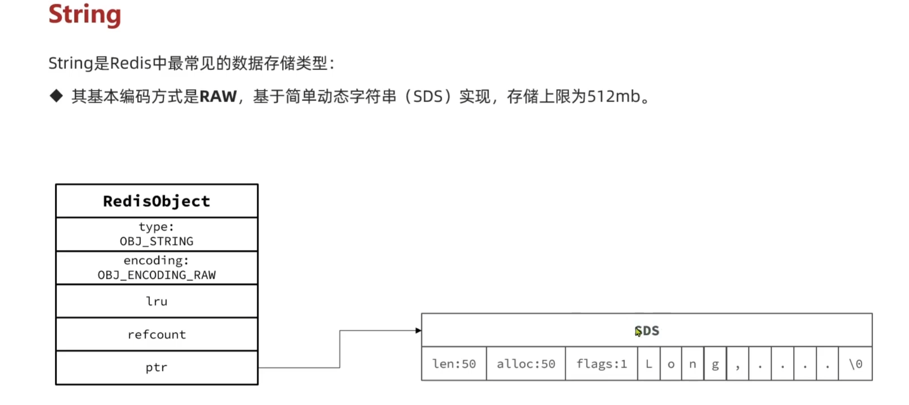
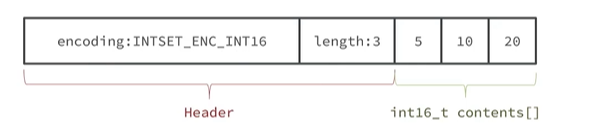

# Redis
## 哪些场景使用了redis呢？

- **缓存**

    缓存三兄弟（穿透、击穿、雪崩）、双写一致、持久化、数据过期策略，数据淘汰策略

- **分布式锁**

    setnx、redisson

- **消息队列、延迟队列**

## 什么是缓存穿透? 怎么解决?

### **是什么：**

**查询一个不存在的数据**，mysql查询不到数据也不会直接写入缓存，就会导致每次请求都查数据库。

### 怎么解决：

- **缓存空数据**

    查询返回的数据为空，仍把这个空结果进行缓存

    优点：简单

    缺点：消耗内存，可能发生不一致问题
- **布隆过滤器**

    

    仍然存在误判的可能性。

    误判率：数组越小误判率就越大，数组越大误判率就越小，但是同时带来了更多的内存消耗。

    

    优点：内存占用较少，没有多余key

    缺点：实现复杂，存在误判

## 什么是缓存击穿 ? 怎么解决 ?

### 是什么

给某一个key设置了过期时间，当key过期的时候，**恰好这时间点**对这个key有大量的并发请求过来，这些并发的请求可能会瞬间把DB压垮

### 怎么解决

- **互斥锁**

    

    

当缓存失效时，不立即去`load db`，先使用如 Redis 的`setnx` 去设置一个互斥锁，当操作成功返回时再进行`load db`的操作并回设缓存，否则重试`get`缓存的方法

优点：强一致性

缺点：性能差

- **逻辑过期**
    1. 在设置key的时候，设置一个**过期时间字段**一块存入缓存中，不给当前key设置过期时间
    2. 当查询的时候，从redis取出数据后判断时间是否过期

    3. 如果过期则开通另外一个线程进行数据同步，当前线程正常返回数据，这个数据不是最新

    优点：高可用性，性能好

    缺点：做不到强一致性，数据可能不是最新

## 什么是缓存雪崩 ? 怎么解决 ?

### 是什么

缓存雪崩是指在同一时段**大量的缓存key同时失效**或者**Redis服务宕机**，导致大量请求到达数据库，带来巨大压力

### 怎么解决

- 给不同的`Key`的**TTL**添加随机值
- 利用**Redis集群**提高服务的可用性

## redis做为缓存，mysql的数据如何与redis进行同步呢？(双写一致性)

**双写一致性**：当**修改了数据库的数据**也要同时**更新缓存**的数据，缓存和数据库的数据要**保持一致**

### 解决方案

- **延迟双删**

    如果是写操作，我们先把缓存中的数据删除，然后更新数据库，最后再延时删除缓存中的数据

    其中这个**延时多久不太好确定**，在延时的过程中可能会出现**脏数据**，并不能保证强一致性
- **redisson实现的读写锁**(强一致性的)

    在**读**的时候添加**共享锁**，可以保证读读不互斥，读写互斥。

    当我们更新数据的时候，添加**排他锁**，它是读写，读读都互斥，这样就能保证在写数据的同时是不会让其他线程读数据的，避免了脏数据。

    这里面需要注意的是读方法和写方法上需要使用同一把锁才行。

    排他锁底层使用也是`setnx`，保证了同时只能有一个线程操作锁住的方法
- **canal组件实现数据同步**(异步通知)

    不需要更改业务代码，部署一个**canal服务**。canal服务把自己伪装成mysql的一个**从节点**，当mysql数据更新以后，canal会读取**binlog**数据，然后在通过canal的客户端获取到数据，更新缓存即可。

    **二进制日志（BINLOG）**：

    记录了所有的 `DDL`（数据定义语言）语句和 `DML`（数据操纵语言）语句，但不包括数据查询（SELECT、SHOW）语句。

    

    

## redis做为缓存，数据的持久化是怎么做的？

- **RDB (Redis Database Backup file) Redis数据快照**

    简单来说就是把内存中的**所有数据**都记录到**磁盘**中。当Redis实例故障重启后，从磁盘读取快照文件，恢复数据。

    过程：

    `bgsave`开始时会`fork`主进程得到子进程，子进程共享主进程的内存数据。完成`fork`后读取内存数据并写入 **RDB 文件**。

    `fork`采用的是**copy-on-write技术**：

    •当主进程执行读操作时，访问共享内存；

    •当主进程执行写操作时，则会拷贝一份数据，执行写操作。
- **AOF(Append Only File)** **追加文件**

    Redis处理的**每一个写命令**都会记录在**AOF文件**，可以看做是命令日志文件。

    AOF默认是关闭的，需要修改`redis.conf`配置文件来开启AOF

    AOF的**命令记录的频率**也可以通过`redis.conf`文件来配

    因为是记录命令，**AOF**文件会比RDB文件**大的多**。而且AOF会记录对同一个key的多次写操作，但只有最后一次写操作才有意义。通过执行`bgrewriteaof`命令，可以让AOF文件执行重写功能，用最少的命令达到相同效果。Redis也会在触发**阈值**时自动去重写AOF文件。阈值也可以在`redis.conf`中配置

    

## Redis的数据过期策略有哪些 ?

- **惰性删除**

    设置该`key`过期时间后，我们不去管它，当需要该`key`时，我们在检查其是否过期，如果过期，我们就删掉它，反之返回该key

    优点 ：**对CPU友好**，只会在使用该key时才会进行过期检查，对于很多用不到的key不用浪费时间进行过期检查

    缺点 ：**对内存不友好**，如果一个key已经过期，但是一直没有使用，那么该key就会一直存在内存中，内存永远不会释放
- **定期删除**

    **每隔一段时间**，我们就对一些key进行检查，**删除**里面过期的key(从一定数量的数据库中取出一定数量的随机key进行检查，并删除其中的过期key)。

    有两种模式：

    1. **SLOW模式**

        是定时任务，执行频率默认为10hz，每次不超过25ms，以通过修改配置文件redis.conf 的hz 选项来调整这个次数
    2. **FAST模式**

        执行频率不固定，但两次间隔不低于2ms，每次耗时不超过1ms

    优点：可以通过限制删除操作执行的时长和频率来减少删除操作对 CPU 的影响。另外定期删除，也能**有效释放过期键占用的内存**。

    缺点：**难以确定**删除操作执行的时长和频率。

惰性删除 + 定期删除两种策略进行**配合使用**

## Redis的数据淘汰策略有哪些 ? (假如缓存过多，内存是有限的，内存被占满了怎么办？
)

- **noeviction**： 不淘汰任何key，但是内存满时不允许写入新数据，**默认**就是这种策略。
- **volatile-ttl**： 对设置了TTL的key，比较key的**剩余TTL值**，TTL越小越先被淘汰
- **allkeys-random**：对全体key ，**随机**进行淘汰。
- **volatile-random**：对设置了**TTL**的key ，**随机**进行淘汰。
- **allkeys-lru**： 对**全体**key，基于**LRU算法**进行淘汰
- **volatile-lru**： 对**设置了TTL的**key，基于**LRU算法**进行淘汰
- **allkeys-lfu**： 对**全体**key，基于**LFU**算法进行淘汰
- **volatile-lfu**： 对**设置了TTL的**key，基于**LFU算法**进行淘汰

### 使用建议：

1. **优先使用 allkeys-lru 策略**。充分利用 LRU 算法的优势，把最近最常访问的数据留在缓存中。如果业务有明显的冷热数据区分，建议使用。
2. 如果业务中数据访问频率差别不大，**没有明显冷热数据区分**，建议使用 **allkeys-random**，随机选择淘汰。
3. 如果业务中有**置顶的需求**，可以使用** volatile-lru 策略**，同时置顶数据不设置过期时间，这些数据就一直不被删除，会淘汰其他设置过期时间的数据。
4. 如果业务中有**短时高频访问的数据**，可以使用 **allkeys-lfu** 或 volatile-lfu 策略。

## 数据库有1000万数据 ,Redis只能缓存20w数据, 如何保证Redis中的数据都是热点数据 ?

可以使用 allkeys-lru （挑选最近最少使用的数据淘汰）淘汰策略

## Redis分布式锁如何实现 ?

在redis中提供了一个命令`setnx`(**SET if not exists**)

由于**redis是单线程的**，用了命令之后，只能有一个客户端对某一个key设置值，在没有过期或删除key的时候是其他客户端是不能设置这个key的

## 如何控制Redis实现分布式锁有效时长呢？

- **根据业务执行时间预估**
- **给锁续期**

    采用的**redis**的一个框架**redisson**实现的。

    在redisson中需要手动加锁，并且可以控制锁的**失效时间**和**等待时间**，当锁住的一个业务还没有执行完成的时候，在redisson中引入了一个**看门狗机制**，就是说每隔一段时间就检查当前业务**是否还持有锁**，如果持有就**增加锁的持有时间**，当业务**执行完成之后需要使用释放锁**就可以了

    还有一个好处就是，在高并发下，一个业务有可能会执行很快，先客户1持有锁的时候，客户2来了以后并不会马上拒绝，它会**自旋**不断尝试获取锁，如果客户1释放之后，客户2就可以马上持有锁，性能也得到了提升。

    

## redisson实现的分布式锁是可重入的吗？

是可以重入的。

这样做是为了**避免死锁**的产生。这个重入其实在内部就是判断是否是当前线程持有的锁，如果是当前线程持有的锁就会**计数**，如果**释放锁**就会在计算上**减一**。在存储数据的时候采用的**hash结构**，`大key`可以按照自己的业务进行定制，其中`小key`是当前线程的唯一标识，`value`是当前线程重入的次数

## redisson实现的分布式锁能解决主从一致性的问题吗

不能的。

比如，当线程1加锁成功后，master节点数据会异步复制到slave节点，此时当前**持有Redis锁的master节点宕机**，slave节点被提升为新的master节点，假如现在来了一个线程2，再次加锁，会在新的master节点上加锁成功，这个时候就会出现**两个节点同时持有一把锁**的问题。

可以利用redisson提供的**红锁**来解决这个问题，它的主要作用是，不能只在一个redis实例上创建锁，应该是**在多个redis实例上创建锁**，并且要求**在大多数redis节点上都成功创建锁**，红锁中要求是redis的节点数量要过半。这样就能避免线程1加锁成功后master节点宕机导致线程2成功加锁到新的master节点上的问题了。
但是，如果使用了红锁，因为需要同时在多个节点上都添加锁，**性能就变的很低了**，并且运维维护成本也非常高，所以，我们一般在项目中也不会直接使用红锁，并且官方也暂时废弃了这个红锁

如果有强一致性要求高的业务，建议使用**zookeeper**实现的分布式锁，它是可以保证强一致性的

## Redis集群有哪些方案, 知道嘛 ?

- **主从复制**

    单节点Redis的并发能力是有上限的，要进一步提高Redis的并发能力，可以搭建**主从集群**，实现读写分离。

    一般都是一主多从，**主节点**负责**写数据**，**从节点**负责**读数据**，主节点写入数据之后，需要把数据同步到从节点中。

    分为两个阶段：**全量同步**、**增量同步**

    **全量同步：**

    1.从节点请求主节点同步数据（**replicationid**、**offset **）

    2.主节点判断是否是第一次请求，是第一次就与从节点**同步版本信息**（replicationid和offset）

    3.主节点执行`bgsave`，生成**RDB文件**后，发送给从节点去执行

    4.在rdb生成执行期间，主节点会以命令的方式记录到缓冲区（一个**日志文件**）

    5.把生成之后的命令日志文件发送给从节点进行同步（为了同步rdb文件生成期间的数据）

    **增量同步**

    1.从节点请求主节点同步数据，主节点判断不是第一次请求，不是第一次就获取从节点的**offset值**

    2.主节点从命令日志中获取offset值之后的数据，发送给从节点进行数据同步
- **哨兵模式**

    Redis提供了**哨兵（Sentinel）**机制来实现主从集群的自动故障恢复。哨兵的结构和作用如下：

    - **监控****：**Sentinel会不断检查您的master和slave是否按预期工作

        基于**心跳机制**监测服务状态，每隔1秒向集群的每个实例发送ping命令：

        - **主观下线**：如果某sentinel节点发现某实例未在规定时间响应，则认为该实例主观下线。
        - **客观下线**：若超过指定数量（quorum）的sentinel都认为该实例主观下线，则该实例客观下线。quorum值最好超过Sentinel实例数量的一半。

        **哨兵选主规则**：

        - 首先判断主与从节点**断开时间长短**，如超过指定值就排该从节点
        - 然后判断从节点的**slave-priority值**，越小优先级越高
        - 如果slave-prority一样，则判断slave节点的**offset值**，越大优先级越高
        - 最后是判断slave节点的运行**id大小**，越小优先级越高。
        - **自动故障恢复****：**如果master故障，Sentinel会将一个slave提升为master。当故障实例恢复后也以新的master为主
    - **通知****：**Sentinel充当Redis客户端的服务发现来源，当集群发生故障转移时，会将最新信息推送给Redis的客户端
- **分片集群**

    解决**海量数据存储问题**，**高并发写**的问题。

    **特征：**

    - 集群中有**多个master**，每个master保存**不同数据**
    - 每个master都可以有**多个slave**节点
    - **master之间通过ping**监测彼此健康状态
    - 客户端请求可以访问集群**任意节点**，最终都会被**转发**到正确节点

    

## redis集群脑裂，该怎么解决呢？

由于网络原因，使得sentinel没有能够心跳感知到master，所以通过选举的方式提升了一个salve为master，这样就存在了两个master，就像大脑分裂了一样，这样会导致客户端还在old master那里写入数据，新节点无法同步数据，当网络恢复后，sentinel会**将old master降为salve**，这时再从新master同步数据，这会导致old master中的**大量数据丢失**。

### 解决方案

redis中有两个配置参数：

- **min-replicas-to-write1** 表示最少的salve节点为1个
- **min-replicas-max-lag5** 表示数据复制和同步的延迟不能超过5秒

## Redis分片集群中数据是怎么存储和读取的？

Redis 分片集群引入了**哈希槽**的概念，Redis 集群有 16384 个哈希槽，每个 key通过 **CRC16 校验**后对 16384 取模来决定放置哪个槽，集群的**每个节点负责一部分 hash 槽**。

## Redis是单线程的，但是为什么还那么快？

1. 完全基于**内存**的，C语言编写
2. 采用**单线程**，避免不必要的上下文切换可竞争条件
3. 使用**多路I/O复用**模型，非阻塞IO

    例如：`bgsave` 和 `bgrewriteaof ` 都是在后台执行操作，不影响主线程的正常使用，不会产生阻塞

## 能解释一下I/O多路复用模型？

- **阻塞IO BIO**

    

- **非阻塞IO NIO**

    

- **IO多路复用**

    是利用单个线程来同时监听多个**Socket **，并在**某个Socket可读、可写时得到通知**，从而避免无效的等待，充分利用CPU资源。

    

    监听Socket的方式、通知的方式又有多种实现，常见的有：

    - select
    - poll
    - epoll

    **select**和**poll**只会通知用户进程有Socket就绪，但**不确定具体是哪个Socket**，需要用户进程逐个遍历Socket来确认

    **epoll**则会在通知用户进程Socket就绪的同时，**把已就绪的Socket写入用户空间**

## redis数据结构底层是怎么实现的？比如zset如何实现的有序？

Redis的数据结构相当高效，这也是Redis性能高的一个原因。

### string

#### **应用场景：**

- 单值缓存

    

- 对象缓存

    

- 分布式锁

    

- 计数器

    

- 分布式系统全局id

    

#### **底层实现**

- **int类型**

    假如存储的是整数型值，比如set num 123这样的类型，就会使用int的存储方式进行存储，在redisObject的ptr属性中就会保存该值。

    

- **SDS类型**

    假如存储的字符串是一个字符串值并且**长度大于32个字节**就会使用SDS（simple dynamic string）方式进行存储，并且encoding设置为raw；

    
- **embstr类型**

    若是字符串长度**小于等于32个字节**就会将encoding改为embstr来保存字符串。

    

### hash

#### **应用场景：**

- 对象缓存

存储对象可以用string类型存储json，但也可以用hash结构存储对象。hash结构明显更快

- 电商购物车

#### **底层实现**

Redis的hash对象有两种编码（底层实现）方式，**字典编码（hashtable）**和**压缩列表编码(ziplist)**。

在使用字典编码的时候程序就是将hash表的key存为字典的键，hash的value作为字典的值，字典的键值都是用的是字符串类型。

在哈希对象保存的所有键值对的键和值的**字符串长度都小于 64 字节**和**哈希对象保存的键值对数量小于 512 个**使用的是ziplist，不能满足这个的使用的是hashtable（字典编码）

- 压缩链表由于是连续空间在刚开始**数据量小的时候性能是显著的**，但是在数据量大的时候就会出现扩容慢的问题。

    由于`ziplist`不具备随机访问能力，查询操作通常采用线性搜索的方式进行。

    其中，

    - **zlbytes**

        压缩列表总大小
    - **zltail**

        头结点到尾结点的偏移量
    - **zllen**

        压缩列表的元素个数
    - **entryi**

        存储具体元素，结构如下：

        

        其中，previous记录前一个元素的长度，encoding记录数据类型，content记录数据
    - **zlend**

        结束标志位

### list

#### **应用场景：**

- feed流

#### **底层实现**

Redis中的列表在**3.2**之前的版本是使用`ziplist`和`linkedlist`进行实现的。在**3.2**之后的版本就是引入了`quicklist`。

**数据量少**的时候，使用的`ziplist`数据结构，

当**数据量较大**时候，采用`linklist(3.2后采用quicklist)`：两个额外的指针 prev 和 next。

**quicklist:**

所以引入了quicklist

### set

#### **应用场景**

- 抽奖

- 点赞/取消点赞

- 共同关注(关注模型)

    交集、并集、差集

    

    

#### **底层实现**

Set的底层实现是**hashtable和intset**

在Set中值较少时，采用更为紧凑的intset，在值较多时，采用hashtable

- 当`Set`中的**所有元素都是整数**且**元素数量较少**时，Redis使用`intset`作为更紧凑的存储方式。`intset`是一种专门针对整数优化的数据结构，能够有效节省内存并保持元素有序。

    

    

    contents[i]的长度根据encoding的要求分配，每个单位必须等长，方便随机寻址。

    当数值大小超过encoding规定的长度时，支持动态升级编码方式，从后往前扩容复制
- 当`Set`中的元素**不全是整数**，或者整数集合元素**数量超过一定阈值时**，Redis使用`hashtable`作为底层实现。

    在`Set`的上下文中，`hashtable`仅存储键（元素本身），不存储与之关联的值。这意味着每个元素都是哈希表中的一个键，其值可以是固定的空值或占位符。

    查找使用二分查找

    插入需要后移元素

### zset

#### **应用场景**

- 点赞排序
- 实时排行榜

#### 底层**实现**

压缩链表→跳表

