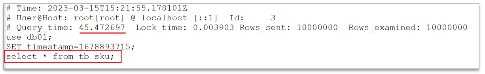
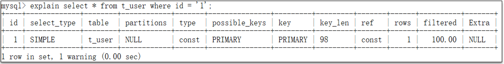
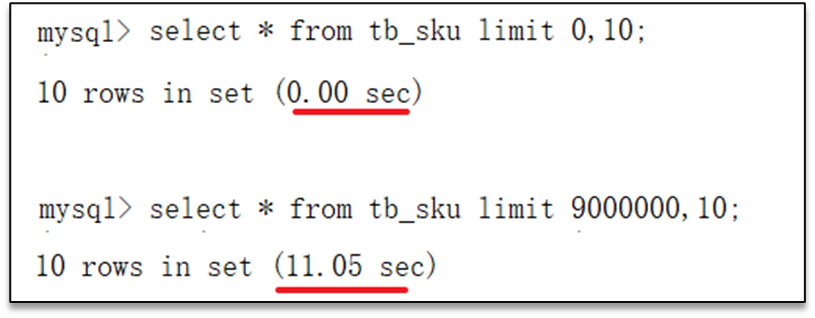
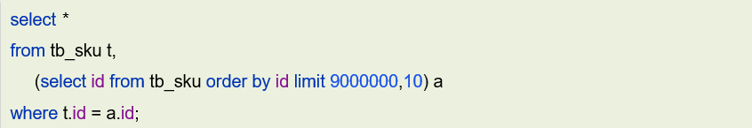
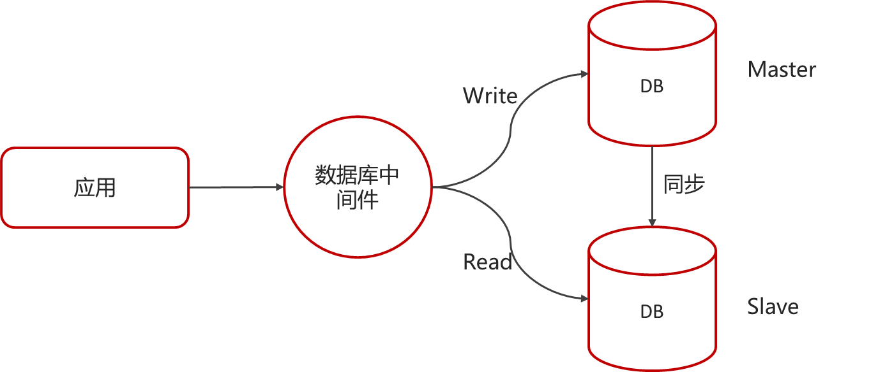
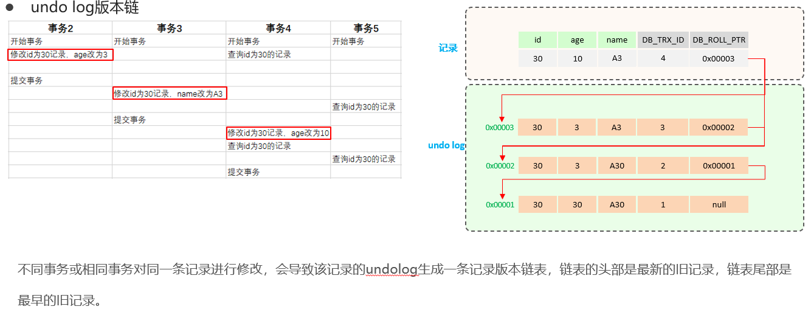
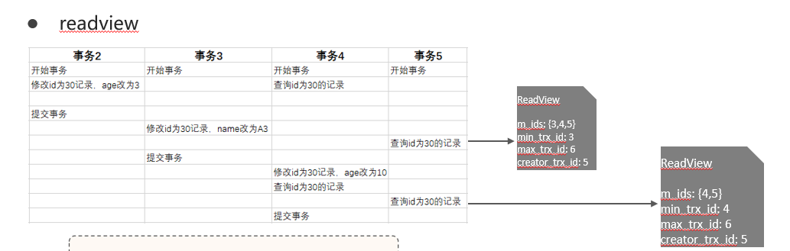
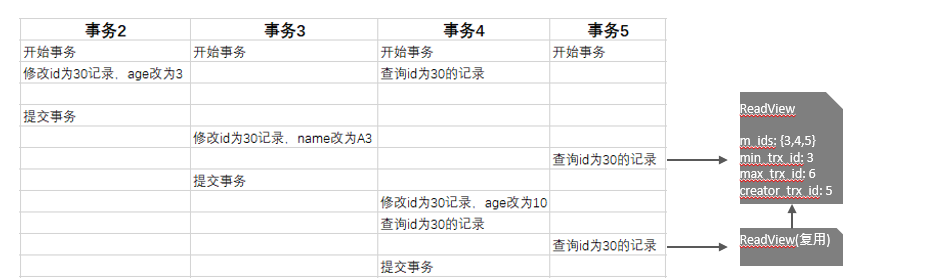
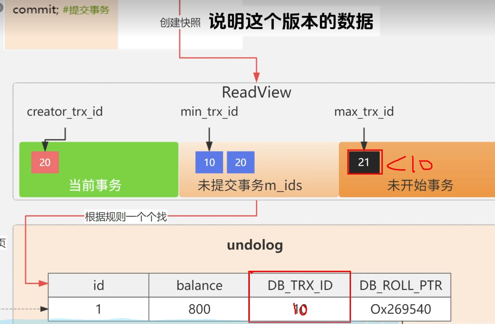
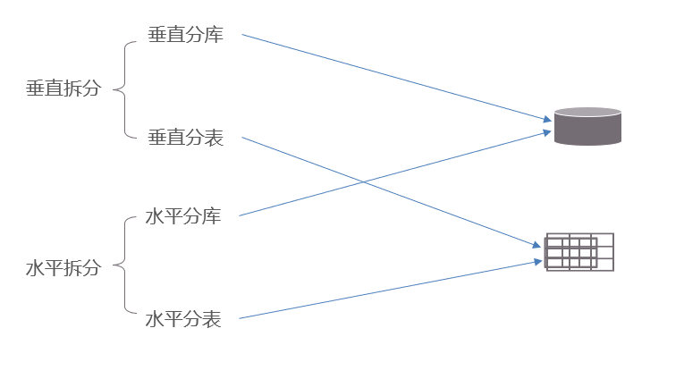

# MySQL

## MySQL中，如何定位慢查询?

### 慢查询的表现

页面加载过慢、接口压测响应时间过长（超过1s）

### 如何定位慢查询

- **使用一些开源工具**

    调试工具：Arthas 

    运维工具：Prometheus、Skywalking
- **使用MySQL自带的慢日志**

    **慢查询日志**记录了所有执行时间超过指定参数（`long_query_time`，单位：秒，默认10秒）的所有SQL语句的日志

    如果要开启慢查询日志，需要在MySQL的配置文件（`/etc/my.cnf`）中配置如下信息：

    

    配置完毕之后，通过以下指令重新启动MySQL服务器进行测试，查看慢日志文件中记录的信息 `/var/lib/mysql/localhost-slow.log`。

    
## SQL语句执行很慢, 如何分析呢？

### 慢查询可能的原因

- 聚合查询
- 多表查询
- 表数据量过大查询
- 深度分页查询

### 如何分析

可以采用`EXPLAIN` 或者 `DESC`命令获取 MySQL 如何执行 `SELECT` 语句的信息，注意其中的字段

- 通过`key`和`key_len`检查**是否命中了索引**（索引本身存在是否有失效的情况）
- 通过`type`字段查看sql是否有进一步的优化空间，是否存在全索引扫描或全盘扫描

    type字段的值可能有：

    - **NULL**：查询没有涉及到表
    - **system**：查询系统中的表
    - **const**：根据主键查询
    - **eq_ref**：主键索引查询或唯一索引查询
    - **ref**：索引查询
    - **range**：范围查询
    - **index**：索引树扫描
    - **all**：全盘扫描
- 通过`extra`建议判断，是否出现了**回表**的情况，如果出现了，可以尝试添加索引或修改返回字段来修复

    

## 了解过索引吗？（什么是索引）

索引（index）是帮助MySQL**高效获取数据**的**数据结构**(有序)。

## 索引的底层数据结构了解过嘛 ?

**InnoDB**存储引擎就是用**B+Tree**实现其索引结构。

B+树的优点：

- 阶数更多，路径更短
- 磁盘读写代价B+树更低，非叶子节点只存储指针，叶子阶段存储数据
- B+树便于扫库和区间查询，叶子节点是一个双向链表

## B树和B+树的区别是什么呢？

略

## 什么是聚簇索引什么是非聚簇索引 ?

关键：聚集索引的记录包括整行数据，二非聚簇索引的记录仅有主键/聚簇索引id

聚集索引选取规则:

- 如果存在**主键**，主键索引就是聚集索引。
- 如果不存在主键，将使用第一个唯一（**UNIQUE**）索引作为聚集索引。
- 如果表没有主键，或没有合适的唯一索引，则InnoDB会自动生成一个**rowid**作为隐藏的聚集索引。

## 知道什么是回表查询嘛 ?

通过**二级索引**找到对应的**主键值**，到聚集索引中查找**整行**数据，这个过程就是回表

## 知道什么叫覆盖索引嘛 ?

覆盖索引是指select查询语句使用了索引，在返回的列，必须**在索引中全部能够找到**

如果我们使用id查询，它会直接走聚集索引查询，一次索引扫描，直接返回数据，性能高。

## MYSQL超大分页怎么处理 ?

### 超大分页的性能问题是什么

在数据量比较大时，如果进行`limit`分页查询，在查询时，越往后，分页查询效率越低。

比如：

在进行分页查询时，如果执行 `limit 9000000,10` ，此时需要MySQL排序前9000010 记录，仅仅返回 9000000 - 9000010 的记录，其他记录丢弃，查询排序的代价非常大 。

### 怎么解决

优化思路: 一般分页查询时，通过创建**覆盖索引**能够比较好地提高性能，可以通过覆盖索引加子查询形式进行优化

## 索引创建原则有哪些？

- 针对于数据量较大，且**查询比较频繁**的表建立索引。
- 针对于**常作为查询条件**（where）、排序（order by）、分组（group by）操作的字段建立索引。
- 尽量选择**区分度高的列**作为索引，尽量建立唯一索引，区分度越高，使用索引的效率越高。
- 如果是字符串类型的字段，字段的长度较长，可以针对于字段的特点，建立**前缀索引**。
- 尽量使用**联合索引**，减少单列索引，查询时，联合索引很多时候可以覆盖索引，节省存储空间，避免回表，提高查询效率。
- 要**控制索引的数量**，索引并不是多多益善，索引越多，维护索引结构的代价也就越大，会影响增删改的效率。
- 如果索引列不能存储NULL值，请在创建表时使用NOT NULL约束它。当优化器知道每列是否包含NULL值时，它可以更好地确定哪个索引最有效地用于查询。

## 什么情况下索引会失效 ?

- 违反**最左前缀法则**

    最左前缀法则（也称为最左匹配原则）指的是在复合索引（即多个列组成的索引）中，查询条件需要从索引的最左边开始匹配，才能使用到该索引。如果跳过了索引中的某个列或者不是从最左边的列开始匹配，则后续的所有列都无法使用该索引进行优化。例如，如果你有一个由三列(A, B, C)组成的复合索引，那么只有当你的查询条件至少包含A列时，这个索引才可能被使用。如果查询条件只包含B和C，或者只包含C，那么这个索引将不会被使用。
- **范围查询**右边的列，不能使用索引
- 不要在**索引列上进行运算操作**， 索引将失效
- 字符串**不加单引号**，造成索引失效。(类型转换)

    比如，你有一个VARCHAR类型的字段，在WHERE子句中写成`WHERE name = 123`而不是`WHERE name = '123'`，数据库可能会试图将所有`name`字段值转换为数字再进行比较，这样就无法有效利用索引。
- 以%开头的Like**模糊查询**，索引失效

## sql的优化的经验

- **表的设计优化**

    比如设置合适的数值（tinyint int bigint），要根据实际情况选择

    比如设置合适的字符串类型（char和varchar）char定长效率高，varchar可变长度，效率稍低
- **索引优化**

    
- **SQL语句优化**
    1. `SELECT`语句务必**指明字段**名称（避免直接使用select* ）
    2. SQL语句要**避免造成索引失效**的写法
    3. 尽量用`unionall`代替`union` `union`会多一次过滤，效率低
    4. 避免在where子句中对字段进行**表达式操作**
    5. Join优化 能用`innerjoin`就不用`leftjoin` `right join`，如必须使用一定要以小表为驱动，内连接会对两个表进行优化，优先把小表放到外边，把大表放到里边。`leftjoin` 或 `rightjoin`，不会重新调整顺序
- **主从复制、读写分离**

    如果数据库的使用场景读的操作比较多的时候，为了避免写的操作所造成的性能影响可以采用读写分离的架构。

    读写分离解决的是，数据库的写入，影响了查询的效率。

    

- **分库分表**

## 事务的特性是什么？可以详细说一下吗？

### 事务是什么

事务是一组操作的集合，它是一个**不可分割的工作单位**，事务会把所有的操作作为一个整体一起向系统提交或撤销操作请求，即这些操作**要么同时成功，要么同时失败**。

举例：转账

### 特性

记忆为**ACID**

- **原子性（Atomicity）**：事务是不可分割的最小操作单元，要么全部成功，要么全部失败。
- **一致性（Consistency）**：事务完成时，必须使所有的数据都保持一致状态。
- **隔离性（Isolation）**：数据库系统提供的隔离机制，保证事务在不受外部并发操作影响的独立环境下运行。
- **持久性（Durability）**：事务一旦提交或回滚，它对数据库中的数据的改变就是永久的。

## 并发事务带来哪些问题？

## 怎么解决这些问题呢？MySQL的默认隔离级别是？

事务隔离级别越高，**数据越安全**，但是**性能越低**。

## undo log和redo log的区别

- **redo log**

    重做日志，记录的是事务提交时数据页的物理修改，是用来实现事务的**持久性**。

    该日志文件由两部分组成：**重做日志缓冲（redo log buffer）**以及**重做日志文件（redo log file）**,前者是在内存中，后者在磁盘中。当事务提交之后会把所有修改信息都存到该日志文件中, 用于在刷新脏页到磁盘,发生错误时, 进行**数据恢复**使用。
- **undo log**

    回滚日志，用于记录数据被修改前的信息, 作用包含两个 : 提供**回滚** 和 **MVCC**(多版本并发控制) 。undo log和redolog记录物理日志不一样，它是**逻辑日志**。

    可以认为当`delete`一条记录时，undo log中会记录一条对应的`insert`记录，反之亦然，当`update`一条记录时，它记录一条对应相反的`update`记录。当执行`rollback`时，就可以从undo log中的逻辑记录读取到相应的内容并进行回滚。

    可以实现事务的**一致性**和**原子性**

## 事务中的隔离性是如何保证的呢？(你解释一下MVCC)

全称 **Multi-Version Concurrency Control**，多版本并发控制。指维护一个数据的多个版本，使得读写操作没有冲突

MVCC的具体实现，主要依赖于数据库记录中的**隐式字段**、**undolog日志**、**readView**。

- **隐式字段**

    `trx_id`(事务id)，记录每一次操作的**事务id**，是自增的

    `roll_pointer`(回滚指针)，指向上一个版本的事务版本记录地址,可以理解为**指针**
- **undolog**
    - 回滚日志，存储老版本数据
    - 版本链：多个事务并行操作某一行记录，记录不同事务修改数据的版本，通过`roll_pointer`指针形成一个链表

    
- **readview**

    

    `readView`解决的是一个事务查询**选择版本的问题**

    根据`readView`的匹配规则和当前的一些事务id判断该访问那个版本的数据

    不同的隔离级别快照读是不一样的，最终的访问的结果不一样：

    - **RC（读已提交）** ：**每一次执行快照读**时生成ReadView

        

    - **RR（可重复读）**：仅在事务中**第一次执行快照读**时生成ReadView，后续复用

        

    

## MySQL主从同步原理

MySQL主从复制的核心就是**二进制日志**(**DDL（数据定义语言）语句**和 **DML（数据操纵语言）语句**)，它的步骤是这样的：

- 第一：**主库**在事务提交时，会把数据变更记录在二进制日志文件 `Binlog` 中。
- 第二：**从库**读取主库的二进制日志文件 `Binlog` ，写入到从库的中继日志 
`Relay Log` 。
- 第三：从库重做中继日志中的事件，将改变反映它自己的数据

## 你们项目用过MySQL的分库分表吗？

单表1000万或超过20G

- **垂直分库**

    以表为依据，根据业务将不同表拆分到不同库中。

    特点：

    - 按业务对数据分级管理、维护、监控、扩展
    - 在高并发下，提高磁盘IO和数据量连接数
- **垂直分表**

    以字段为依据，根据字段属性将不同字段拆分到不同表中。

    特点：

    - 冷热数据分离
    - 减少IO过渡争抢，两表互不影响
- **水平分库**

    将一个库的数据拆分到多个库中。

    特点：

    - 解决了单库大数量，高并发的性能瓶颈问题
    - 提高了系统的稳定性和可用性
- **水平分表**

    将一个表的数据拆分到多个表中(可以在同一个库内)。

    特点：

    - 优化单一表数据量过大而产生的性能问题;
    - 避免IO争抢并减少锁表的几率;