# 框架篇

## Spring框架中的单例bean是线程安全的吗？

不是线程安全的

Spring框架中有一个`@Scope`注解，默认的值就是**singleton**，单例的。

因为一般在spring的bean的中都是注入**无状态的对象**，没有线程安全问题。

如果在bean中定义了可修改的成员变量，是要考虑线程安全问题的。如果该处理逻辑中有对该单列状态的修改（体现为该单例的成员属性），则必须考虑线程同步问题。

Spring框架并没有对单例bean进行任何多线程的封装处理。关于**单例bean**的线程安全和并发问题需要开发者自行去搞定。

如果你的bean有多种状态的话（比如 `View` `Model`对象），就需要自行保证线程安全。最浅显的解决办法就是将多态bean的作用由“`singleton`”变更为“`prototype`”。

## 什么是AOP

AOP称为**面向切面编程**，用于将那些**与业务无关**，但却对多个对象产生影响的**公共行为**和逻辑，抽取并封装为一个可重用的模块，这个模块被命名为“**切面**”（Aspect），减少系统中的重复代码，降低了模块间的耦合度，同时提高了系统的可维护性。

**AOP常用场景**

- 记录操作日志

    核心是：使用aop中的**环绕通知**+**切点表达式**（找到要记录日志的方法），通过环绕通知的参数**获取请求方法的参数**（类、方法、注解、请求方式等），获取到这些参数以后，保存到数据库
- 缓存处理
- Spring中内置的事务处理

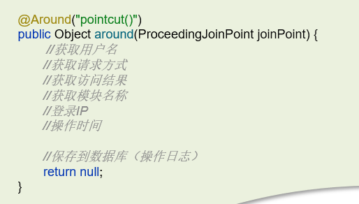

## Spring中的事务是如何实现的

spring实现的事务本质就是**aop完成**，对方法前后进行拦截，在执行方法之前开启事务，在执行完目标方法之后根据执行情况提交或者回滚事务。

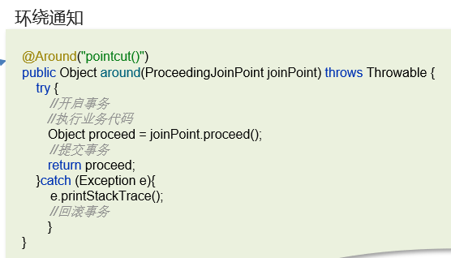

## Spring中事务失效的场景有哪些

- 异常捕获处理，自己处理了异常，没有抛出，解决：手动抛出。

    事务通知只有捉到了**目标抛出的异常**，才能进行后续的回滚处理，如果目标自己处理掉异常，事务通知无法知悉

    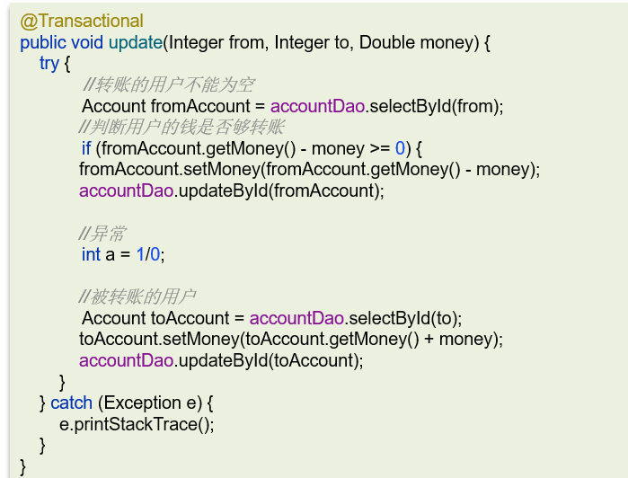

- 抛出**检查异常**，配置`rollbackFor`属性为`Exception`

    Spring 默认只会回滚**非检查异常**

    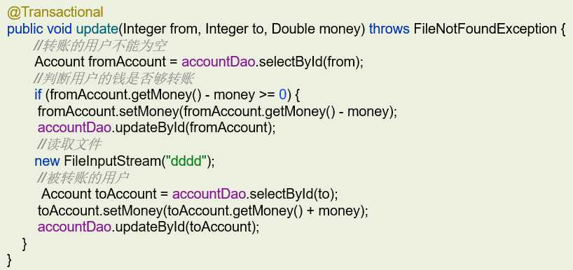

    应该修改注解：

    

- 非public方法导致的事务失效，改为public

    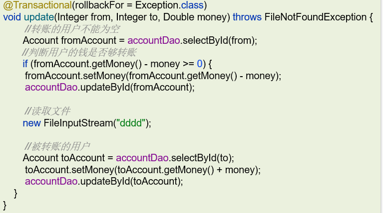

- 事务方法中调用另一个事务方法(参考**黑马点评**)

    使用`AopContext.currentProxy()`获取当前方法的代理方法，通过代理方法调用。

## Spring的bean的生命周期

- 通过`BeanDefinition`获取bean的定义信息
- 调用**构造函数**实例化bean
- bean的**依赖注入**

    比如一些`set`方法注入，像平时开发用的`@Autowire`都是这一步完
- 处理**Aware接口**(BeanNameAware、BeanFactoryAware、ApplicationContextAware)

    如果某一个bean实现了Aware接口就会重写方法执行
- Bean的**后置处理器BeanPostProcessor-前置**
- **初始化方法**(InitializingBean、init-method)
- Bean的**后置处理器BeanPostProcessor-后置**
- **销毁**bean

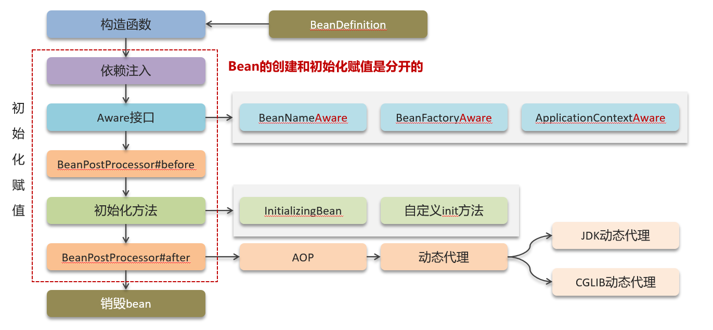

## Spring中的循环引用

循环依赖：循环依赖其实就是循环引用,也就是两个或两个以上的bean互相持有对方,最终形成闭环。比如A依赖于B,B依赖于A

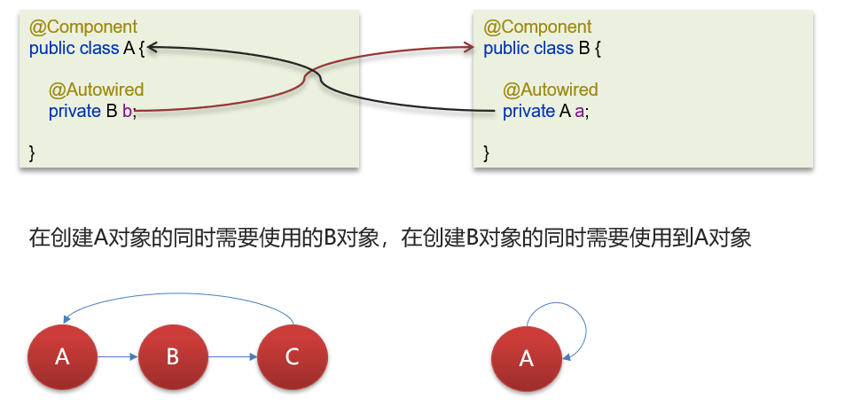

Spring解决循环依赖是通过**三级缓存**，对应的三级缓存如下所示：

循环依赖在spring中是允许存在，spring框架依据三级缓存已经解决了大部分的循环依赖

- 一级缓存：单例池，缓存已经经历了完整的生命周期，已经**初始化完成的bean对象**
- 二级缓存：缓存**早期的bean对象**（生命周期还没走完）
- 三级缓存：缓存的是ObjectFactory，表示**对象工厂**，用来创建某个对象的

1. 先实例A对象，同时会创建`ObjectFactory`对象存入**三级缓存**`singletonFactories ` 
2. A在初始化的时候需要B对象，这个走B的创建的逻辑
3. B实例化完成，也会创建`ObjectFactory`对象存入三级缓存`singletonFactories`  
4. B需要注入A，通过三级缓存中获取`ObjectFactory`来生成一个A的对象同时存入**二级缓存**，这个是有两种情况，一个是可能是A的普通对象，另外一个是A的代理对象，都可以让ObjectFactory来生产对应的对象，这也是三级缓存的关键
5. B通过从通过二级缓存`earlySingletonObjects`  获得到A的对象后可以正常注入，B创建成功，存入**一级缓存**singletonObjects  
6. 回到A对象初始化，因为B对象已经创建完成，则可以直接注入B，A
创建成功存入一次缓存singletonObjects 
7. 二级缓存中的临时对象A清除

## 构造方法出现了循环依赖怎么解决？

由于bean的生命周期中构造函数是**第一个执行**的，spring框架并不能解决构造函数的的依赖注入，可以使用`@Lazy`**懒加载**，什么时候需要对象再进行bean对象的创建

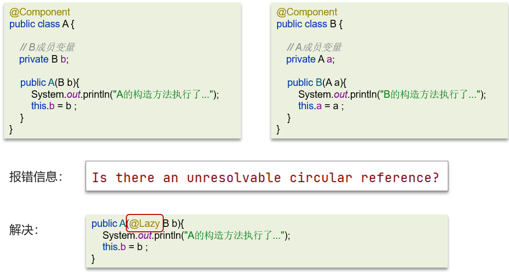

## SpringMVC的执行流程知道嘛

- 用户发送出请求到前端控制器**DispatcherServlet**

    这是一个调度中心
- DispatcherServlet收到请求调用**HandlerMapping**（处理器映射器）

    
- HandlerMapping找到具体的处理器，生成处理器对象及处理器拦截器(如果有)，再一起返回给DispatcherServlet。
- DispatcherServlet调用**HandlerAdapter**（处理器适配器）
- HandlerAdapter经过适配调用具体的**处理器**（Handler/Controller）
- 方法上添加了`@ResponseBody`
- 通过**HttpMessageConverter**来**返回结果**转换为JSON并响应

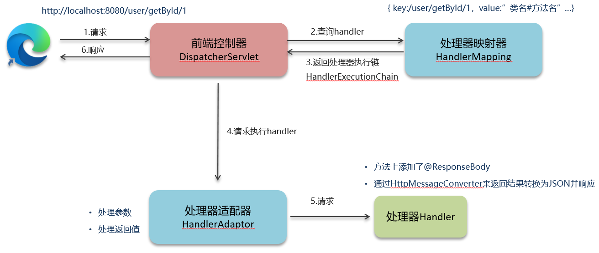

## Springboot自动配置原理

1, 在Spring Boot项目中的引导类上有一个注解`@SpringBootApplication`，这个注解是对三个注解进行了封装，分别是：

- `@SpringBootConfiguration`
- `@EnableAutoConfiguration`
- `@ComponentScan`

2, 其中`@EnableAutoConfiguration`是实现自动化配置的**核心注解**。

 该注解通过`@Import`注解导入对应的配置选择器。

内部就是读取了该项目和该项目引用的Jar包的的classpath路径下**META-INF/spring.factories**文件中的所配置的类的**全类名**。 在这些配置类中所定义的Bean会根据条件注解所指定的条件来决定**是否需要将其导入**到Spring容器中。

3, 条件判断会有像`@ConditionalOnClass`这样的注解，判断是否有对应的**class文件**，如果有则加载该类，把这个配置类的所有的Bean放入spring容器中使用。

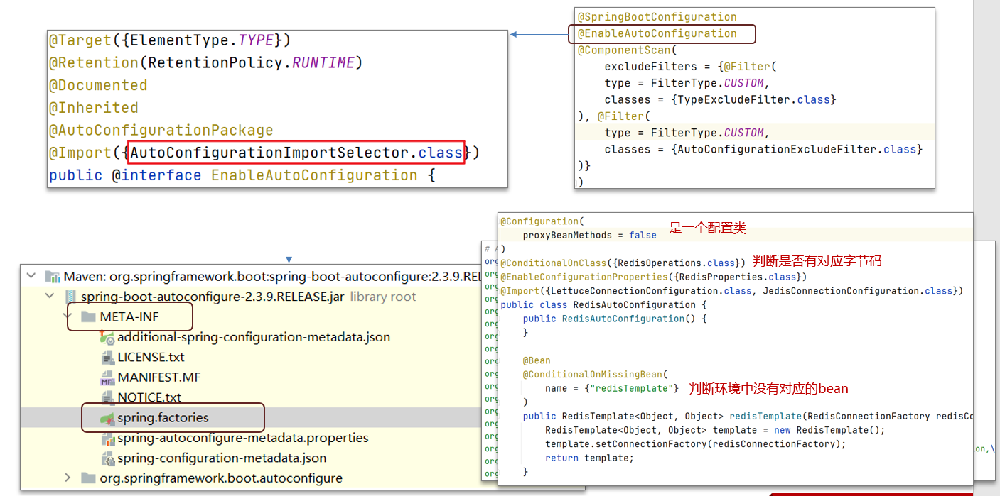

## Spring/SpringMVC/SpringBoot常见注解

### Spring 的常见注解有哪些

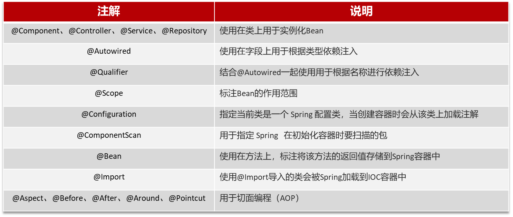

### SpringMVC常见的注解有哪些

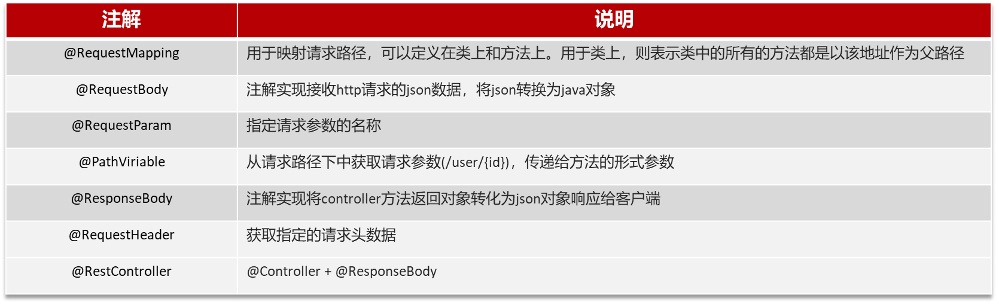

### Springboot常见注解有哪些

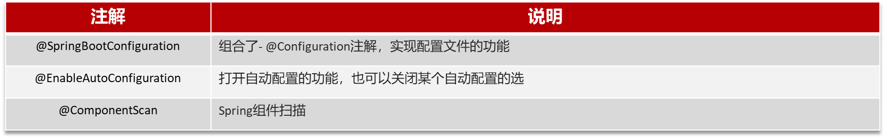

## MyBatis执行流程

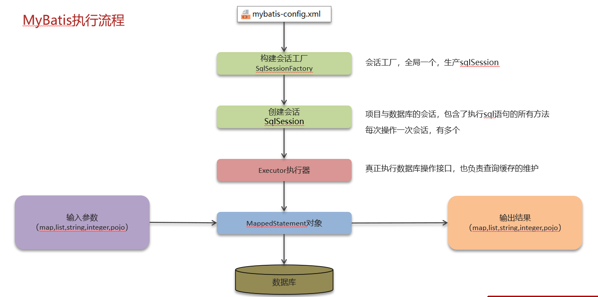

- 读取MyBatis配置文件：`mybatis-config.xml`加载运行环境和映射文件
- 构造会话工厂**SqlSessionFactory**，一个项目只需要一个，单例的，一般由spring进行管理
- 会话工厂创建**SqlSession**对象，这里面就含了执行SQL语句的所有方法
- 操作数据库的接口，**Executor执行器**，同时负责查询缓存的维护
- Executor接口的执行方法中有一个**MappedStatement**类型的参数，封装了映射信息
- 输入**参数映射**
- 输出**结果映射**

## Mybatis是否支持延迟加载？

Mybatis**支持**延迟记载，但**默认没有开启**

延迟加载的意思是：就是在需要用到数据时才进行加载，不需要用到数据时就不加载数据。

Mybatis支持一对一关联对象和一对多关联集合对象的

延迟加载在Mybatis**配置文件**中，可以配置是否启用延迟加载`lazyLoadingEnabled=true|false`，默认是关闭的

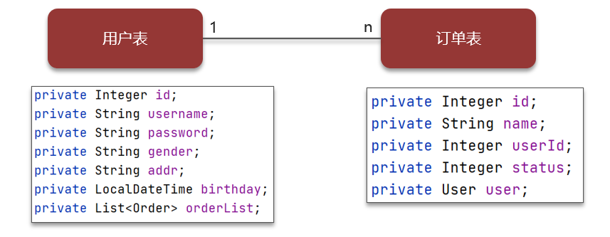

## 延迟加载的底层原理知道吗？

1. 使用`CGLIB`创建目标对象的**代理对象**
2. 当调用目标方法`user.getOrderList()`时，进入**拦截器invoke方法**，发现`user.getOrderList()`是null值，执行sql查询order列表
3. 把order查询上来，然后调用`user.setOrderList(List<Order>orderList) `，接着完成user.getOrderList()方法的调用

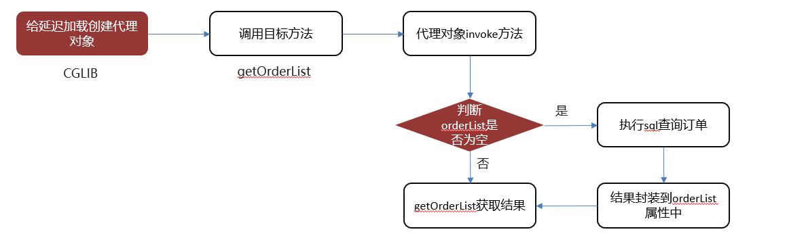

## Mybatis的一级、二级缓存用过吗？

- **一级缓存**

    基于 PerpetualCache 的 HashMap本地缓存，其存储作用域为Session，当Session进行flush或close之后，该Session中的所有Cache就将清空，默认打开一级缓存

    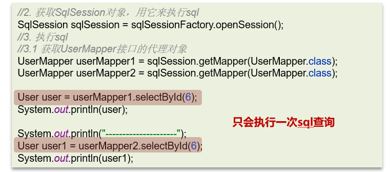

    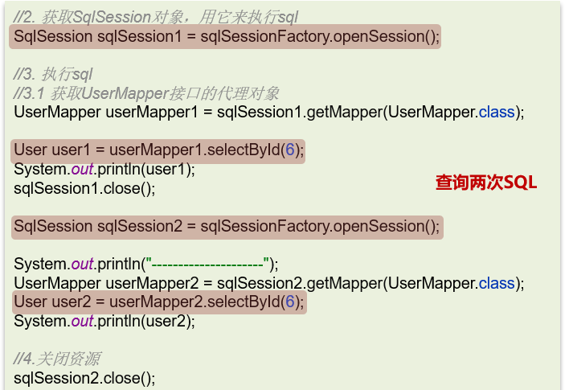

- **二级缓存**

    是基于**namespace**和**mapper**的作用域起作用的，不是依赖于SQLsession，默认也是采用PerpetualCache，HashMap存储。

    **需要单独开启**，一个是核心配置，一个是mapper映射文件

    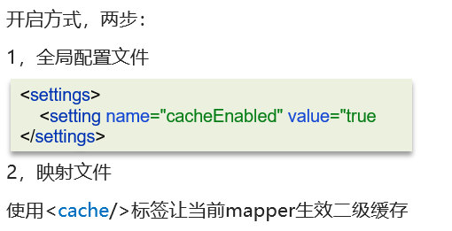

## Mybatis的二级缓存什么时候会清理缓存中的数据

当某一个作用域(一级缓存 Session/二级缓存Namespaces)的进行了**新增、修改、删除**操作后，默认**该作用域下**所有 select 中的缓存将被 clear。

## 为什么要用spring boot？

### spring, spring mvc, spring boot的联系与区别

- **spring**

    Spring Framework 是一个综合性的框架，提供了**依赖注入（IoC）**、**面向切面编程（AOP）**、**事务管理**、数据访问等各种功能。Spring Framework 为企业级 Java 应用提供了基础架构和解决方案。

    Spring Framework 本身不提供 Web 开发的特性，它主要关注于应用程序的核心功能。
- **spring mvc**

    Spring MVC 是 Spring Framework 的**一部分**，它是基于 MVC（Model-View-Controller）设计模式的 Web 应用开发框架。Spring MVC 提供了**处理 Web 请求和响应的功能**，以及与前端页面的交互。
- **spring boot**

    Spring Boot 是 Spring Framework 的一个**子项目**，它简化了 Spring 应用程序的搭建和部署过程，提供了**自动配置**、**快速启动**、约定优于配置等特性。

    Spring Boot 旨在简化 Spring 应用程序的开发和部署流程，它通过默认配置和自动化的方式来减少开发者的配置工作，提高了开发效率。Spring Boot 并不是一个独立的框架，而是构建于 Spring Framework 之上的工具。

### spring boot 相比spring mvc的改进

1. **自动配置**：
    - Spring Boot 提供了大量的自动配置，根据应用程序的依赖和环境，自动配置了许多常见的组件和功能，减少了开发者的配置工作量。
    - 传统的 Spring MVC 需要手动配置大量的组件和功能，需要开发者了解并配置许多细节。
2. **快速启动**：
    - Spring Boot 提供了**嵌入式的 Web 服务器**（如Tomcat、Jetty等），使得应用程序可以直接以独立的方式运行，**不需要额外部署外部的 Web 服务**器。
    - 传统的 Spring MVC 需要将应用程序打包成 WAR 文件，并部署到外部的 Web 服务器中运行。
3. **约定优于配置**：
    - Spring Boot 遵循了约定优于配置的原则，通过默认的配置和约定，大大减少了开发者需要进行的配置。
    - 传统的 Spring MVC 需要开发者手动配置大量的 XML 或 Java 代码来定义应用程序的组件和行为。
4. **集成度高**：
    - Spring Boot 提供了大量的 starter（起步依赖），可以方便地集成各种常见的第三方库和框架，例如数据库访问、安全认证、消息队列等。
    - 传统的 Spring MVC 需要开发者手动集成各种第三方库和框架，需要处理不同库之间的兼容性和配置。
5. **微服务支持**：
    - Spring Boot 很适合用于构建微服务架构，可以轻松地创建独立的、可扩展的微服务应用。
    - 传统的 Spring MVC 更适用于构建单体应用，需要考虑更多的集成和依赖关系。

### 使用spring framework比jsp + servlet好在哪里

1. **繁琐的配置**：
    - 传统的 **JSP+Servlet** 开发需要手动配置各种 **Servlet**、**Filter**、**Listener** 等组件，以及相关的部署描述符（如 **web.xml**），配置繁琐，需要开发者了解和处理很多细节。
    - Spring Boot 通过自动配置和约定优于配置的原则，大大减少了开发者需要手动配置的工作量，使得开发更加简洁和高效。
2. **依赖管理**：
    - 在传统的 JSP+Servlet 开发中，需要**手动管理项目的依赖**，包括 Servlet API、JSP API、数据库驱动等，需要**处理版本兼容性和冲突问题**。
    - Spring Boot 通过 Maven 或 Gradle 等构建工具，提供了一种简便的依赖管理方式，开发者可以通过添加合适的 starter（起步依赖）来自动引入所需的依赖库，不需要手动处理版本和兼容性问题。
3. **缺乏统一的开发模式**：
    - 在传统的 JSP+Servlet 开发中，**缺乏统一的开发模式**和最佳实践，开发者需要自行选择和设计架构、模式和组件，导致项目结构和代码风格的差异较大。
    - Spring Boot 提供了一套规范和最佳实践，使得开发者能够更容易地构建标准化的应用程序，减少了开发过程中的决策和抉择。
4. **部署和运维复杂**：
    - 在传统的 JSP+Servlet 开发中，部署和运维工作相对复杂，需要**手动配置和管理应用服务器**，处理服务器集群和负载均衡等问题。
    - Spring Boot 内置了**嵌入式的 Web 服务器（如Tomcat、Jetty等）**，使得应用程序可以以独立的方式运行，不需要额外部署外部的 Web 服务器，大大简化了部署和运维工作。
5. **测试困难**：
    - 在传统的 JSP+Servlet 开发中，由于缺乏统一的测试框架和工具，测试工作相对困难，需要编写大量的手动测试代码。
    - Spring Boot 提供了丰富的测试支持，包括单元测试、集成测试等各种测试类型，开发者可以借助各种测试框架和工具，更方便地进行测试工作。