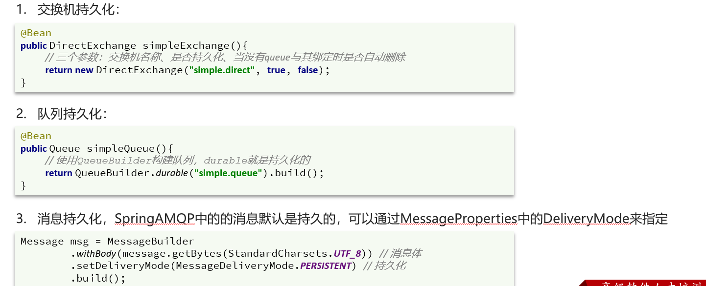
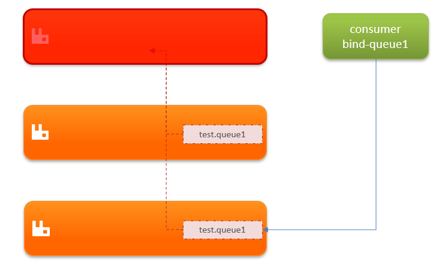

# 消息中间件

## RabbitMQ-如何保证消息不丢失

### 可能丢失消息的位置

### 解决方案

- **生产者确认机制**

    RabbitMQ提供了**publisher confirm**机制来避免消息发送到MQ过程中丢失。消息发送到**MQ**以后，会返回一个结果给**发送者**，表示消息是否处理成功

    消息发送失败后：

    - 回调方法即时重发
    - 记录日志
    - 保存到数据库然后定时重发，成功发送后即刻删除表中的数据
- **消息持久化**

    MQ默认是内存存储消息，开启持久化功能可以确保缓存在MQ中的消息不丢失。

    

- **消费者确认机制**

    RabbitMQ支持**消费者确认机制**，即：消费者处理消息后可以向MQ发送**ack回执**，MQ收到ack回执后才会删除该消息。而SpringAMQP则允许配置三种确认模式：

    - **manual**：

        **手动**ack，需要在业务代码结束后，调用api发送ack。
    - **auto**：

        **自动**ack，由spring监测listener代码是否出现异常，没有异常则返回ack；抛出异常则返回nack
    - **none**：

        **关闭**ack，MQ假定消费者获取消息后会成功处理，因此消息投递后立即被删除

    消息发送失败后：
我们可以利用Spring的**retry机制**，在消费者出现异常时利用本地重试，设置重试次数，当次数达到了以后，如果消息依然失败，将消息投递到**异常交换机**，交由人工处理

    

## RabbitMQ消息的重复消费问题如何解决的

### 产生原因

- 消费者设置了自动确认机制，当服务还没来得及给MQ确认的时候，**服务宕机**了，导致服务重启之后，又消费了一次消息。这样就重复消费
- 网络抖动，ack没能正确到达MQ

### 解决方案

使用业务的**唯一标识**，我们再处理消息时，先到数据库查询一下，这个数据是否存在，如果不存在，说明没有处理过，这个时候就可以正常处理这个消息了。如果已经存在这个数据了，就说明消息重复消费了，我们就不需要再消费了

## RabbitMQ中死信交换机 ? （RabbitMQ延迟队列有了解过嘛）

**延迟队列**：进入队列的消息会被延迟消费的队列

**场景**：超时订单、限时优惠、定时发布

延迟队列就是用到了**死信交换机**和**TTL**（消息存活时间）实现的。

如果消息超时未消费就会变成死信，在RabbitMQ中如果消息成为死信，队列可以绑定一个死信交换机，在死信交换机上可以绑定其他队列，在我们发消息的时候可以按照需求指定TTL的时间，这样就实现了延迟队列的功能了。

我记得RabbitMQ还有一种方式可以实现延迟队列，在RabbitMQ中安装一个**死信插件**，这样更方便一些，我们只需要在声明交互机的时候，指定这个就是死信交换机，然后在发送消息的时候直接指定超时时间就行了，相对于死信交换机+TTL要省略了一些步骤

## 如果有100万消息堆积在MQ , 如何解决 ?

解决消息堆积有三种种思路：

- 增加更多消费者，提高消费速度
- 在消费者内开启线程池加快消息处理速度
- 扩大队列容积，提高堆积上限

    惰性队列的特征如下：

    - 接收到消息后直接存入磁盘而非内存
    - 消费者要消费消息时才会从磁盘中读取并加载到内存
    - 支持数百万条的消息存储

    可能会降低时效性

## RabbitMQ的高可用机制有了解过嘛

在生产环境下，使用**集群**来保证高可用性

- **普通集群**

    普通集群，或者叫标准集群（classic cluster），具备下列特征：

    - 会在集群的各个节点间**共享部分数据**，包括：交换机、队列元信息。不包含队列中的消息。
    - 当访问集群某节点时，如果队列不在该节点，会从数据所在节点**传递到当前节点**并返回
    - 队列所在节点宕机，队列中的消息就会丢失

    
    
- **镜像集群**

    本质是**主从模式**，具备下面的特征：

    - 交换机、队列、队列中的消息会在各个mq的镜像节点之间同步备份。
    - 创建队列的节点被称为该队列的**主节点**，备份到的其它节点叫做该队列的镜像节点。
    - 一个队列的主节点可能是另一个队列的镜像节点
    - 所有操作都是**主节点完成**，然后**同步给镜像节点**
    - 主宕机后，镜像节点会替代成新的主节点
- **仲裁队列**

    仲裁队列：仲裁队列是3.8版本以后才有的新功能，用来替代镜像队列，具备下列特征：

    - 与镜像队列一样，都是主从模式，支持主从数据同步
    - 使用非常简单，没有复杂的配置
    - 主从同步基于Raft协议，**强一致**

    可以避免丢失数据。