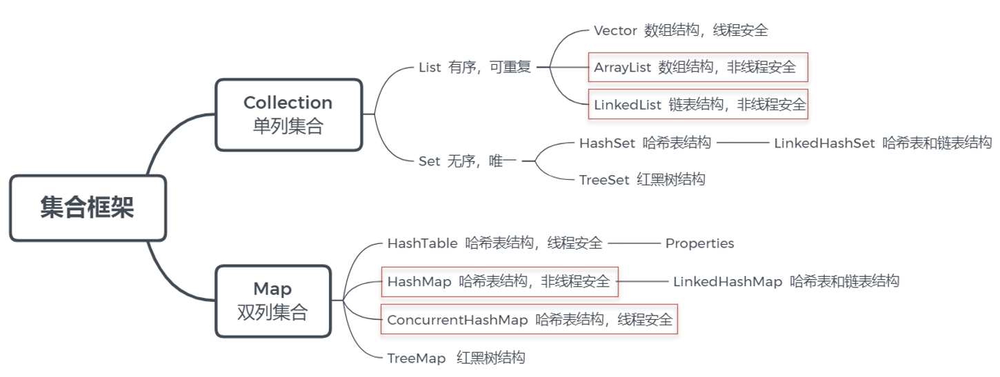
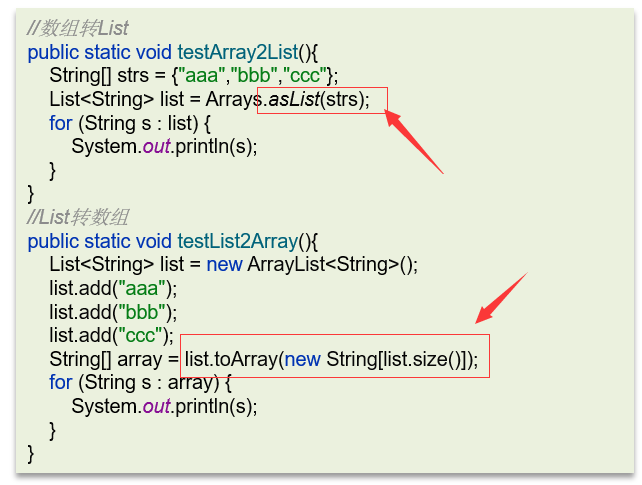
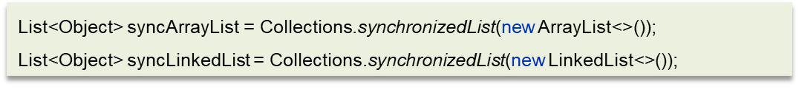
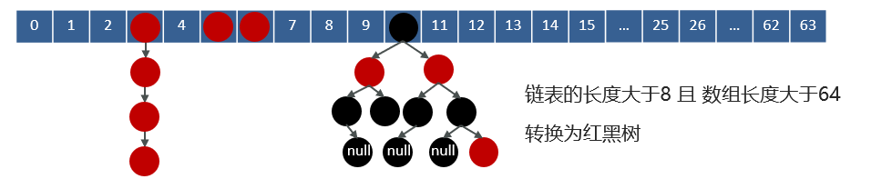
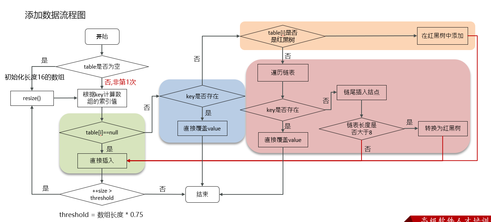
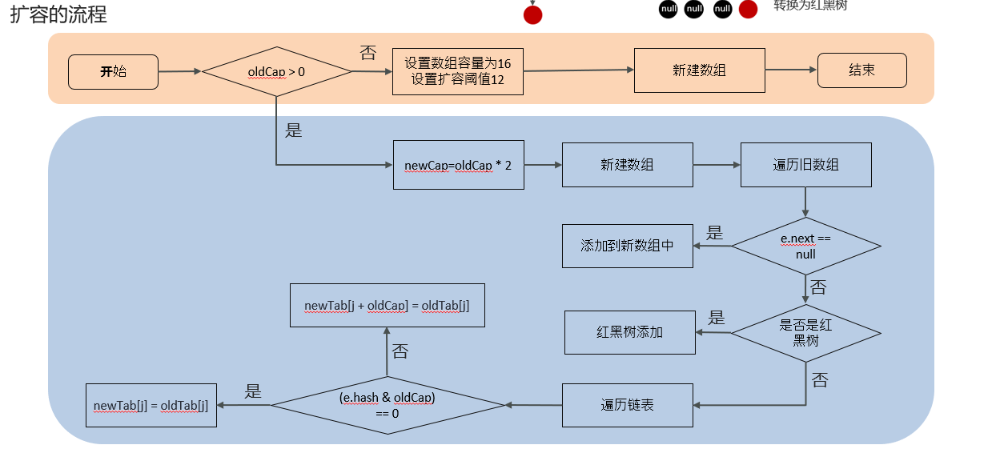
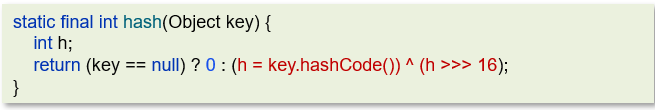

# Java 集合

## 说一说Java提供的常见集合？（画一下集合结构图）

在java中提供了量大类的集合框架，主要分为两类：

第一个是`Collection` 属于单列集合

第二个是`Map`  属于双列集合。

在`Collection`中有两个子接口`List`和`Set`。在我们平常开发的过程中用的比较多像`list`接口中的实现类`ArraryList`和`LinkedList`。  在`Set`接口中有实现类`HashSet`和`TreeSet`。

在`map`接口中有很多的实现类，平时比较常见的是`HashMap`、`TreeMap`，还有一个线程安全的map:`ConcurrentHashMap`

## ArrayList底层是如何实现的？

- **底层数据结构**

    `ArrayList`底层是用**动态的数组**实现的。
- **初始容量**

    `ArrayList`初始容量为0，当**第一次添加数据的时候**才会初始化容量为**10**
- **扩容逻辑**

    `ArrayList`在进行扩容的时候是原来容量的**1.5倍**，每次扩容都需要拷贝数组
- **添加逻辑**
    - 确保数组已使用长度（size）加1之后足够存下下一个数据 
    - 计算数组的容量，如果当前数组已使用长度+1后的大于当前的数组长度，则调用**grow方法**扩容（原来的1.5倍）
    - 确保新增的数据有地方存储之后，则将新元素添加到**位于size的位置上**。
    - 返回添加成功布尔值。

## ArrayList list=new ArrayList(10)中的list扩容几次

在ArrayList的源码中提供了一个带参数的构造方法，这个参数就是指定的集合初始长度，所以给了一个10的参数，就是指定了集合的初始长度是10，这里面并**没有扩容**。

## 如何实现数组和List之间的转换

- 数组转List，使用JDK中`java.util.Arrays`工具类的`asList`方法
- List转数组，使用List的`toArray`方法。无参`toArray`方法返回 `Object`数组，传入初始化长度的数组对象，返回该对象数组

`Arrays.asList`转换`list`之后，如果修改了数组的内容，list**会受影响**，因为它的底层使用的Arrays类中的一个内部类ArrayList来构造的集合，在这个集合的构造器中，把我们传入的这个集合进行了包装而已，最终指向的都是同一个内存地址。

list用了`toArray`转数组后，如果修改了list内容，数组**不会影响**，当调用了toArray以后，在底层是它是进行了数组的拷贝，跟原来的元素就没啥关系了，所以即使list修改了以后，数组也不受影响。

## **ArrayList 和 LinkedList 的区别是什么？**

- **底层数据结构**
    - `ArrayList`是**动态数组**的数据结构实现
    - `LinkedList`是**双向链表**的数据结构实现
- **操作效率**

    略，不能更熟了
- **内存空间占用**
    - `ArrayList`底层是数组，内存连续，**节省内存**
    - `LinkedList`是双向链表需要存储数据，和两个指针，更**占用内存**
- **线程安全性**

    ArrayList和LinkedList都**不是线程安全的**

    如果需要保证线程安全，有两种方案：

    - 在方法内使用，**局部变量则是线程安全的**
    - 使用线程安全的ArrayList和LinkedList

        

## 说一下HashMap的实现原理？

HashMap的数据结构： 底层使用hash表数据结构，即数组和链表或红黑树

1. 当我们往HashMap中put元素时，利用key的hashCode重新hash计算出当前对象的元素在数组中的下标
2. 存储时，如果出现hash值相同的key，此时有两种情况。

    a. 如果key相同，则覆盖原始值；

    b. 如果key不同（出现冲突），则将当前的key-value放入链表或红黑树中
3. 获取时，直接找到hash值对应的下标，在进一步判断key是否相同，从而找到对应值。

## HashMap的jdk1.7和jdk1.8有什么区别

JDK1.8之前采用的是拉链法。头插法。

jdk1.8在解决哈希冲突时有了较大的变化，当链表长度大于阈值（默认为8） 时并且数组长度达到64时，将链表转化为红黑树，以减少搜索时间。扩容resize( ) 时，红黑树拆分成的树的结点数小于等于临界值6个，则退化成链表。尾插法。

## 好的，你能说下HashMap的put方法的具体流程吗？

## 好的，刚才你多次介绍了hashmap的扩容，能讲一讲HashMap的扩
容机制吗？

- 在添加元素或初始化的时候需要调用`resize`方法进行扩容，第一次添加数据初始化数组长度为**16**，以后每次每次扩容都是达到了扩容**阈值**（数组长度 * 0.75）
- 每次扩容的时候，都是扩容之前容量的**2倍**； 
- 扩容之后，会新创建一个数组，需要把老数组中的数据挪动到新的数组中

- **没有hash冲突**的节点，则直接使用 `e.hash & (newCap - 1)` 计算新数组的索引位置
- 如果是红黑树，走红黑树的添加

- 如果是链表，则需要遍历链表，可能需要拆分链表，判断`(e.hash & oldCap)`**是否为0**，该元素的位置要么停留在原始位置，要么移动到原始位置+增加的数组大小这个位置上

## 通过hash计算后找到数组的下标，是如何找到的呢，你了解hashMap的寻址算法吗？

这个哈希方法首先计算出`key`的`hashCode`值，然后通过这个hash值**右移16位**
后的二进制进行**按位异或**运算得到最后的`hash`值。

## 为何HashMap的数组长度一定是2的次幂？

- 计算索引时效率更高：如果是 2 的 n 次幂可以使用位与运算代替取模
- 扩容时重新计算索引效率更高： `hash & oldCap == 0`的元素留在原来位置 ，否则**新位置 = 旧位置 + oldCap**

## 你知道hashmap在1.7情况下的多线程死循环问题吗？

在数组进行扩容的时候，因为链表是头插法，在进行数据迁移的过程中，有可能导致死循环。
比如说，现在有两个线程

线程一：
读取到当前的hashmap数据，数据中一个链表，在准备扩容时，线程二介入

线程二也读取hashmap，直接进行扩容。因为是头插法，链表的顺序会进行颠倒过来。比如原来的顺序是AB，扩容后的顺序是BA，线程二执行结束。

当线程一再继续执行的时候就会出现死循环的问题。

线程一先将A移入新的链表，再将B插入到链头，由于另外一个线程的原因，B的next指向了A，所以B->A->B,形成循环。

当然，JDK 8 将扩容算法做了调整，不再将元素加入链表头（而是保持与扩容前一样的顺序），尾插法，就避免了jdk7中死循环的问题。

## hashmap是线程安全的吗？

不是线程安全的。

我们可以采用`ConcurrentHashMap`进行使用，它是一个线程安全的`HashMap`

## HashSet与HashMap的区别？

`HashSet`底层其实是用`HashMap`实现存储的, HashSet封装了一系列HashMap的方法. 依靠HashMap来存储元素值,(利用`hashMap`的`key`键进行存储)

而`value`值默认为**Object对象**. 所以HashSet也不允许出现重复值, 判断标准和HashMap判断标准相同, 两个元素的hashCode相等并且通过equals()方法返回true.

## HashTable与HashMap的区别

- 第一，数据结构不一样，`hashtable`是数组+链表，`hashmap`在1.8之后改为了数组+链表+红黑树
- 第二，`hashtable`存储数据的时候都**不能为null**，而hashmap是可以的
- 第三，hash算法不同，hashtable是用**本地修饰的hashcode值**，而hashmap使用了**二次hash**
- 第四，扩容方式不同，`hashtable`是当前容量**翻倍+1**，`hashmap`是当前容量**翻倍**
- 第五，`hashtable`是**线程安全**的，操作数据的时候加了锁`synchronized`，`hashmap`不是线程安全的，效率更高一些在实际开中不建议使用`HashTable`，在多线程环境下可以使`ConcurrentHashMap`类

