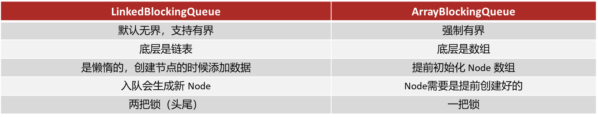

# Java 并发

## 聊一下并行和并发有什么区别？

宏观与微观，不必赘述

## 线程和进程的区别？

- 进程是正在运行程序的实例，进程中包含了线程，每个线程执行不同的任务

- 不同的进程使用不同的内存空间，在当前进程下的所有线程可以共享内存空间

- 线程更轻量，线程上下文切换成本一般上要比进程上下文切换低(上下文切换指的是从一个线程切换到另一个线程)

## 如果在java中创建线程有哪些方式？

- **继承**`Thread`**类**

    

- **实现**`runnable`**接口**

    

- **实现**`Callable`**接口**

    

- **线程池创建线程**

    

    **通常情况下**，我们项目中都会采用**线程池**的方式创建线程。

## runnable 和 callable 两个接口创建线程有什么不同呢？

1.`Runnable`接口`run`方法没有返回值

2.`Callable`接口`call`方法有返回值，是个泛型，和`Future`、`FutureTask`配合可以用来**获取异步执行的结果**

3.`Callable`接口的`call`方法**允许抛出异常**；而`Runnable`接口的`run`方法的异常只能在**内部消化**，不能继续上抛

在实际开发中，如果**需要拿到执行的结果**，需要使用`Callalbe`接口创建线程，调用`FutureTask.get()`得到可以得到返回值，此方法会阻塞主进程的继续往下执行，如果不调用不会阻塞。

## 线程包括哪些状态，状态之间是如何变化的？

## 线程中的 wait 和 sleep方法有什么不同呢？

- **方法归属不同
**`sleep(long)` 是 `Thread` 的静态方法。

    而 `wait()`，是 `Object`的成员方法，**每个对象都有**
- **线程醒来时机不同**

    线程执行 `sleep(long)` 会在等待相应毫秒后醒来，而 `wait()` 需要被 `notify` 唤
醒，`wait()` 如果不唤醒就**一直等下去**
- **锁特性不同
**`wait`方法的调用必须先获取 **wait 对象的锁**，而 sleep 则无此限制

    `wait`方法执行后会**释放**对象锁，允许其它线程获得该对象锁（相当于我放弃 cpu，但你们还可以用）

    而 `sleep`如果在 synchronized 代码块中执行，并**不会释放对象锁**（相当于我放弃 cpu，你们也用不了）

## 新建 T1、T2、T3 三个线程，如何保证它们按顺序执行？

可以使用线程中的`join`方法解决

## 线程的 run()和 start()有什么区别？

`start`方法用来启动线程，通过该线程调用`run`方法执行`run`方法中所定义的逻辑代码。`start`方法只能被调用一次。

`run`方法封装了要被线程执行的代码，可以被调用多次。

## 那如何停止一个正在运行的线程呢？

有三种方式可以停止线程

- 使用退出标志，使线程正常退出，也就是当**`run`**方法完成后线程终止
- 使用`stop`方法强行终止（不推荐，方法已作废）
- 使用`interrupt`方法中断线程

建议使用第一种或第三种方式中断线程

## 讲一下synchronized关键字的底层原理？

`synchronized`底层使用的**JVM级别**中的**Monitor **来决定当前线程是否获得了锁，如果某一个线程获得了锁，在没有释放锁之前，其他线程是不能或得到锁的。synchronized 属于**悲观锁**。

synchronized 因为需要依赖于JVM级别的Monitor ，相对**性能也比较低**。因为需要从用户态和内核态进行切换。

## 能具体说下Monitor 吗？

**monitor对象**存在于**每个Java对象**的**对象头**中，`synchronized`锁便是通过这种方式获取锁的，也是为什么Java中任意对象可以作为锁的原因

monitor内部维护了三个变量

- **WaitSet**：保存处于Waiting状态的线程
- **EntryList**：保存处于Blocked状态的线程
- **Owner**：持有锁的线程

只有一个线程获取到的标志，就是在monitor中设置成功了`Owner`，一个monitor中只能有一个`Owner`

在上锁的过程中，如果有其他线程也来抢锁，则进入`EntryList`进行阻塞，当获得锁的线程执行完了，释放了锁，就会唤醒`EntryList`中等待的线程竞争锁，竞争的时候是**非公平的**。

## 关于synchronized 的锁升级的情况了解吗？

Java中的`synchronized`有偏向锁、轻量级锁、重量级锁三种形式，分别对应了锁只被一个线程持有、不同线程交替持有锁、多线程竞争锁三种情况。

- **重量级锁**：底层使用的`Monitor`实现，里面涉及到了用户态和内核态的切换、进程的上下文切换，成本较高，性能比较低。
- **轻量级锁**：线程加锁的时间是错开的（也就是没有竞争），可以使用轻量级锁来优化。轻量级修改了对象头的锁标志，相对重量级锁性能提升很多。每次修改都是**CAS操作**，保证原子性
- **偏向锁**：一段很长的时间内都只被一个线程使用锁，可以使用了偏向锁，在**第一次获得锁**时，会有一个**CAS操作**，之后该线程再获取锁，只需要判断`mark word`中**是否是自己的线程id即可**，而不是开销相对较大的CAS命令

一旦锁发生了竞争，都会升级为重量级锁。

## 说下ReentrantLock的使用方式和底层原理？

`synchronized`在高并发量的情况下，性能不高。

在高并发下，我们可以采用`ReentrantLock`来加锁。

`ReentrantLock`翻译过来是可重入锁，相对于synchronized它具备以下特点：

- 可中断
- 可以设置**超时时间**
- 可以设置**公平锁**
- 支持**多个条件变量**
- 与synchronized一样，都**支持重入**

`ReentrantLock`主要利用**CAS+AQS队列**来实现。它支持公平锁和非公平锁，两者的实现类似

构造方法接受一个可选的**公平参数**（默认非公平锁），当设置为true时，表示公平锁，否则为非公平锁。

公平锁的效率往往没有非公平锁的效率高，在许多线程访问的情况下，**公平锁表现出较低的吞吐量**。

## CAS和AQS，你能介绍一下吗？

### CAS

CAS的全称是：**Compare And Swap**(比较再交换);它体现的一种乐观锁的思想，**在无锁状态下保证线程操作数据的原子性**。

CAS使用到的地方很多：AQS框架、AtomicXXX类

在操作共享变量的时候使用的自旋锁，效率上更高一些

CAS的底层是调用的Unsafe类中的方法，都是操作系统提供的，其他语言实现

### AQS

全称是 **AbstractQueuedSynchronizer**，即抽象队列同步器。它是构建锁或者其他同步组件的基础框架。

AQS与Synchronized的区别

内部有一个属性 `state`属性来表示资源的状态，默认state等于0，表示没有获取锁，state等于1的时候才标明获取到了锁。通过**cas 机制**设置 state 状态

在它的内部还提供了**基于 FIFO 的等待队列**，是一个**双向列表**，其中tail 指向队列最后一个元素
head  指向队列中最久的一个元素

其中我们刚刚聊的ReentrantLock底层的实现就是一个AQS。

## synchronized和Lock有什么区别 ?  

主要有三个方面不太一样

- **语法层面**
`synchronized`是**关键字**，源码在 jvm 中，用 **c++ **语言实现，退出同步代码块锁会自动释放
`Lock`是**接口**，源码由 jdk 提供，用** java** 语言实现，需要手动调用 unlock 方法释放锁
- **功能层面
**二者均属于**悲观锁**、都具备基本的互斥、同步、锁重入功能
- Lock 提供了许多 synchronized 不具备的功能，例如**获取等待状态**、**公平锁**、**可打断**、**可超时**、**多条件变量**，同时Lock 可以实现不同的场景，如 **ReentrantLock**，**ReentrantReadWriteLock**
- **性能层面**
在**没有竞争**时，`synchronized`做了很多优化，如偏向锁、轻量级锁，性能不赖

    在**竞争激烈**时，`Lock`的实现通常会提供更好的性能

综合来看，需要根据不同的场景来选择不同的锁的使用。

## 你谈谈 JMM（Java内存模型） 

- **JMM(Java Memory Model) **Java内存模型，定义了**共享内存中多线程程序读写操作的行为规范**，通过这些规则来规范对内存的读写操作从而保证指令的正确性
- JMM把内存分为两块，一块是私有线程的工作区域（**工作内存**），一块是所有线程的共享区域（**主内存**）
- 线程跟线程之间是相互隔离，线程跟线程交互需要通过主内存

## 死锁产生的条件是什么？

例子来说：

t1 线程获得A对象锁，接下来想获取B对象的锁

t2 线程获得B对象锁，接下来想获取A对象的锁 

这个时候t1线程和t2线程都在互相等待对方的锁，就产生了死锁

## 如何进行死锁诊断？

需要通过jdk自动的工具就能搞定

- 我们可以先通过**jps**来查看当前java程序运行的**进程id**
- 然后通过**jstack**来查看这个**进程id**，就能展示出来死锁的问题，并且，可以定
位代码的具体行号范围，我们再去找到对应的代码进行排查就行了。

## 请谈谈你对 volatile 的理解

`volatile`是一个关键字，可以修饰类的成员变量、类的静态成员变量，主要有两个功能

- **保证**了不同线程对这个变量进行操作时的**可见性**，即一个线程修改了某个变量的值，这新值对其他线程来说是立即可见的,volatile关键字会强制将修改的值立即写入主存。

    

- **禁止**进行指令**重排序**，可以保证代码执行有序性。底层实现原理是，添加了一个**内存屏障**，通过插入内存屏障禁止在内存屏障前后的指令执行重排序优化

    

## 你能聊一下ConcurrentHashMap的原理吗？

`ConcurrentHashMap`是一种线程安全的高效Map集合

底层数据结构：

- **JDK1.7**底层采用**分段的数组+链表**实现

    

- **JDK1.8**采用的数据结构跟HashMap1.8的结构一样，数组+链表/红黑二叉树。

    

## 线程池的种类有哪些？

在jdk中默认提供了4中方式创建线程池

- 第一个是：`newCachedThreadPool`

    核心线程数为0

    最大线程数是Integer.MAX_VALUE

    阻塞队列为SynchronousQueue:不存储元素的阻塞队列，每个插入操作都必须等待一个移出操作。
- 第二个是：`newFixedThreadPool`

    核心线程数与最大线程数一样，没有救急线程

    阻塞队列是LinkedBlockingQueue，最大容量为Integer.MAX_VALUE
- 第三个是：`newScheduledThreadPool`

    创建一个定长线程池，支持定时及周期性任务执行。 
- 第四个是：`newSingleThreadExecutor`

    核心线程数和最大线程数都是1

    阻塞队列是LinkedBlockingQueue，最大容量为Integer.MAX_VALUE

## 线程池的核心参数有哪些？

- `corePoolSize`

    核心线程数目
- `maximumPoolSize`

    最大线程数目 = (核心线程+救急线程的最大数目)
- `keepAliveTime`

    生存时间 - 救急线程的生存时间，生存时间内没有新任务，此线程资源会释放
- `unit`

    时间单位 - 救急线程的生存时间单位，如秒、毫秒等
- `workQueue`

    当没有空闲核心线程时，新来任务会加入到此队列排队，队列满会创建救急线程执行任务

    - **ArrayBlockingQueue**：基于**数组**结构的有界阻塞队列，FIFO。
    - **LinkedBlockingQueue**：基于**链表**结构的有界阻塞队列，FIFO。
    - **DelayedWorkQueue **：是一个**优先级**队列，它可以保证每次出队的任务都是当前队列中执行时间最靠前的
    - **SynchronousQueue**：不存储元素的阻塞队列，每个插入操作都必须等待一个移出操作。
        
- `threadFactory`

    线程工厂 - 可以定制线程对象的创建，例如设置线程名字、是否是守护线程等
- `handler`

    拒绝策略 - 当所有线程都在繁忙，workQueue 也放满时，会触发拒绝策略

    - **AbortPolicy**：直接抛出异常，默认策略；
    - **CallerRunsPolicy**：用调用者所在的线程来执行任务；
    - **DiscardOldestPolicy**：丢弃阻塞队列中靠最前的任务，并执行当前任务；
    - **DiscardPolicy**：直接丢弃任务；

## 如何确定核心线程池呢？

- **IO密集型任务**

    一般来说：文件读写、DB读写、网络请求等
- **CPU密集型任务**

    一般来说：计算型代码、Bitmap转换、Gson转换等

## 线程池的执行原理知道吗？

## 为什么不建议使用Executors创建线程池呢？

这个事情在阿里提供的最新开发手册《Java开发手册-嵩山版》中也提到了。

主要原因是如果使用`Executors`创建线程池的话，它允许的请求队列默认长度是**Integer.MAX_VALUE**，这样的话，有可能导致堆积大量的请求，从而导致**OOM**（内存溢出）。

所以，我们一般推荐使用`ThreadPoolExecutor`来创建线程池，这样可以明确规定线程池的参数，避免资源的耗尽。

## 如果控制某一个方法允许并发访问线程的数量？

`Semaphore`信号量，是JUC包下的一个工具类，底层是AQS，我们可以通过其限制执行的线程数量

使用场景：

通常用于那些资源有明确访问数量限制的场景，常用于限流。

## 那该如何保证Java程序在多线程的情况下执行安全呢？

- JDK Atomic开头的原子类、synchronized、LOCK，可以解决**原子性问题**
- synchronized、volatile、LOCK，可以解决**可见性问题**
- Happens-Before 规则可以解决**有序性问题**

## 你在项目中哪里用了多线程？

## 谈谈你对ThreadLocal的理解

`ThreadLocal`是多线程中对于解决线程安全的一个操作类，它会为每个线程都分配一个**独立的线程副本**从而解决了**变量并发访问冲突的问题**。

`ThreadLocal`同时实现了线程内的**资源共享**。

案例：使用JDBC操作数据库时，会将每一个线程的Connection放入各自的ThreadLocal中，从而保证每个线程都在各自的 Connection 上进行数据库的操作，避免A线程关闭了B线程的连接。

## 那你知道ThreadLocal的底层原理实现吗？

- 在`ThreadLocal`内部维护了一个 `ThreadLocalMap`类型的成员变量，用来存储资源对象
- 当我们调用 `set`方法，就是以 `ThreadLocal`自己作为 key，资源对象作为 value，放入当前线程的 `ThreadLocalMap`集合中
- 当调用 `get`方法，就是以 `ThreadLocal`自己作为 key，到当前线程中查找关联
的资源值
- 当调用 `remove`方法，就是以 `ThreadLocal`自己作为 key，移除当前线程关联
的资源值

## 那关于ThreadLocal会导致内存溢出这个事情，了解吗？

是因为`ThreadLocalMap`中的 key 被设计为**弱引用**，它是被动的被GC调用释放key，不过关键的是只有key可以得到内存释放，而**value不会**，因为value是一个**强引用**。

在使用`ThreadLocal`时都把它作为静态变量（即强引用），因此无法被动依靠 GC 回收，建议主动的`remove`释放 key，这样就能避免内存溢出

