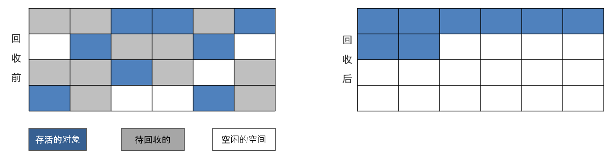
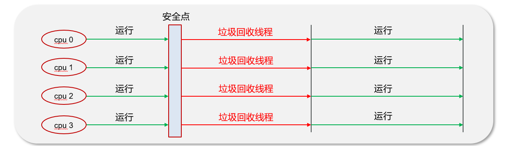

# JVM

## JVM是什么

**Java Virtual Machine**  Java程序的运行环境（java二进制字节码的运行环境）

好处：

- 一次编写，到处运行
- 自动内存管理，垃圾回收机制


## JVM由那些部分组成，运行流程是什么？

在JVM中共有四大部分，分别是**ClassLoader（类加载器）**、**Runtime Data Area（运行时数据区，内存分区）**、**Execution Engine（执行引擎）**、**Native Method Library（本地库接口）**

它们的运行流程是：


1. **类加载器（ClassLoader）**把Java代码转换为**字节码**
2. **运行时数据区（Runtime Data Area）**把字节码加载到内存中

    字节码文件只是JVM的一套指令集规范，并不能直接交给底层系统去执行，而是有执行引擎运行
3. **执行引擎（Execution Engine）**将字节码翻译为底层系统指令，再交由CPU执行去执行，此时需要调用其他语言的本地库接口（Native Method Library）来实现整个程序的功能。


## 能详细说一下 JVM 运行时数据区吗？

运行时数据区包含了**堆**、**方法区**、**栈**、**本地方法栈**、**程序计数器**这几部分，每个功能作用不一样。

- **堆**

    解决的是**对象实例存储的问题**，**垃圾回收器管理**的主要区域。
- **方法区**

    可以认为是堆的一部分，用于存储已被虚拟机加载的信息，**常量**、**静态变量**、**即时编译器编译后的代码**。
- **栈**

    解决的是**程序运行**的问题，栈里面存的是**栈帧**，栈帧里面存的是**局部变量表**、**操作数栈**、动态链接、方法出口等信息。
- **本地方法栈**

    与栈功能相同，本地方法栈执行的是**本地方法**，一个Java调用**非Java代码**的接口。
- **程序计数器（PC寄存器）**

    程序计数器中存放的是当前线程所执行的**字节码的行数**。JVM工作时就是通过变这个计数器的值来选取下一个需要执行的字节码指令。

## 详细介绍一下程序计数器的作用？

线程私有的，每个线程一份，内部保存的字节码的行号。用于记录正在执行的字节码指令的地址。

在并发执行多线程的时候保存的线程上下文。

## 你能给我详细的介绍Java堆吗?

Java中的堆术语线程共享的区域。主要用来保存对象实例，数组等，当堆中没有内存空间可分配给实例，也无法再扩展时，则抛出`OutOfMemoryError`异常。

在**JAVA8**中堆内会存在**年轻代**、**老年代**

- **年轻代**被划分为三部分
    - Eden区
    - 两个大小严格相同的**Survivor区**

    根据JVM的策略，在经过几次垃圾收集后，仍然存活于Survivor的对象将被移动到老年代区间。
- **老年代**

    主要保存**生命周期长的对象**，一般是一些老的对象


### Jdk1.7和1.8的堆区区别

- 1.7中有有一个**永久代**，存储的是类信息、静态变量、常量、编译后的代码
- 1.8**移除了永久代**，把数据存储到了本地内存的**元空间中**，防止内存溢出


## 能不能解释一下方法区？(本地方法栈)

**方法区(Method Area)**是各个线程共享的内存区域

主要存储**类的信息**、运行时**常量池**


虚拟机启动的时候创建，关闭虚拟机时释放

如果方法区域中的内存无法满足分配请求，则会抛出`OutOfMemoryError: Metaspace`

### 常量池

可以看作是一张表，虚拟机指令根据这张常量表找到要执行的类名、方法名、参数类型、字面量等信息


## 你听过直接内存吗？

直接内存：并不属于JVM中的内存结构，不由JVM进行管理。是虚拟机的系统内存，常见于 **NIO 操作**时，用于**数据缓冲区**，它分配回收成本较高，但**读写性能高**

以Java代码完成**文件拷贝**为例：


上面的方式需要两次拷贝数据，效率较低。


上面的方式使用了直接内存。直接内存是系统和Java都能访问的内存，节省了一半的拷贝时间。

## 什么是虚拟机栈

- 每个线程运行时所需要的内存，称为虚拟机栈，先进后出。虚拟机栈是**线程私有**的。
- 每个栈由多个**栈帧（frame）**组成，对应着每次方法调用时所占用的内存。每次方法调用都会产生栈帧。
- 每个线程只能有一个**活动栈帧**(栈顶那个)，对应着当前正在执行的那个方法。

    方法**开始执行**的时候会**进栈**，方法**执行完**会**出栈**【相当于清空了数据】，所以这块区域**不需要进行GC**。但有可能出现栈溢出：`java.lang.StackOverflowError`


### 栈内存分配越大越好吗？

未必，默认的栈内存通常为1024k，栈帧过大会导致线程数变少

### 方法内的局部变量是否线程安全？

如果**方法内局部变量**没有逃离方法的作用范围，它是**线程安全**的

如果是**局部变量引用了对象**，并逃离方法的作用范围，**需要考虑**线程安全


## 能说一下堆栈的区别是什么吗？

- **栈内存**一般会用来存储**局部变量**和**方法调用**

    **堆内存**是用来存储**Java对象**和**数组**的的。

    堆会**GC垃圾回收**，而栈不会。
- **栈内存**是**线程私有**的，而**堆内存**是**线程共有**的。
- 两者**异常错误不同**，但如果栈内存或者堆内存不足都会抛出异常。

    栈空间不足：`java.lang.StackOverFlowError`。

    堆空间不足：`java.lang.OutOfMemoryError`。

## 什么是类加载器，类加载器有哪些?


**JVM**只会运行**二进制文件**，类加载器的作用就是将**字节码文件****加载**到JVM中，从而让Java程序能够启动起来。

包括以下内容：

- **启动类加载器(BootStrap ClassLoader)**

    加载`JAVA_HOME/jre/lib`目录下的库，由C++编写实现
- **扩展类加载器(ExtClassLoader)**

    主要加载`JAVA_HOME/jre/lib/ext`目录中的类，是ClassLoader的子类
- **应用类加载器(AppClassLoader)**

    用于加载`classPath`下的类，是ClassLoader的子类
- **自定义类加载器(CustomizeClassLoader)**

    自定义类继承ClassLoader，实现自定义类加载规则。

## 说一下类装载的执行过程

类从加载到虚拟机中开始，直到卸载为止，它的整个生命周期包括了：加载、验证、准备、解析、初始化、使用和卸载这**7个阶段**。其中，验证、准备和解析这三个部分统称为连接（linking）


- **加载：**

    查找和导入`class`文件。

    通过类的全名，获取类的二进制数据流。

    解析**类的二进制数据流**为**方法区内的数据结构**（Java类模型）

    创建`java.lang.Class`类的实例，表示该类型。作为方法区这个类的各种数据的访问入口
- **验证：**

    保证加载类的准确性

    格式检查，如：文件格式是否错误、语法是否错误、字节码是否合规
- **准备：**

    为类变量分配内存并设置类变量初始值

    - `static`变量，分配空间在**准备阶段完成**（设置默认值），赋值在初始化阶段完成
    - `static`变量是`final`的**基本类型**，以及字符串常量，值已确定，赋值在**准备阶段完成**
    - `static`变量是`final`的**引用类型**，那么赋值也会在**初始化阶段完成**
        

- **解析：**

    把类中的符号引用转换为直接引用

    - 如果初始化一个类的时候，其父类尚未初始化，则**优先初始化其父类**。
    - 如果同时包含多个静态变量和静态代码块，则按照**自上而下**的顺序依次执行。
- **初始化：**

    对类的静态变量，静态代码块执行初始化操作
- **使用：**

    JVM 开始从入口方法开始执行用户的程序代码
- **卸载：**

    当用户程序代码执行完毕后，JVM 便开始销毁创建的 Class 对象，最后负责运行的 JVM 也退出内存

## 什么是双亲委派模型？

**一个类加载器**加载某一个类时，**不会自己先尝试加载这个类**，而是**先委托上一级的加载器**进行加载，如果上级加载器也有上级，则会继续向上委托，如果该类委托上级没有被加载，子加载器尝试加载该类。

## JVM为什么采用双亲委派机制

第一、通过双亲委派机制可以避免某一个类被重复加载，当父类已经加载后则无需重复加载，保证唯一性。


第二、为了安全，保证类库API不会被修改

举例：


## 简述Java垃圾回收机制？（GC是什么？为什么要GC）

为了**让程序员更专注于代码的实现**，而不用过多的考虑内存释放的问题，所以，在Java语言中，有了**自动的**垃圾回收机制，也就是我们熟悉的**GC(Garbage Collection)**。

比如c++需要手动delete指针。

或者悬挂指针的问题：


```C++
int* ptr = new int(10);
delete ptr;
*ptr = 20; // 悬挂指针，已释放内存后再写入，这是未定义行为，可能导致崩溃
```

有了垃圾回收机制后，程序员只需要关心内存的申请即可，内存的释放由**系统自动识别完成**。

在进行垃圾回收时，不同的对象引用类型，GC会采用不同的回收时机

## 强引用、软引用、弱引用、虚引用的区别？

- **强引用**

    表示一个对象处于**有用且必须**的状态。

    只有所有 GC Roots 对象都不通过【强引用】引用该对象，该对象才能被垃圾回收。

    

- **软引用**

    软引用表示一个对象处于**有用且非必须**状态。

    仅有软引用引用该对象时，在垃圾回收后，**内存仍不足**时会再次出发垃圾回收。

    
- **弱引用**

    表示一个对象处于**可能有用且非必须**的状态。

    仅有弱引用引用该对象时，在垃圾回收时，无论内存是否充足，都会回收弱引用对象。

    

    `ThreadLocal`内存泄漏问题就是这种情况.
- **虚引用**

    表示一个对象处于**无用的状态**。

    必须配合**引用队列**使用，被引用对象回收时，会将虚引用入队，由 **Reference Handler** 线程调用虚引用相关方法释放直接内存

    

## 对象什么时候可以被垃圾器回收

简单地说，如果一个或多个对象**没有任何的引用指向它了**，那么这个对象现在**就是垃圾**，如果定位了垃圾，则有可能会被垃圾回收器回收。

定位垃圾有两种方式：


- **引用计数法**

    一个对象**被引用了一次**，在当前的对象头上**递增一次引用次数**，如果这个对象的**引用次数为0**，代表这个对象**可回收**

    

    存在问题，**可能引发内存泄漏**：

    

    
- **可达性分析算法**

    Java 虚拟机中的垃圾回收器采用可达性分析来探索所有存活的对象

    扫描堆中的对象，看是否能够沿着**GCRoot 对象**为起点的**引用链**找到该对象，找不到，表示可以回收

    

### 哪些对象可以作为 GC Root ?

- **虚拟机栈**（栈帧中的本地变量表）中引用的对象
- **方法区**中**类静态属性**引用的对象
- **方法区**中**常量**引用的对象
- 本地方法栈中JNI（即一般说的**Native方法**）引用的对象

## JVM 垃圾回收算法有哪些？

- **1.标记清除算法**

    标记清除算法，是将垃圾回收分为2个阶段，分别是**标记**和**清除**。

    - 1.根据可达性分析算法得出的垃圾进行标记

        
    - **2.**对这些标记为可回收的内容进行垃圾回收

        

    优点：标记和清除**速度较快**

    缺点：**碎片化**较为严重，内存不连贯的
- **3.标记整理算法**

    优缺点同标记清除算法，解决了标记清除算法的碎片化的问题，同时，标记压缩算法多了一步，对象移动内存位置的步骤，其效率也有有一定的影响。

    
- **复制算法**

    

    优点：

    - 在**垃圾对象多**的情况下，**效率较高**
    - 清理后，内存无碎片

    缺点：

    分配的2块内存空间，在同一个时刻，只能使用一半，内存使用率较低
- **分代回收**

    **堆的区域划分：**

    - 堆被分为了两份：**新生代**和**老年代**【1：2】
    - 对于新生代，内部又被分为了三个区域。

        **Eden区**，**幸存者区**survivor(分成from和to)【8：1：1】

        

    **分代回收策略**

    1.**新创建**的对象，都会先分配到**eden区**

    2.当**伊甸园内存不足**，**标记**伊甸园与from（现阶段没有）的**存活对象**

    3.将存活对象采用复制算法**复制到to**中，复制完毕后，伊甸园和from 内存都得到释放

    4.经过一段时间后伊甸园的内存又出现不足，标记eden区域to区存活的对象，将其复制到from区

    5.当幸存区对象熬过几次回收（最多**15次**），**晋升到老年代**（幸存区内存不足或大对象会提前晋升）

    

## MinorGC、 Mixed GC 、 FullGC的区别是什么

- **MinorGC**发生在**新生代**的垃圾回收，暂停时间短（STW）
- **MixedGC** **新生代 + 老年代部分区域**的垃圾回收，**G1 收集器**特有
- **FullGC：** **新生代+ 老年代完整**垃圾回收，暂停时间长（STW），应尽力避免

## 说一下 JVM 有哪些垃圾回收器？

在jvm中，实现了多种垃圾收集器，包括：

- **串行垃圾收集器**

    **Serial**和**Serial Old**串行垃圾收集器，是指使用单线程进行垃圾回收，堆内存较小，适合个人电脑

    **Serial** 作用于**新生代**，采用**复制算法**

    **Serial Old** 作用于老年代，采用标记-整理算法

    垃圾回收时，只有一个线程在工作，并且java应用中的**所有线程都要暂停（STW）**，等待垃圾回收的完成。

    
- **并行垃圾收集器(JDK8默认)**

    **Parallel New**和**Parallel Old**是一个并行垃圾回收器，JDK8默认使用此垃圾回收器

    **Parallel New**作用于**新生代**，采用**复制算法**

    **Parallel Old**作用于**老年代**，采用**标记-整理算法**

    垃圾回收时，**多个线程在工作**，并且java应用中的**所有线程都要暂停（STW）**，等待垃圾回收的完成。

    
- **CMS（并发）垃圾收集器**

    **CMS**全称 **Concurrent Mark Sweep**，是一款**并发的**、使用**标记-清除算法**的垃圾回收器，该回收器是**针对老年代**垃圾回收的，是一款以**获取最短回收停顿时间**为目标的收集器，停顿时间短，用户体验就好。其最大特点是在进行垃圾回收时，应用仍然能正常运行。

    

    - CMS追求低停顿（Low Pause），适合对响应时间要求高的应用。
    - 采用传统的分代收集（新生代、老年代）。
    - **新生代**使用**复制算法**（通常是ParNew收集器）。
    - **老年代**使用**标记-清除算法**（Mark-Sweep）。因此老年代会产生碎片。
    - CMS 的设计目标主要是**低停顿**（低延迟），而不是高吞吐量。它适用于对响应时间敏感、需要较短GC停顿的应用场景，比如Web服务器、在线交易系统等。
    - 由于收集时应用线程与GC线程并发执行，GC期间应用程序能继续工作，但GC本身需要消耗一定的CPU资源，整体吞吐量通常低于以吞吐量为目标的收集器（如Parallel GC）。

- **G1垃圾收集器(JDK9默认)**

    划分成多个区域，每个区域都可以充当eden，survivor，old， humongous，其中 humongous 专为大对象准备

    采用**复制算法**

    响应时间与吞吐量**兼顾**

    如果并发失败（即回收速度赶不上创建新对象速度），会触发 **Full GC**

    G1收集器**兼顾高吞吐量和低延迟**。

    分成三个阶段：

    - **新生代回收**

        初始时，所有区域都处于空闲状态

        创建了一些对象，挑出一些空闲区域作为伊甸园区存储这些对象

        当伊甸园需要垃圾回收时，挑出一个空闲区域作为幸存区，用复制算法复制存活对象，需要暂停用户线程

        

        变化为

        

        随着时间流逝，伊甸园的内存又有不足

        将**伊甸园**以及之前**幸存区**中的**存活对象**，采用**复制算法**，复制到**新的幸存区**，其中较老对象晋升至**老年代**

        

        变为

        
    - **并发标记**

        当老年代占用内存超过**阈值**(默认是**45%**)后，触发**并发标记**，这时无需暂停用户线程

        并发标记之后，会有**重新标记**阶段**解决漏标问题**，此时需要暂停用户线程。

        这些都完成后就知道了老年代有哪些**存活对象**，随后进入混合收集阶段。此时不会对所有老年代区域进行回收，而是根据暂停时间目标**优先回收价值高（存活对象少）的区域**（这也是GabageFirst 名称的由来）。

        
    - **混合收集**

        进行回收

        

        复制完成，内存得到释放。进入下一轮的新生代回收、并发标记、混合收集

        

## Minor GC、Major GC、Full GC是什么

指的是不同代之间的垃圾回收


- **Minor GC**

    发生在**新生代**的垃圾回收，暂停时间短
- **Major GC**

    **老年代**区域的垃圾回收，老年代空间不足时，会先尝试触发Minor GC。Minor GC之后空间还不足，则会触发Major GC，Major GC速度比较慢，暂停时间长
- **Full GC**

    **新生代 + 老年代**完整垃圾回收，暂停时间长，应尽力避免

## JVM 调优的参数可以在哪里设置参数值？

- **war包部署在**`tomcat`**中设置**

    修改`TOMCAT_HOME/bin/catalina.sh`文件

    
- **jar包部署在启动参数设置**

    通常在linux系统下直接**加参数**启动springboot项目

    

    `nohup`: 用于在系统后台不挂断地运行命令，退出终端不会影响程序的运行

    `参数 &` ：让命令在后台执行，终端退出后命令仍旧执行。

## 用的 JVM 调优的参数都有哪些？

对于JVM调优，主要就是调整年轻代、老年代、元空间的**内存空间大小**及使用的**垃圾回收器类型**。

- **设置堆空间大小**

    设置**堆的初始大小**和**最大大小**，为了防止垃圾收集器在初始大小、最大大小之间收缩堆而产生额外的时间，通常把最大、初始大小设置为相同的值。

    

    堆空间设置多少合适？

    - **最大**大小的默认值是**物理内存的1/4**，**初始**大小是**物理内存的1/64**
    - **堆太小**，可能会频繁的导致年轻代和老年代的**垃圾回收**，会产生stw，暂停用户线程
    - 堆内存**大**肯定是好的，存在风险，假如发生了`fullgc`,它会**扫描整个堆空间**，暂停用户线程的时间长
    - 设置参考推荐：尽量大，也要考察一下当前计算机其他程序的内存使用情况
- **虚拟机栈的设置**

    

    每个线程默认会开启1M的内存，用于存放栈帧、调用参数、局部变量等，但一般256K就够用。通常减少每个线程的堆栈，可以产生更多的线程，但这实际上还受限于操作系统。
- **年轻代中Eden区和两个Survivor区的大小比例**

    
- **年轻代晋升老年代阈值**

    
- **设置垃圾回收收集器**

    通过增大吞吐量提高系统性能，可以通过设置并行垃圾回收收集器。

    

## 你们平时调试 JVM都用了哪些工具呢？

**命令工具**

- **jps 进程状态信息**

    
- **jstack 查看java进程内线程的堆栈信息**

    

    
- **jmap 用于生成堆转内存快照、内存使用情况**

    

    `format=b`表示以hprof二进制格式转储Java堆的内存

    `file=<filename>`用于指定快照dump文件的文件名。

    它是一个进程或系统在某一给定的时间的快照。比如在**进程崩溃**时，甚至是任何时候，我们都可以通过工具将系统或某进程的内存备份出来供调试分析用。dump文件中包含了程序运行的模块信息、线程信息、堆栈调用信息、异常信息等数据，方便系统技术人员进行错误排查。
- **jhat 堆转储快照分析工具**
- **jstat JVM统计监测工具**

    是JVM统计监测工具。可以用来显示垃圾回收信息、类加载信息、新生代统计信息等。

    

**可视化工具**

- **jconsole 用于对jvm的内存，线程，类 的监控**

    用于对jvm的内存，线程，类 的监控，是一个基于 jmx 的 GUI 性能监控工具

    打开方式：java 安装目录 bin目录下 直接启动 `jconsole.exe` 就行
- **VisualVM 能够监控线程，内存情况**

    能够监控线程，内存情况，查看方法的CPU时间和内存中的对象，已被GC的对象，反向查看分配的堆栈

    打开方式：java 安装目录 bin目录下 直接启动 `jvisualvm.exe`就行

## 假如项目中产生了java内存泄露，你说一下你的排查思路？


1. **获取堆内存快照dump**

    使用`jmap`命令获取运行中程序的`dump`文件

    

    有的情况是内存溢出之后程序则会直接中断，而jmap只能打印在运行中的程序，所以建议**通过参数的方式**的生成dump文件

    
2. **VisualVM去分析dump文件**

    文件-->装入--->选择dump文件即可查看堆快照信息

    
3. **通过查看堆信息的情况，定位内存溢出问题**
   
    
4. **找到对应的代码，通过阅读上下文的情况，进行修复即可**

## 服务器CPU持续飙高，你的排查方案与思路？

1. **使用top命令查看占用cpu的情况**

    
    
2. **通过top命令查看后，可以查看是哪一个进程占用cpu较高，上图所示的进程为：40940**
3. **查看进程中的线程信息**

    

    

    通过以上分析，在进程40940中的线程40950占用cpu较高
4. **可以根据线程 id 找到有问题的线程，进一步定位到问题代码的源码行号**

    

    

