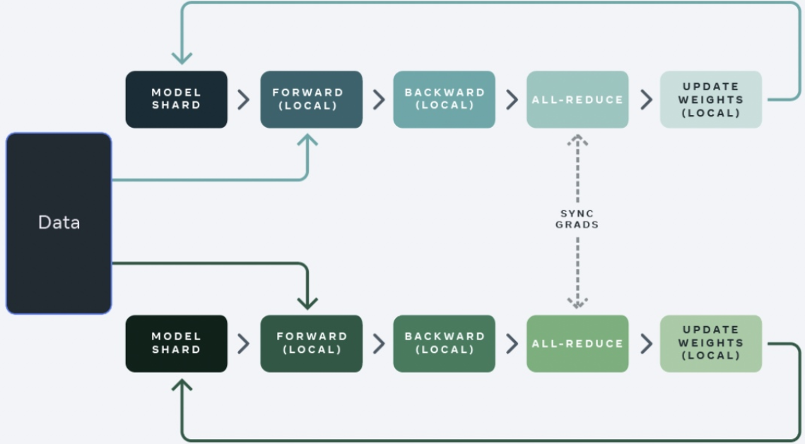
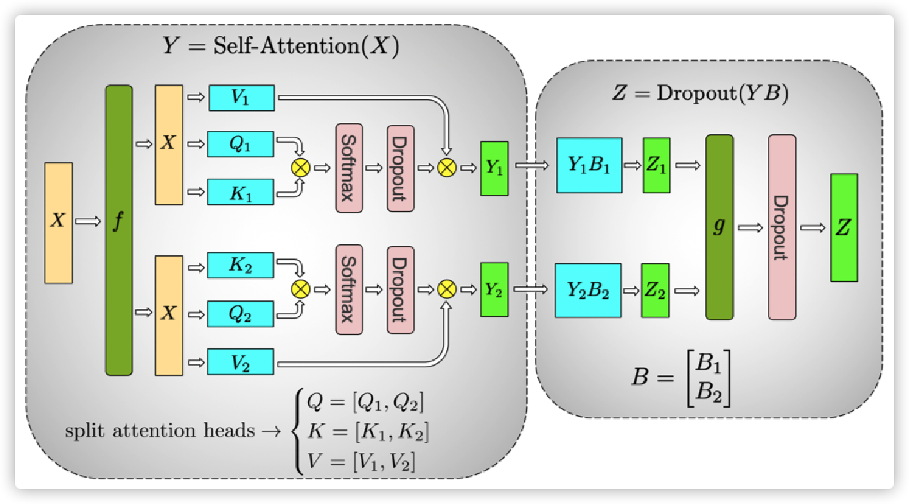
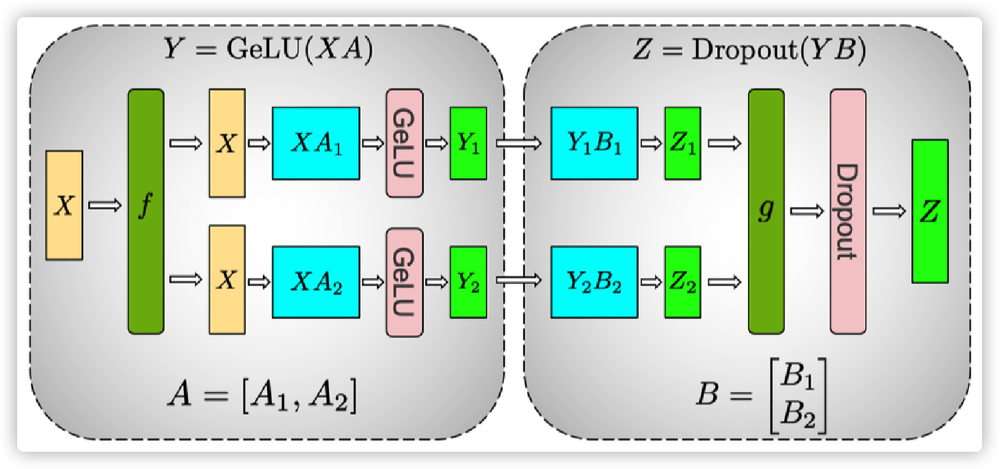
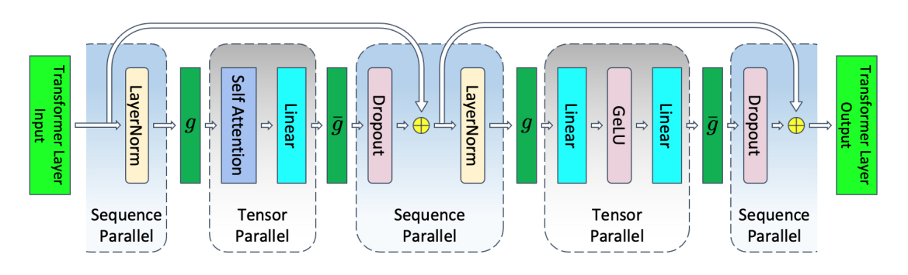
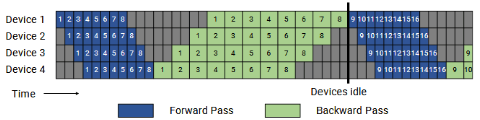
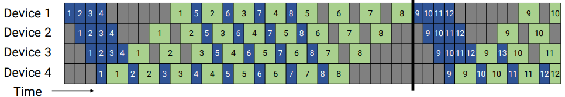
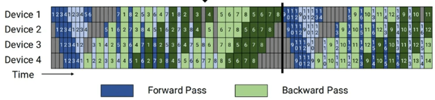

# 并行策略简介
在大模型训练中，由于数据量和模型复杂度的增加，单个计算节点的计算能力难以满足训练的需求。为了提高训练效率和加速训练过程，通常采用并行策略来将计算任务分配给多个计算节点进行计算。

并行策略通常分为DP（Data Parallelism，数据并行）、TP（Tensor Parallelism，张量并行）、PP（Pipeline Parallelism，流水线并行）、SP（Sequence Parallelism，序列并行）等多种并行模式。在实际应用中，通常会同时使用多种并行的混合并行策略，以及多种优化手段，例如使用ZeRO优化器、重计算等方式，以减少模型对内存的使用，提高训练的效率和加速训练的过程。因此并行策略设计与模型的效率息息相关，在模型调优之前先确定一组或多组较优的并行策略，是至关重要的。

## 数据并行（DP）
数据并行将训练数据划分为多个批次，并将每个批次分配给不同的设备进行并行处理，每张计算卡都并行处理不同批次的数据，然后将结果合并。在数据并行中，每张计算卡都拥有自己的内存和计算资源，可以独立地处理数据，但由于每张计算卡上存在一份完整的模型权重副本，所以对显存会有更多的要求。换而言之，在每个worker之上复制一份模型，这样每个worker都有一个完整模型的副本。输入数据集是分片的，一个训练的小批量数据将在多个worker之间分割；worker定期汇总它们的梯度，以确保所有worker看到一个一致的权重版本。对于无法放进单个worker的大型模型，人们可以在模型之中较小的分片上使用数据并行。

## 张量并行（TP）

张量并行是一种基于张量（Tensor）概念的数据处理和分析方法。张量是一种多维数组，通过对其进行分解和并行计算，实现高效的数据处理。其核心思想是将张量分解为多个小张量，然后对这些小张量进行并行计算。这种方法可以显著减少计算时间和内存占用，提高计算效率。在计算过程中，张量被列切分，然后在不同设备上分配不同的列张量，最后在计算完成后对结果进行拼接。

在图2中，可以看到，左边输入的X经过f 后被拆成两个张量，对于权重的QKV同样拆分，计算得到Y1和Y2，最后合并到图中最右边的Z，最终完成了一次张量并行计算。

## 序列并行（SP）

序列并行是一种针对输入序列进行列切分的并行计算方式，它可以在张量并行的基础上进一步提高计算效率。在序列并行中，计算过程中的权重会进行行切分，然后同其他张量并行方法一起放置在同一台计算设备上进行计算。完成计算后，会进行加操作，从而得到最终的结果。与其他并行计算方式相比，序列并行并不会增加额外的通信量，因此在开启张量并行的同时建议也同步开启序列并行。此外，序列并行还可以与现有的数据并行、流水线并行一起使用，从而实现更高效的4D并行计算。

## 流水线并行（PP）

流水线并行是将同一个任务分成多个阶段，每个阶段由不同的处理器处理，然后将结果传递给下一个阶段，以实现并行计算。此种并行方式，特别适用于深层模型，可以充分利用多个设备的计算能力，大幅减小模型对内存的依赖，且计算的通信可以重叠，所以对通信需求较低。但流水线之间存在空闲 bubble，对训练效率有较大影响。存在以下几种模式：
- GPipe模式

    GPipe模式下，所有微批次（以数字表示）均为前向传播（Forward Pass，蓝色方块），然后为后向传播（Backward Pass，绿色方块）。灰色区域表示流水线气泡。为简单起见，我们假设后向传播的时间是前向传播的两倍。本例中的每个批次由8个微批次组成，每个蓝色或绿色方块中的数字是给相应微批次的唯一标识符（比如，第一批由1−8个微批次组成，第二批由微批次9−16组成等）。该模式一方面空泡比率高，另一方面峰值内存占比高。可以看出，m个micro-batch（每张卡的批次）反向算梯度的过程，都需要之前的前向保存的激活值，所以在m个micro-batch 前向结束时，达到内存占用的峰值。

    当然了，可以利用重计算（即Re-Materialization，以释放前向激活值，只保留模型切段的部分激活值和种子信息）来解决GPipe模式下显存占用高的问题，但是重计算本质上是时间换空间的策略，节省空间的同时，会导致计算耗时增加。

    
- PipeDream

    PipeDream的方案如图6所示，把一个迭代分成三个阶段：

    1. 预热前向传播阶段（Warmup forward passes）：在这里，除了最后一个stage（阶段，图中的每一个格子代表一个阶段），每个worker会做前向计算，进行不同数目的前向传播，并且向其下游发送激活，一直到最后一个stage被激发。该计划将执行中的（即in-flight）微批次数量（即未完成反向传播且需要保持激活的微批次数量）限制在流水线深度之内，而不是一个批次中的微批次数量。
    
    2. 稳定1F1B（1 Forward 1 Backward，一次前向，一次反向）阶段（Run 1F1B in steady state）：进入稳定状态之后，每个worker都进行1F1B操作。

    3. 冷却反向传播阶段（Cooldown backward passes）：此阶段会把执行中的（in-flight）的微批次执行完毕，只是执行反向计算和向反向计算下游发送梯度。

    其相对与GPipe的改进在内存方面，气泡率和GPipe一致，但通过合理安排前向和反向过程的顺序，在step中间的稳定阶段，形成1前向1反向的形式，称为1F1B模式。在这个阶段，每个Device上最少只需要保存1份micro-batch的激活值，最多需要保存p份激活值。从图6可以看到，激活值份数的上限从micro-batch数量m变成了pipeline stage阶段p，这样就可以依据m远大于p的原则有效降低空泡占比。

    
- Virtual pipe模式

  virtual pipeline如图7所示，假定当前模型网络共16层（编号 0-15），4个Device，前述GPipe模式和PipeDream是分成4个stage， 按编号0-3层放Device1，4-7层放Device2，并以此类推。virtual pipeline则是按照文中提出virtual_pipeline_stage概念减小切分粒度，以virtual_pipeline_stage=2为例，将0-1层放Device1，2-3层放在Device2，...，6-7层放到 Device4，8-9层继续放在Device1，10-11层放在Device2，...，14-15层放在Device4。在steady的时候也是1F1B的形式，叫做1F1B-interleaving。按照这种方式，Device之间的点对点通信次数或通信量变为原来的virtual_pipeline_stage倍，但空泡比率降低了。若定义每个Device 上有v个virtual stages，在Device数量不变的情况下，分出更多的pipeline stage，以更多的通信量换取空泡比率降低（气泡率与PipeDream降低到1/v），进而减小了该step的端到端耗时。

  

## Zero模式

Zero模式是一种节省内存的方法，Zero模式会带来通信策略的变化。

模型的内存占用主要由优化器状态（optimizer states）、梯度（gradient）和权重（weight）组成。在传统数据并行下，每个设备都会复制一份模型数据，占用了大量显存，而ZeRO优化的主要原理就是将这些数据进行切分，分别存在各个设备上，在需要用到的时候通过集合通信进行同步，不需要了就释放掉相关显存，来减少显存的使用峰值，是一种典型的时间换空间的办法。

总共有ZeRO 1、ZeRO 2、ZeRO 3三个阶段：

1. ZeRO 1：模型的权重更新，需要优化器状态参与计算，并得出新的权重。在正向和反向传播中，优化器状态并不参与到其中的计算，所以可以将优化器状态进行切分，每个设备都只保存一部分。在正向反向计算完成后，每个设备都只负责更新那一部分的权重，最后再进行集合通信对新的模型权重进行同步。
2. ZeRO 2：在ZeRO 1的基础上，对梯度信息（gradient）也进行切分，既然我们只有一部分的优化器状态，那么其实我们也只是需要那一部分的梯度信息来更新模型权重。在一个 Layer的梯度被计算出来后会通过集合通信来聚合，聚合后的梯度信息只会被需要的设备保存，其他不需要的设备就会释放掉，以节省显存使用。注意，ZeRO 2开始便与流水并行不兼容。
3. ZeRO 3：在ZeRO 1和ZeRO 2的基础上，对模型权重也进行切分，分配的不同的设备上。只在需要的时候通过集合通讯进行同步，在计算完成后便立即释放。相较于ZeRO 1和ZeRO 2，此优化更加复杂，虽然节省了更显存，但设备间的通信数据也大幅增加，对模型训练的效率影响也较大。

## 重计算

重计算是一种以时间换空间的策略。重计算的思路是在正向计算中不再保存（反向计算依赖的）中间结果，而是在反向计算时进行重新计算，从而减少模型训练中的显存需求。

重计算技术允许更大规模的模型和更长的序列进行计算，特别是对于内存受限的环境。然而，重计算也可能增加计算开销，因为需要重新计算一些中间结果。因此，在实际应用中，需要综合考虑显存和计算的平衡，选择适当的重计算策略。