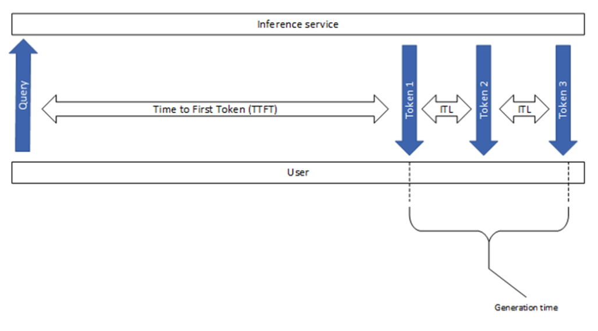
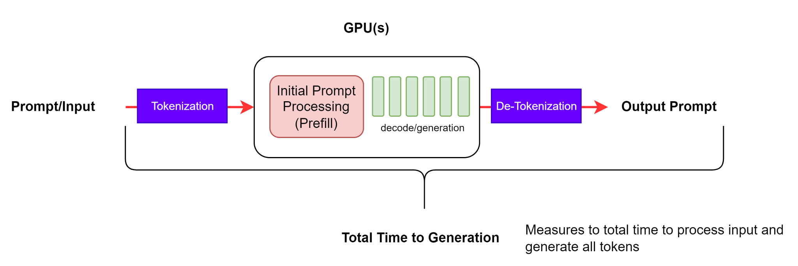

# 指标

本节介绍一些常见的大型语言模型（LLM）推理指标。请注意，不同工具之间的基准测试结果可能存在差异。下图展示了一些广泛使用的LLM推理性能指标。

**图1. 流行的LLM推理性能指标概览。**

---

## 首个Token时间（TTFT）

该指标表示用户从提交查询到看到模型输出的等待时间。即从提交请求到接收到第一个token的时间（如果响应非空）。

**图2：TTFT - 包含第一个输出token的分词和反分词步骤的首个token时间。**

> **注意**  
> NVIDIA GenAI-Perf和LLMPerf基准工具会忽略无内容或空字符串（无token）的初始响应，因为当首个响应没有token时，TTFT测量无意义。

TTFT通常包括请求排队时间、预填充时间和网络延迟。提示越长，TTFT越大。这是因为注意力机制需要整个输入序列来计算并创建所谓的键值缓存（KV-cache），之后才能开始迭代生成循环。此外，生产环境中可能有多个请求同时进行，一个请求的预填充阶段可能与另一个请求的生成阶段重叠。

> **注意**  
> 传统的Web服务基准工具如K6也可以通过HTTP请求的计时事件提供TTFT。

## 端到端请求延迟（e2e_latency）

该指标表示从提交查询到接收完整响应所需的时间，包括排队/批处理机制的性能和网络延迟，如图3所示。

**图3. 端到端请求延迟**

> **注意**  
> 在流式模式下，当部分结果返回给用户时，反分词步骤可能多次执行。

对单个请求，端到端请求延迟是请求发送时间与最后一个token接收时间的差值。因此：

$$ \begin{aligned} e2e\_latency = TTFT + Generation\_time \end{aligned} $$

> **注意**  
> 生成时间是从接收到第一个token到接收到最后一个token的持续时间，如图1所示。此外，GenAI-Perf会移除最后的[done]信号或空响应，因此它们不计入e2e延迟。

## Token间延迟（ITL）

定义为连续token之间的平均时间，也称为每个输出token的时间（TPOT）。

**图4：ITL - 连续token生成之间的延迟。**

虽然定义看似简单直接，但不同基准工具在采集该指标时有细微差别。例如，是否应包含首个token时间（TTFT）？NVIDIA GenAI-Perf不包含，LLMPerf包含。

GenAI-Perf对ITL的定义为：

$$ \begin{aligned}\\\frac{\text{e2e\_latency} - \text{TTFT}}{\text{Total\_output\_tokens} - 1}\\\end{aligned} $$

该公式不包括首个token（分母减1），以使ITL仅反映解码部分的处理时间。

需要注意的是，随着输出序列变长，KV缓存增大，内存成本增加。注意力计算的成本也随之增长：每生成一个新token，该成本与输入 + 输出序列长度线性相关（但通常不受计算能力限制）。稳定的token间延迟表明内存管理高效，内存带宽和注意力计算也更高效。

---

## 每秒Token数（TPS）

系统总TPS表示所有同时请求产生的总输出token数除以时间。随着请求数增加，总TPS会上升，直到达到GPU计算资源饱和点，此后可能下降。

给定基准测试中所有请求的时间线：

 
**图5：基准测试运行中的事件时间线**

定义变量：

| 变量       | 含义                         |
|------------|------------------------------|
| \(Li\)    | 第\(i\)个请求的端到端延迟    |
| \(T_start\) | 基准测试开始时间          |
| \(T_x\)    | 第一个请求的时间戳           |
| \(T_y\)    | 最后一个请求的最后响应时间戳 |
| \(T_end\)   | 基准测试结束时间          |

GenAI-Perf定义TPS为总输出token数除以第一个请求和最后一个响应之间的端到端延迟：

$$ \begin{aligned} \frac{Total\_output\_tokens}{Ty - Tx} \end{aligned} $$

LLM-Perf定义TPS为总输出token数除以整个评测的时长：

$$ \begin{aligned}\frac{\text { Total\_output\_tokens }}{T_{\text {end }}-T_{\text {start }}}\end{aligned} $$

因此，该指标还包含以下开销：（1）输入提示生成；（2）请求准备；（3）响应存储。在单并发场景下，这些开销有时占基准时长的33%。

注意，此计算是批量完成的，而非实时运行指标。此外，GenAI-Perf使用滑动窗口技术寻找稳定测量值，意味着计算指标时排除了“预热”和“冷却”请求。

单用户TPS表示单个用户视角的吞吐量，定义为：(Output sequence length)/(e2e_latency)

随着输出序列长度增加，该值渐近于 1/ITL。随着系统中并发请求增加，总TPS增加，但单用户TPS下降，因为延迟变差。

## 每秒请求数（RPS）

表示系统每秒成功完成的请求平均数量。计算公式为：

$$ RPS = \frac{total\_completed\_requests}{Ty - Tx} $$