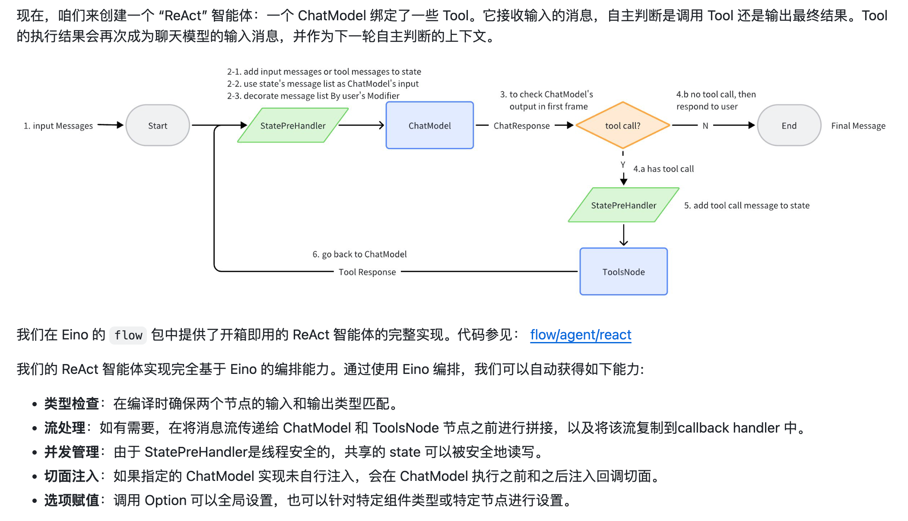
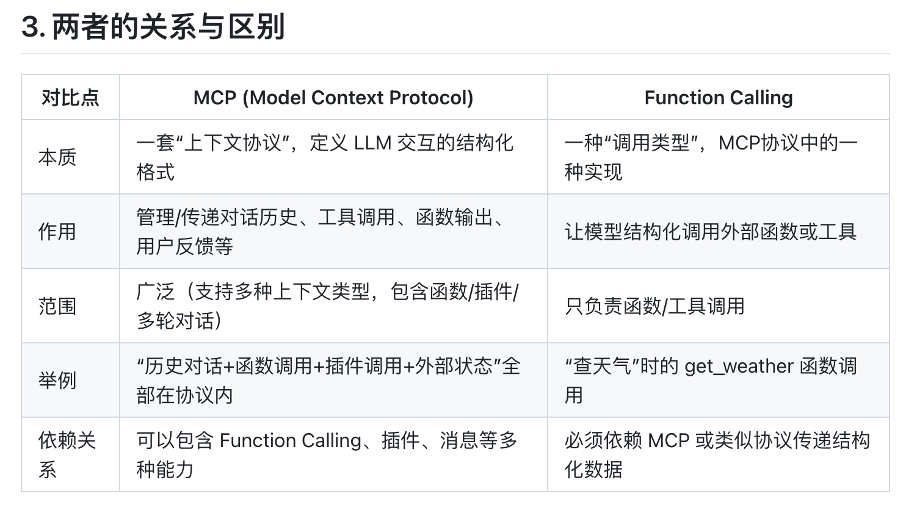

# 目前流行的 Agent Workflow 有哪些？

## 目前主流的 Agent Workflow（智能体工作流）模式

1. **ReAct（Reason + Act）**

    **是什么：**

    ReAct 模式融合了“推理（Reasoning）”和“行动（Acting）”。Agent 通过交替进行思考（分析当前状态、推断下一步）和行动（采取具体操作、调用工具或环境），实现动态决策与多步任务执行。    

    **最大特点：**

    - 推理与行动交替进行，Agent 可边思考边执行，遇到新信息时能及时调整决策。

    - 鼓励 Agent 明确表达自己的思考过程（类似 Chain of Thought），但每一步思考后可以立即采取行动。

    **缺陷：**

    - 任务步骤过多时效率比较低

    - 依赖推理环节的准确性。

    **例子：**
    假设 Agent 需要帮用户预定火车票。

        Reason: “我需要知道目的地和时间。”

        Act: 询问用户目的地。

        Reason: “用户说去上海，需要查上海的车次。”

        Act: 查询数据库获取车次列表。

        Reason: “有多趟车，可以向用户推荐最早的。”

        Act: 推荐给用户。
    
    eino的reAct示例：

    
    
    https://github.com/cloudwego/eino/blob/main/flow/agent/react/react.go

2. **Plan & Execute（规划-执行）**

    **是什么？**

    Agent 首先整体规划整个任务，把目标拆解为一系列子任务或步骤，然后顺序、分批执行每个子任务。

    **最大特点：**

    先规划、后执行，流程通常是线性的。

    任务分解和执行相互独立，计划阶段结束后不再动态调整。

    **优势：**

    对于结构清晰、步骤明确的流程非常高效。

    易于监控和审计，因为整个计划和执行过程一目了然。

    **缺陷：**

    缺乏即时调整能力，计划外变化时适应能力弱。
    
    计划阶段错误会导致后续执行全部出错。
    
    例子：
    
    开源项目Deepwiki-open

3. **Tool-Augmented LLM Agent（工具增强型智能体）**

    **是什么？**
    
    Agent 具备动态调用外部工具、API、数据库等能力，能突破大语言模型的知识和能力局限，实现更丰富的任务处理。

    **最大特点：**

    LLM 结合外部工具，动态选择和调用合适的工具辅助决策。
    
    通常采用 **Function Calling**、**插件机制**等实现。

    **Function Calling:**

        Function Calling 是指大语言模型（如 OpenAI GPT-4、Gemini、Claude 等）在推理过程中，能够“理解”并自动生成符合预设格式的函数调用请求，然后由外部系统实际执行这些函数，并将结果返回给模型。

        这种方式让 LLM 能直接与外部世界（API、数据库、工具等）进行交互，而不是只生成文本。

        函数定义：开发者先用 OpenAPI/JSON Schema 等定义一组可供调用的函数（包括名称、参数、描述、返回值等）。

        模型推理：用户提问时，模型根据输入内容和函数定义，决定是否需要调用某个函数，并自动生成函数调用请求（包括参数）。

        执行与反馈：平台收到模型的函数调用请求后，实际执行对应代码或 API，把执行结果（如数据、结果等）再反馈给模型，模型据此继续生成后续文本或调用。
    
    ```go

    // ===模型绑定工具===

    import "github.com/cloudwego/eino/schema"

    // 定义工具
    tools := []*schema.ToolInfo{
        {
        Name: "search",
        Desc: "搜索信息",
        ParamsOneOf: schema.NewParamsOneOfByParams(map[string]*schema.ParameterInfo{
            "query": {
                Type:     schema.String,
                Desc:     "搜索关键词",
                Required: true,
            },
        }),
        },
    }

    // 绑定可选工具
    err := model.BindTools(tools)

    // 绑定强制工具
    err := model.BindForcedTools(tools)

    // ===直接对话===
    package main

    import (
        "context"
        "time"
        
        "github.com/cloudwego/eino-ext/components/model/openai"
        "github.com/cloudwego/eino/schema"
    )

    func main() {
        ctx := context.Background()
        
        // 初始化模型
        model, err := openai.NewChatModel(ctx, &openai.ChatModelConfig{
            APIKey:  "your-api-key", // required
            Timeout: 30 * time.Second,
            Model:   "gpt-4", // required
        })
        if err != nil {
            panic(err)
        }
        
        // 准备消息
        messages := []*schema.Message{
            schema.SystemMessage("你是一个助手"),
            schema.UserMessage("介绍一下 eino"),
        }
        
        // 生成回复
        response, err := model.Generate(ctx, messages)
        if err != nil {
            panic(err)
        }
        
        // 处理回复
        println(response.Content)
    }

    ```
    
    **优势：**

    扩展性强，适合需要实时数据、计算或外部资源的任务。
    
    可处理更复杂、更现实的业务场景。
    
    **缺陷：**

    依赖外部工具的可用性和安全性，链路复杂。
    
    工具调用的选择和参数匹配需要精心设计，否则容易出错。
    
    **例子：**
    
    开源项目 OpenManus

4. **Multi-agent Collaboration（多智能体协作）**

    **是什么？**

    多个 Agent 按照分工协作，共同完成复杂任务。每个 Agent 负责不同的子任务或角色，可以互相通信。

    **最大特点：**

    多个 Agent 有各自专长，分工明确。
    
    支持并行处理，提高效率。
    
    **优势：**

    适合大规模、复杂或需要多领域知识的任务。
    
    可以灵活扩展，动态组队。
    
    **缺陷：**

    通信和协作成本高，任务拆解和协调复杂。
    
    容易出现冲突或死锁，需要良好的协调机制。
    
    **例子：**
    
    一个多 Agent 团队完成市场调研：

    一个 Agent 负责数据收集、一个负责分析、一个负责报告生成，三者协作输出最终结果。

    开源项目AutoGen

5. **Chain of Thought（思维链）**

    **是什么？**

    Agent 在回答问题或执行任务时，显式地逐步展示自己的推理和中间过程，而不是直接给出最终答案。

    **最大特点：**

    强调中间推理，每一步都清晰可见。
    
    源于大语言模型的“思维链”提示设计。
    
    **优势：**

    可解释性强，便于发现和纠正错误。
    
    对于多步骤逻辑推理类任务表现更好。
    
    **缺陷：**

    输出内容冗长，可能影响效率。
    
    纯粹思维链无法主动行动或调用外部工具。

    **例子:**

    chain of thought paper:

    https://arxiv.org/abs/2201.11903

6. **Self-Reflective/Iterative Agent（自我反思/迭代型智能体）**

    **是什么？**

    Agent 输出初稿后主动自查，发现问题后自动修改，反复优化，直到达标。适合主观性强、对质量要求高的场景。

    **最大特点：**

    具备自我评估和纠错能力，反复迭代。

    **优势：**

    输出质量高，能持续提升。
    
    减少人工 Review 负担。

    **缺陷：**

    计算资源消耗大，响应慢。
    
    设计不当易陷入无效循环。

    **例子：**

    MetaGPT、AutoGen 都有自反思机制

## 目前主流的Agent 工作流平台、框架

- Eino

    Eino 是一个开源的多智能体（Multi-Agent）工作流编排平台，强调多 Agent 协作、可视化和灵活的任务拆解。它支持 Agent 间的消息通信、任务分配、流程管理，并且能够与外部工具集成。

    - 多 Agent 协作与通信

    - 强调“流程可视化”和“任务追踪”

    - 可与第三方 LLM、API、数据库、插件等集成

    - 支持自定义 Agent 能力和行为

- Coze

    Coze（字节跳动推出）是面向企业和开发者的 Agent 开发与托管平台，主打低代码/可视化构建、API 接入和多渠道部署（如微信、钉钉、网页等）。

    - 拖拽式可视化流程编辑器

    - 丰富的插件市场，支持多种工具/API

    - 强大的多渠道集成（企业微信、钉钉、网页、移动端等）

    - SaaS 托管服务，易于部署和运维

- Dify

    Dify 是一个开源的 LLM 应用开发平台，支持工作流编排、插件集成、数据管理、可视化和一站式部署，适合快速构建和上线 AI Agent 应用。

    - 可视化工作流设计与管理

    - 内置“对话流”“Agent 流程编排”

    - 插件和工具市场

    - 数据中台支持，适合企业数据流转

    - 多模型支持（OpenAI、Qwen、GLM、Azure 等）

- LangChain

    LangChain 是当前最流行的开源 LLM 应用开发框架，支持链式推理、Agent 编排、多工具集成。它为构建复杂 LLM 应用（如多步推理、插件调用、工具链衔接）提供了强大的抽象能力。

- LangGraph

    LangGraph 是 LangChain 推出的“流程图式” LLM 工作流编排框架，基于有向图（DAG/Graph）将 Agent、工具及流程节点进行灵活连接，适合复杂、多分支的 Agent 应用开发。

    - 基于图的流程编排（Graph-based Workflow）

    - 支持分支、循环、条件判断等复杂流程

    - 与 LangChain 深度集成

    - 易于可视化和扩展

总结来说：

Eino：偏向于需要“多 Agent 协作”、“可视化流程”且自托管的团队。

Coze：适合企业级、低代码、希望快速上线多渠道 Agent 的用户。

Dify：适合需要一站式开发、管理、上线 LLM Agent 的团队，对数据流和插件有较高需求。

LangChain：适合技术开发者，需要高度定制和灵活的 LLM 工作流。

LangGraph：适合需要复杂分支/循环/流程可视化的 Agent 工作流，且与LangChain 配合更佳。

## FunctionCalling 与MCP有什么联系？

MCP（Model Context Protocol） 是由 OpenAI 等公司提出的一种用于 LLM（大语言模型）与外部世界（如工具、API、函数、数据库等）交互的“标准协议”或“上下文管理协议”。
其核心目的是：

- 让模型与外部函数、插件、Agent、用户输入等多种上下文信息进行结构化/标准化的交互。

- 支持对话历史、工具调用、函数输出、用户反馈等上下文的高效管理和传递。

- 为多步推理、多工具协作、复杂 Agent 工作流提供统一的“上下文协议”。



在 MCP 协议下，模型调用工具的格式一般是结构化的 JSON 对象（通常嵌套在消息流中），典型格式如下：

``` json

{
  "role": "assistant",
  "content": null,
  "tool_calls": [
    {
      "id": "call_abc123",
      "type": "function",
      "function": {
        "name": "get_weather",
        "arguments": "{\"city\": \"北京\", \"date\": \"明天\"}"
      }
    }
  ]
}

```
解释：

`role: assistant`：这条消息由模型生成。

`tool_calls`：这是一个数组，表示模型需要调用的工具/函数们。

`type: function`：表明是函数调用（还有可能是插件、API等）。

`function.name`：要调用的函数/工具名字（如 get_weather）。

`function.arguments`：参数，通常为 JSON 字符串，模型自动填充。

平台接收到指令，执行工具后将结果作为tool_results插入对话上下文

```json

{
  "role": "tool",
  "tool_call_id": "call_abc123",
  "name": "get_weather",
  "content": "{\"weather\": \"晴，30°C\"}"
}

```

相当于所有的`Function Calling`的实际 API都在远程的MCP Server上，而我本地只需要实现MCP Client就能通过请求MCP Server来实现对这些tool的调用，而不需要本地再实现这些tool调用方式了。

# Workflow 的 Structure是什么？

## 结构的核心要素

- **节点（Node/Step/Task）**：工作流的最小执行单元，比如一个函数调用、一个API请求或一个子任务。

- **连接关系（Edges/Links）**：各节点之间的数据流或控制流，比如“先执行A，再执行B”，或“如果A成功则执行C，否则执行D”。

- **入口与出口（Start/End）**：工作流的起点和终点。

- **分支与循环（Branch/Loop）**：是否支持条件判断、并行执行、重复执行等控制结构。

- **上下文与状态**：任务执行时传递的输入、输出和中间状态。

## 常见的结构类型

- **线性结构（Linear）**：任务一步步顺序执行。

- **分支结构（Branching）**：根据条件不同走不同路径。

- **并行结构（Parallel）**：多个任务同时进行。

- **图结构（Graph/DAG）**：任意节点之间可以有复杂依赖，常见于复杂自动化和数据流处理。

- **循环与递归（Loop/Iteration）**：支持节点或子流程的多次重复执行。

# 如何让 Agent 最终输出符合预期的内容？

1. 优化Prompt设计
   - 清晰描述需求：在Prompt或任务声明中，明确告诉Agent你要什么（如格式、风格、内容范围、详细程度等）。
   - 举例/模板引导：提供目标输出的示例或模板，让Agent有参照。
   - 结构化指令：分步骤、分条列出需求，避免含糊或歧义。
   - 补充约束条件：如字数、格式、输出风格（如“输出只包含代码”、“只返回JSON对象”）。
   - Chain of Thought（思维链）：要求Agent逐步推理，有助于复杂任务可控。
2. 多轮交互与反馈纠正
    - 中间检查：复杂任务可让Agent先输出中间结果或推理过程，人工审核后再继续。
    - 多轮对话：允许用户根据初稿反馈，让Agent修正细节，迭代优化。
3. 函数调用/工具调用阶段的控制
    - 结构化输出要求：如要求Agent返回JSON、表格、固定字段，便于后处理和验证。
    - Function Calling/MCP协议：利用标准协议，保证输出结构和语义的准确性。
    - 结合正则、Schema、单元测试等自动检查输出格式。

总之，越复杂的任务，越要重视“任务拆解、中间反馈和多轮纠错”。

# 在 Agent执行过程中，应如何制定内容安全策略

- （1）输入内容安全

    输入过滤：对用户输入内容进行敏感词、命令注入、恶意脚本检测。
    上下文记录与审查：对Agent上下文（包括历史消息、外部API返回内容）定期审查。

- （2）输出内容安全

    敏感信息检测：对Agent输出的文本进行敏感词、涉政、涉黄、暴恐、个人隐私等内容检测。

    内容分级：根据不同用户/场景设置内容输出等级（如内部测试VS正式上线）。

    响应审查机制：高风险输出需人工或二次模型审核。

- （3）工具/函数调用安全

    白名单机制：限定Agent只能调用受控、审核通过的工具或API。

    参数校验：严格校验模型生成的函数调用参数，防止越权或危险操作。

    调用日志与追溯：所有外部调用操作均需日志记录，便于审计和溯源。

# 如何实现Tracing?

## 埋点与标识

在每个关键节点（如函数、API、Agent步骤、工具调用）自动或手动“埋点”，记录事件、输入、输出、耗时、错误等信息。

每次请求分配唯一 Trace ID（链路追踪ID），用于全链路串联。

## 日志与上下文传递

在日志（Log）、上下文（Context）、消息体中传递 Trace ID，实现链路关联。

支持多服务/组件/节点间的 Trace 信息自动透传。

## 集中收集与可视化

追踪数据发送到集中式 Tracing/Log 系统（如 Jaeger、Zipkin、Elasticsearch 等）。
可视化展示调用链、依赖关系、响应时间、异常节点等。

# 思维链(Chain-of-Thought)是什么？

Chain-of-Thought（CoT，思维链）本质上是一种**提示工程技术**，旨在提升大型语言模型（LLM）在处理复杂推理任务时的表现。其核心思想是通过引导模型生成一系列中间自然语言推理步骤，来模仿人类解决问题时的思考过程，从而逐步推导出最终答案。这种方法不仅提高了模型解决复杂问题的能力，还增强了模型输出结果的可解释性。

CoT（Chain of Thought）本质上是一种构建 prompt 的方式。

- CoT 的核心思想是：在 prompt 中引入中间推理步骤（`reasoning chain`），引导模型不仅仅给出答案，还展示思考过程。这种方式改变了传统的“输入直接输出”（<input——>output>）的模式，变为“输入——推理链——输出”（<input——>reasoning chain——>output>）的模式。

- CoT 的实现方式主要体现在 **prompt 的设计**上。一个 CoT prompt 通常包括：
  - **指令（Instruction）**：告诉模型要做什么，输出格式等。
  - **逻辑依据（Rationale）**：要求模型给出解决问题的步骤、过程或解释。
  - **示例（Exemplars）**：以少样本形式给模型展示“问题-推理过程-答案”的范例。

- 示例：

    ```
    请仔细思考并详细写出解答过程，最后给出答案。

    问题：小明有2个橘子，小红有4个橘子，他们一共有多少个橘子？
    推理过程：小明有2个橘子，小红有4个橘子。把他们的橘子加在一起，2+4=6。
    答案：6个橘子。

    问题：小明有3个苹果，小红有5个苹果，他们一共有多少个苹果？
    推理过程：
    ```

CoT的好处：

提升模型推理能力，减少模型思维跳跃和错误，增强模型可解释性，适用于复杂任务和开放问题

# RAG常用向量数据库

业界常用的向量数据库：

- Faiss （本地库，适合单机和实验）

    Faiss（Facebook AI Similarity Search）是一个由 Facebook AI Research（FAIR）开发的高效相似度搜索与密集向量聚类的开源库。它主要用于：

    高效地在大规模向量集合中进行最近邻搜索（Nearest Neighbor Search）
    
    支持CPU和GPU，能够处理数百万、甚至数十亿级别的向量数据
    
    支持多种索引结构和压缩算法，适合不同场景下的性能与内存需求

    Faiss的主要用途
    
    - 检索与给定向量最相似的向量（如图片、文本、音频等的向量化表示）
    - 支持向量聚类（如K-means聚类）
    - 常用于推荐系统、相似内容检索、向量数据库等场景

- Milvus
    
    开源、分布式的向量数据库，支持大规模向量数据的存储与检索。
    
    支持多种索引类型、高可用、水平扩展、支持多种数据类型。
    
    适合生产级应用，生态活跃。
- Redis (with Redis Vector/Redisearch)
    
    Redis 7.x及以上版本支持原生向量检索（通过Redisearch模块）。
    
    适合需要与已有Redis生态集成的场景。
- Elasticsearch/OpenSearch（with KNN plugin）
    
    通过KNN插件支持向量检索。
    
    适合既有文本检索又有向量检索需求的混合场景。

# RAG 检索策略优化有哪些常用方法？

- Query Reformulation（查询重写/扩展）

    目的：提升召回率和相关性。

    方式：

    同义词扩展：将用户查询中的关键词替换或扩展为同义表达（如“买车”→“购车、汽车购买”）。
    
    多轮改写：根据历史对话或上下文，自动补全或澄清问题。
    
    语义泛化/特化：对查询进行**“上钻”**或**“下钻”**，调整粒度（如“打印机卡纸”→“打印机常见问题”）。
    
    结构化补全：将模糊表达转为更精确的检索条件。
- Hybrid Retrieval（混合检索）

    目的：兼顾**语义相关**与**关键词精确匹配**。

    方式：
    
    - 语义检索（向量检索）+关键词检索（BM25、TF-IDF等）结合。
    
    - 结果融合或重排序：将两种方式的**结果合并**，根据相关性打分排序。
- Negative Sampling & Hard Negative Mining（负样本挖掘）

    目的：提升检索模型的判别能力，减少误召。
    
    方式：
    
    - 在**embedding模型（向量化模型）的训练阶段**加入与查询“相似但不相关”的负样本。
    
    - 重点挑选“难负样本”（hard negatives），如与正例语义接近但实际无关的文档。
- Multi-step/Iterative Retrieval（多步/迭代检索）

    目的：逐步细化检索结果，提升相关性。
    
    方式：
    
    - 先检索出一批候选文档，再用更强的模型（如cross-encoder）对候选进行精排(re-ranking)。
    
    - 支持用户或模型二次提问、澄清、补充，逐步缩小范围。

    - **初检模型**（如向量相似度、BM25）**速度快**但**不够精准**；
    
    - **精排模型**通常**计算量大**，但能**更好理解语义和上下文**，提升最终结果的相关性。

    - 先用embedding模型或BM25做粗排，再用cross-encoder或re-ranker做精排
- Query Expansion / Contextualization（查询扩展/上下文化）

    目的：充分利用对话历史与用户上下文信息。
    
    方式：
    
    - 将用户历史提问、会话上下文、用户属性等一并编码，作为检索条件。
    
    - 多轮对话场景下，自动补全查询的上下文。
- Top-k & Top-p 策略优化

    - 目的：调节召回数量和范围，控制检索多样性与覆盖率。
    
    方式：
    
    - 根据问题类型、知识库规模、召回率/精确率需求，动态调整top-k或top-p参数。

