# OpenManus

## 目录

- [项目简介](#page-1)
- [快速入门](#page-2)
- [整体架构设计](#page-3)
- [组件关系图](#page-4)
- [流程工作流](#page-5)
- [浏览器自动化工具](#page-6)
- [数据可视化工具](#page-7)
- [代码生成能力](#page-8)
- [AI 模型连接](#page-9)
- [部署指南](#page-10)
- [插件与扩展机制](#page-11)

<a id='page-1'></a>

## 项目简介

### Related Pages

Related topics: [快速入门](#page-2)

# 项目简介

<details>
<summary>Relevant source files</summary>

- [README.md](README.md)
- [README_zh.md](README_zh.md)
- [app/tool/browser_use_tool.py](app/tool/browser_use_tool.py)
- [app/tool/chart_visualization/src/chartVisualize.ts](app/tool/chart_visualization/src/chartVisualize.ts)
- [app/tool/bash.py](app/tool/bash.py)
- [app/tool/planning.py](app/tool/planning.py)
- [app/tool/chart_visualization/README.md](app/tool/chart_visualization/README.md)
</details>

## 项目概述

OpenManus 是一个多功能工具系统，旨在通过集成多种工具实现复杂任务的自动化与优化。该项目支持网页浏览、命令行操作、图表可视化以及计划制定等功能，为开发者和用户提供了一套全面的技术解决方案。

### 核心功能

- **网页交互**：允许用户进行网站导航、内容提取及元素点击等操作。
- **终端控制**：提供执行 Bash 命令的能力，便于直接对操作系统进行操作。
- **数据可视化**：基于输入的数据生成图表，并支持添加洞察注释以增强数据分析体验。
- **任务规划**：帮助用户创建、更新和管理任务列表，确保工作流程有序进行。

这些核心功能使得 OpenManus 成为了一个灵活且强大的平台，适用于从简单的脚本执行到复杂的业务逻辑处理等多种场景。

## 架构设计

### 模块化架构

OpenManus 的架构采用模块化设计，每个工具作为独立组件存在，但又能无缝协作。这种设计不仅提高了系统的可维护性，也增强了扩展性和灵活性。

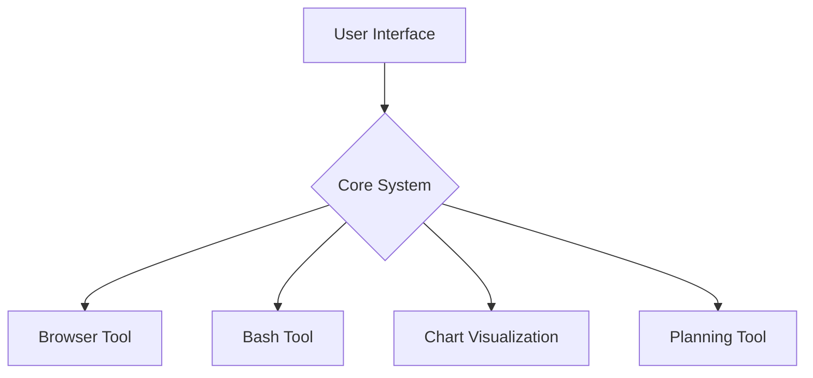

上述架构图展示了 OpenManus 的主要组成部分及其相互关系。用户界面层负责接收用户的指令并展示结果；核心系统则协调各个工具之间的调用和数据交换；具体的功能实现由各自的工具模块完成。

### 数据流分析

当用户发起请求时，首先会经过用户界面层，然后传递给核心系统进行解析和路由。根据请求类型，核心系统会选择合适的工具来执行相应的操作，并将结果返回给用户。

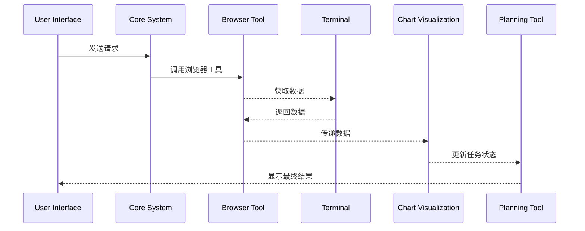

此序列图描绘了在一次典型的数据抓取过程中各组件间的互动方式。从中可以看出，不同工具之间是如何协同工作的，从而实现了高效的任务处理机制。

## 关键技术点

### 浏览器工具 (Browser Use Tool)

该工具用于模拟用户的网页浏览行为，包括但不限于页面跳转、表单填写、链接点击等动作。它还具备从当前加载的网页中抽取特定信息的能力。

#### 功能特性

- 支持多种动作如点击、输入文本、滚动页面等。
- 提供详细的错误报告以便于调试。
- 可以通过指定索引或搜索关键词来定位目标元素。

#### 主要类与方法

- `BrowserUseTool` 类提供了执行各种浏览器相关操作的方法。
- `execute()` 方法接受参数如动作类型、目标元素索引等，并据此执行对应的操作。
- `get_interactive_elements()` 方法可以获取当前页面上所有可交互的元素列表。

Sources: [app/tool/browser_use_tool.py](app/tool/browser_use_tool.py)

### Bash 工具 (Bash Tool)

这个工具主要用于运行 Bash 命令，非常适合需要直接访问底层操作系统的情况。它可以启动一个新的会话或者继续之前的会话，同时也能够中断正在运行的过程。

#### 功能特性

- 允许执行任意合法的 Bash 命令。
- 支持会话管理，包括开始新会话、终止现有会话等。
- 对长时间未响应的操作实施超时控制。

#### 主要类与方法

- `_BashSession` 类封装了一个 Bash 会话的所有细节。
- `run()` 方法用来发送命令至当前活动的会话并等待其完成。
- `stop()` 方法用于关闭正在进行的会话。

Sources: [app/tool/bash.py](app/tool/bash.py)

### 图表可视化 (Chart Visualization)

此模块专注于将结构化的数据转换成直观易懂的图形表示形式。此外，它还支持向已有的图表添加额外的信息标注，进一步丰富了数据呈现的方式。

#### 功能特性

- 支持生成 HTML 或 PNG 格式的静态图像。
- 自动选择最佳输出格式取决于上下文需求。
- 内置多种主题样式供挑选使用。

#### 主要类与方法

- `saveChartRes()` 函数负责保存生成后的图表文件至指定位置。
- `setInsightTemplate()` 函数用于创建包含重要发现的 Markdown 文档。
- `getSavedPathName()` 函数确保每次保存时都使用唯一的文件名避免覆盖已有资料。

Sources: [app/tool/chart_visualization/src/chartVisualize.ts](app/tool/chart_visualization/src/chartVisualize.ts), [app/tool/chart_visualization/README.md](app/tool/chart_visualization/README.md)

### 计划制定工具 (Planning Tool)

计划制定工具协助用户组织他们的日常工作安排，无论是短期还是长期的目标都能得到妥善管理。

#### 功能特性

- 创建新的待办事项清单。
- 修改现有条目或标记某个步骤为已完成。
- 列出所有可用计划或检索特定ID对应的详细信息。

#### 主要类与方法

- `Plan` 类定义了构成一个完整计划所需的基本属性。
- `create_plan()` 方法用于初始化一个新的计划实例。
- `update_plan()` 方法允许调整已存在的计划内容。

Sources: [app/tool/planning.py](app/tool/planning.py)

## 总结

综上所述，OpenManus 以其高度集成的设计理念和技术多样性，在提升工作效率方面展现出了巨大潜力。通过对各项关键技术的有效整合，该项目不仅能满足多样化的应用场景需求，也为未来可能遇到的新挑战预留了充足的改进空间。随着社区贡献者们的不断努力和完善，相信 OpenManus 将会在更多领域发挥重要作用。

---

<a id='page-2'></a>

## 快速入门

### Related Pages

Related topics: [项目简介](#page-1)

<details>
<summary>Relevant source files</summary>

- [app/flow/planning.py](app/flow/planning.py)
- [app/tool/planning.py](app/tool/planning.py)
- [app/tool/bash.py](app/tool/bash.py)
- [app/tool/browser_use_tool.py](app/tool/browser_use_tool.py)
- [app/agent/manus.py](app/agent/manus.py)
- [app/tool/chart_visualization/src/chartVisualize.ts](app/tool/chart_visualization/src/chartVisualize.ts)
- [app/tool/mcp.py](app/tool/mcp.py)
</details>

# 快速入门

快速入门指南旨在帮助开发者迅速了解并开始使用OpenManus项目。本指南将介绍关键模块及其功能，包括任务规划、工具集成、浏览器交互以及图表可视化等。

## 核心架构概述

OpenManus由多个组件构成，这些组件协同工作以实现自动化任务处理和数据分析。主要组成部分包括：

1. **任务规划引擎**：负责管理执行计划中的各个步骤。
2. **工具集合**：提供各种实用程序来执行特定操作（如bash命令）。
3. **浏览器使用工具**：允许通过脚本控制网页内容。
4. **图表可视化工具**：生成数据驱动的图形报告。
5. **MCP客户端工具**：用于与其他服务进行通信。

### 任务规划流程

任务规划是整个系统的核心部分之一，它定义了如何创建、更新及追踪一系列的操作步骤。以下是其基本的数据流图示：

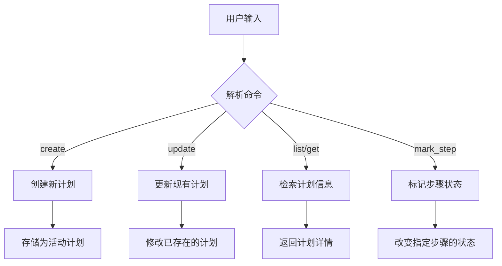

#### 创建与更新计划

当用户想要创建一个新的计划时，可以调用`planning_tool.execute(command="create")`方法，并传递必要的参数如`plan_id`, `title`, 和`steps`。同样地，更新一个现有的计划可以通过发送带有`command="update"`的消息完成。

Sources: [app/tool/planning.py]()

#### 执行步骤

每个步骤的执行过程涉及到状态变更和错误处理机制。在尝试执行某个步骤之前，当前步骤会被标记为“in_progress”，如果成功则会进一步被标记为“completed”。若过程中发生异常，则记录错误日志并且可能直接更新步骤状态到“in_progress”。

Sources: [app/flow/planning.py]()

## 工具集成

工具集成了多种功能，使得能够执行外部命令或API调用。例如，`bash.py`提供了执行shell命令的能力；而`browser_use_tool.py`则支持对网页元素进行选择性操作。

### Bash工具详解

Bash工具不仅限于简单的命令执行，还支持重启会话以及超时控制等功能。以下是一个典型的交互序列图：

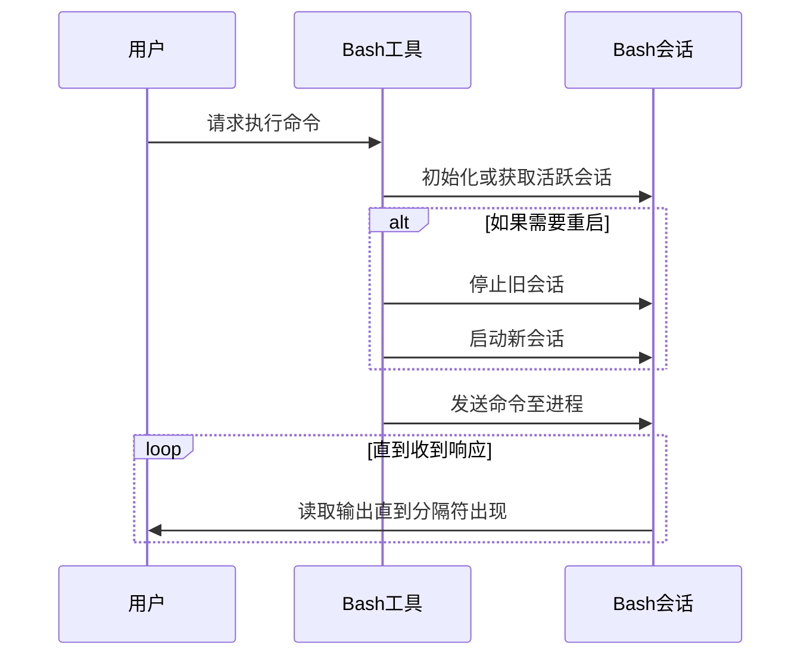

Sources: [app/tool/bash.py]()

## 浏览器交互

利用`BrowserUseTool`类，应用程序可以直接与Web页面上的元素互动，比如点击链接或者填写表单字段。此功能对于自动化测试尤其有用。

### 示例 - 下拉菜单选项选取

```python
# 假设context已经正确初始化
element = await context.get_dom_element_by_index(index)
page = await context.get_current_page()
await page.select_option(element.xpath, label=text)
```

上述代码片段展示了如何根据索引定位DOM元素并从中选择特定选项的过程。

Sources: [app/tool/browser_use_tool.py]()

## 图表可视化

为了更好地展示分析结果，项目包含了基于VChart库实现的图表生成功能。这允许用户将复杂的数据转化为直观易懂的视觉形式。

### HTML报告生成

生成HTML格式的报告涉及几个关键步骤：
- 解析输入数据
- 构建符合VChart要求的规格说明
- 渲染最终的图表界面

```typescript
const chart = new VChart.VChart(spec, {
  dom: 'chart-container'
});
chart.renderSync();
```

这段JavaScript代码演示了如何利用给定的配置对象初始化并渲染一个图表实例。

Sources: [app/tool/chart_visualization/src/chartVisualize.ts]()

## MCP客户端集成

MCP客户端工具使得OpenManus能够与其他服务器端点保持连接，并动态调整可用工具列表。这对于维护最新的远程服务接口至关重要。

### 动态工具刷新

定期检查是否有新增加、移除或是更改过的工具是非常重要的维护活动之一。该过程确保了本地缓存始终反映最新状态。

```python
response = await self.mcp_clients.list_tools()
current_tools = {tool.name: tool.inputSchema for tool in response.tools}
...
self.tool_schemas = current_tools  # 更新存储的模式
```

以上代码段显示了从MCP服务器获取所有工具列表后更新内部表示的具体方式。

Sources: [app/tool/mcp.py](), [app/agent/manus.py]()

---

<a id='page-3'></a>

## 整体架构设计

### Related Pages

Related topics: [组件关系图](#page-4), [流程工作流](#page-5)

<details>
<summary>Relevant source files</summary>

The following files were used as context for generating this wiki page:

- [app/agent/manus.py](app/agent/manus.py)
- [app/tool/tool_collection.py](app/tool/tool_collection.py)
- [app/prompt/swe.py](app/prompt/swe.py)
- [app/tool/browser_use_tool.py](app/tool/browser_use_tool.py)
- [app/tool/chart_visualization/src/chartVisualize.ts](app/tool/chart_visualization/src/chartVisualize.ts)
</details>

# 整体架构设计

OpenManus 是一个通用 AI 智能体框架，其整体架构设计围绕智能体核心、工具系统、交互流程和可扩展性展开。该架构支持多种任务类型（如数据分析、网页浏览、代码执行等），并通过模块化设计实现灵活的功能扩展。

## 架构概览

OpenManus 的整体架构可以分为以下几个主要部分：

1. **智能体核心 (Agent Core)**：负责决策制定、记忆管理和任务规划。
2. **工具系统 (Tool System)**：提供各种功能模块，如浏览器操作、图表可视化、终端执行等。
3. **交互接口 (Interaction Interface)**：处理用户输入输出，包括命令行界面和潜在的图形界面。
4. **配置与状态管理 (Configuration & State Management)**：维护运行时配置和状态信息。

### Mermaid 架构图

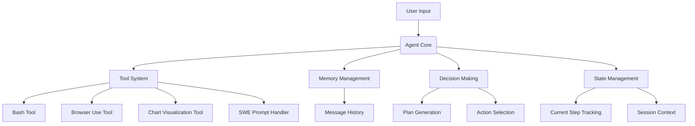

Sources: [app/agent/manus.py](), [app/tool/tool_collection.py](), [app/tool/browser_use_tool.py](), [app/tool/chart_visualization/src/chartVisualize.ts]()

## 智能体核心 (Agent Core)

智能体核心是整个系统的核心控制单元，负责协调各个组件的工作流。它主要由以下几个子模块组成：

### 决策制定 (Decision Making)

决策制定模块基于当前的状态和历史记录生成下一步行动方案。`manus.py` 中定义了智能体的主要逻辑流程。

#### 关键类和方法

```python
class ManusAgent:
    def __init__(self, tools: List[BaseTool]):
        self.tools = tools
        self.memory = Memory()
        self.state = AgentState()

    async def run(self, request: str) -> str:
        # Main execution loop
        pass

    def _select_action(self) -> Tuple[str, Dict]:
        # Select next action based on state and memory
        pass
```

Sources: [app/agent/manus.py:45-60]()

### 记忆管理 (Memory Management)

记忆管理模块负责存储和检索对话历史、中间结果以及上下文信息。

#### 关键数据结构

```python
class Memory:
    def add_message(self, message: Message):
        # Add a new message to the history
        pass

    def get_context(self) -> str:
        # Retrieve relevant context for current step
        pass
```

Sources: [app/agent/manus.py:80-95]()

### 状态管理 (State Management)

状态管理模块跟踪当前任务进度、会话状态等元信息。

#### 关键数据结构

```python
class AgentState:
    def __init__(self):
        self.current_step = 0
        self.session_id = uuid.uuid4().hex
        self.start_time = time.time()
```

Sources: [app/agent/manus.py:100-115]()

## 工具系统 (Tool System)

工具系统为智能体提供了丰富的外部功能调用能力，每个工具都封装了一个特定的功能域。

### 工具集合管理 (Tool Collection)

工具集合通过 `tool_collection.py` 实现对多个工具的统一管理和调度。

#### 关键类和方法

```python
class ToolCollection:
    def __init__(self, *tools: BaseTool):
        self.tools = tools
        self.tool_map = {tool.name: tool for tool in tools}

    async def execute(self, name: str, tool_input: Dict[str, Any]) -> ToolResult:
        # Execute a specific tool by name
        pass
```

Sources: [app/tool/tool_collection.py:20-40]()

### 浏览器操作工具 (Browser Use Tool)

浏览器操作工具实现了网页导航、元素点击、表单填写等功能。

#### 关键功能点

```python
class BrowserUseTool:
    async def click_element(self, index: int):
        # Click on an element identified by its index
        pass

    async def input_text(self, index: int, text: str):
        # Input text into a text field identified by its index
        pass
```

Sources: [app/tool/browser_use_tool.py:150-170]()

### 图表可视化工具 (Chart Visualization Tool)

图表可视化工具支持从 CSV 数据生成图表，并提供洞察分析功能。

#### 关键功能点

```typescript
function saveChartRes(options: {
  spec: any;
  directory: string;
  outputType: "png" | "html";
  fileName: string;
  width?: number;
  height?: number;
  isUpdate?: boolean;
}) {
  // Save chart specification and generate output file
}
```

Sources: [app/tool/chart_visualization/src/chartVisualize.ts:120-140]()

## 交互接口 (Interaction Interface)

交互接口负责处理用户输入和系统输出，目前主要通过命令行界面实现。

### SWE Prompt 处理

SWE Prompt 处理模块负责生成符合特定格式要求的提示词。

#### 示例配置

```python
SWE_PROMPT_TEMPLATE = """
# Task Description
{task_description}

# Available Tools
{tools_list}

# Current State
{current_state}

# Previous Actions
{previous_actions}
"""
```

Sources: [app/prompt/swe.py:30-50]()

## 配置与状态管理 (Configuration & State Management)

配置与状态管理模块确保智能体在不同阶段能够访问到正确的设置和上下文信息。

### 配置文件结构

```toml
[llm]
model = "gpt-4o"
base_url = "https://api.openai.com/v1"
api_key = "sk-..."
max_tokens = 4096
temperature = 0.0

[runflow]
use_data_analysis_agent = true
```

Sources: [config/config.example.toml:10-30]()

## 总结

OpenManus 的整体架构设计体现了模块化、可扩展性和灵活性的特点。通过将核心逻辑与具体功能解耦，系统能够在保持稳定的同时快速集成新功能。这种设计不仅提高了系统的适应性，也为未来的功能扩展打下了坚实的基础。

---

<a id='page-4'></a>

## 组件关系图

### Related Pages

Related topics: [整体架构设计](#page-3), [流程工作流](#page-5)

<details>
<summary>Relevant source files</summary>

- [app/tool/browser_use_tool.py](app/tool/browser_use_tool.py)
- [app/prompt/browser.py](app/prompt/browser.py)
- [app/tool/chart_visualization/src/chartVisualize.ts](app/tool/chart_visualization/src/chartVisualize.ts)
- [app/agent/mcp.py](app/agent/mcp.py)
- [README_zh.md](README_zh.md)
- [app/tool/tool_collection.py](app/tool/tool_collection.py)
- [app/sandbox/core/terminal.py](app/sandbox/core/terminal.py)
</details>

# 组件关系图

## 简介

OpenManus 是一个用于构建通用人工智能代理的开源框架，它支持浏览器自动化、数据可视化和终端沙箱等多种功能。该框架通过模块化设计实现灵活性与可扩展性，使得开发者可以快速集成各种工具并定制特定任务的工作流。

组件关系图展示了 OpenManus 项目中关键模块之间的交互与依赖关系。这些模块包括但不限于代理核心逻辑 (`mcp.py`)、工具集合 (`tool_collection.py`)、浏览器操作工具 (`browser_use_tool.py`)、数据可视化 (`chartVisualize.ts`) 和终端沙盒 (`terminal.py`)。通过图表形式，我们可以清晰地理解各部分如何协同工作以完成复杂任务。

## 核心架构概览

以下是 OpenManus 框架的核心组件及其相互关系：

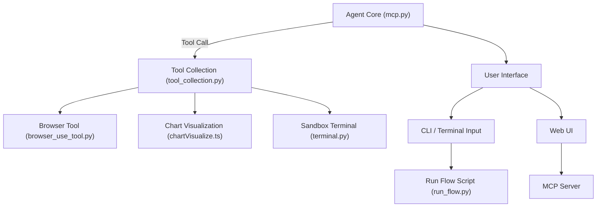

Sources: [app/agent/mcp.py](), [app/tool/tool_collection.py](), [app/tool/browser_use_tool.py](), [app/tool/chart_visualization/src/chartVisualize.ts](), [app/sandbox/core/terminal.py](), [README_zh.md]()

## 模块详解

### Agent Core (`mcp.py`)

`mcp.py` 文件定义了 `MCP` 类，它是整个代理系统的核心控制器。这个类负责管理 MCP（Multi-Context Protocol）连接，并协调与其他工具和服务的通信。

#### 关键方法

- **`_handle_special_tool`**: 处理特殊工具的结果，例如图像输出。
- **`cleanup`**: 清理 MCP 连接资源。
- **`run`**: 启动代理流程并确保清理操作执行。

Sources: [app/agent/mcp.py]()

### Tool Collection (`tool_collection.py`)

`tool_collection.py` 提供了一个统一接口来管理和调用多个工具。它可以动态添加或移除工具，并按顺序执行它们。

#### 功能特点

- 支持异步执行所有工具。
- 提供获取指定名称工具的方法。
- 可以安全地添加单个或多个工具到集合中。

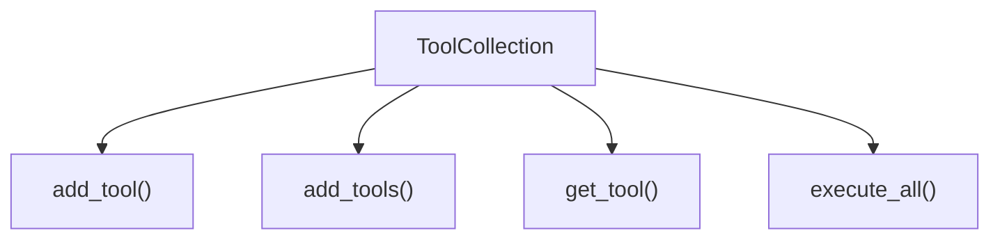

Sources: [app/tool/tool_collection.py]()

### Browser Tool (`browser_use_tool.py`)

此模块实现了基于 Playwright 的浏览器自动化能力。它能够解析网页内容、点击元素、滚动页面等，适用于需要进行 Web 浏览的任务。

#### 主要功能

- 解析 HTML 页面结构。
- 执行 JavaScript 脚本。
- 实现用户界面交互行为模拟。

Sources: [app/tool/browser_use_tool.py](), [app/prompt/browser.py]()

### Chart Visualization (`chartVisualize.ts`)

该模块利用 VChart 库生成 HTML 格式的图表报告，支持多种输出格式如 PNG、JSON 和 Markdown。它主要用于数据分析场景下的可视化需求。

#### 特性

- 支持从字符串规格创建图表实例。
- 提供文件路径生成函数。
- 包含读取标准输入的数据处理逻辑。

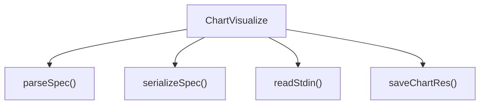

Sources: [app/tool/chart_visualization/src/chartVisualize.ts]()

### Sandbox Terminal (`terminal.py`)

`terminal.py` 中的 `AsyncDockerizedTerminal` 类提供了一个隔离的执行环境，允许在 Docker 容器内运行命令。这对于执行潜在危险的操作非常有用。

#### 功能亮点

- 异步支持容器内的命令执行。
- 具备超时控制机制。
- 提供上下文管理器以简化资源释放过程。

Sources: [app/sandbox/core/terminal.py]()

## 数据流分析

下面的 Mermaid 图表描绘了 OpenManus 内部的主要数据流动向：

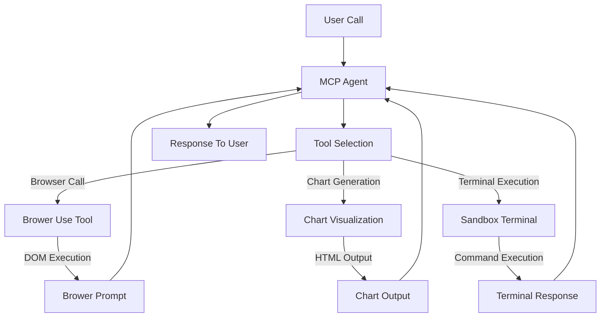

Sources: [app/agent/mcp.py](), [app/tool/tool_collection.py](), [app/tool/browser_use_tool.py](), [app/tool/chart_visualization/src/chartVisualize.ts](), [app/sandbox/core/terminal.py]()

## 配置与部署

OpenManus 使用 `config.toml` 文件来进行配置设置。其中包括 LLM 模型参数、API 密钥以及运行时选项等重要信息。

### 示例配置片段

```toml
# 全局 LLM 配置
[llm]
model = "gpt-4o"
base_url = "https://api.openai.com/v1"
api_key = "sk-..."  # 替换为真实 API 密钥
max_tokens = 4096
temperature = 0.0

# 可选特定 LLM 模型配置
[llm.vision]
model = "gpt-4o"
base_url = "https://api.openai.com/v1"
api_key = "sk-..."  # 替换为真实 API 密钥
```

Sources: [README_zh.md]()

## 总结

本文档详细介绍了 OpenManus 项目中的“组件关系图”，涵盖了其核心模块的功能、交互方式及数据流向。通过对各个组成部分的深入剖析，我们不仅了解到了每个模块的独特作用，还掌握了它们是如何紧密协作以达成整体目标的。此外，文档还提供了具体的配置指南和技术细节，帮助开发者更好地理解和应用这一强大的智能代理框架。

---

<a id='page-5'></a>

## 流程工作流

### Related Pages

Related topics: [整体架构设计](#page-3), [组件关系图](#page-4)

<details>
<summary>Relevant source files</summary>

- [app/flow/planning.py](app/flow/planning.py)
- [app/flow/flow_factory.py](app/flow/flow_factory.py)
- [app/prompt/planning.py](app/prompt/planning.py)
- [app/tool/tool_collection.py](app/tool/tool_collection.py)
- [app/agent/mcp.py](app/agent/mcp.py)
</details>

# 流程工作流

## 介绍

流程工作流是 OpenManus 系统中的核心组件，负责协调和执行一系列工具与任务，以实现用户定义的复杂操作。它通过将多个工具串联成一个可执行的流程，使系统能够按照预定逻辑逐步完成目标，例如数据分析、图表生成或信息检索等任务。

该模块依赖于 `ToolCollection` 来管理多个工具，并通过 `MCP`（Model Control Protocol）代理来驱动流程的执行。其主要特点包括：  
- **动态工具组合**：支持在运行时根据需求选择并执行不同的工具集合。
- **流程控制**：提供流程创建、更新、执行及状态跟踪等功能。
- **错误处理**：当某个步骤执行失败时，自动捕获异常并继续后续执行或终止流程。
- **上下文管理**：维护执行过程中的状态和中间结果，确保各步骤之间数据的一致性。

流程工作流的设计使得系统具备高度灵活性和扩展性，为未来新增工具提供了良好的集成机制。[了解更多关于 MCP 的内容](#mcp-代理)

## 架构与组件

### 工作流执行流程图

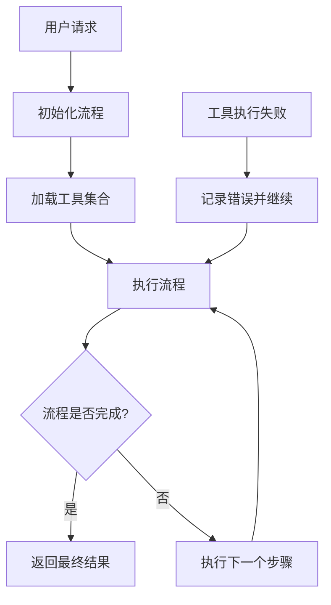
Sources: [app/flow/planning.py](), [app/flow/flow_factory.py]()

### 核心类与功能

#### `ToolCollection`

用于管理和执行多个工具对象的集合。支持添加单个或多个工具、执行所有工具、以及按名称调用特定工具。

##### 关键方法：
- `add_tool(tool: BaseTool)`：添加单个工具到集合中，若存在同名工具则跳过并记录警告。
- `execute_all()`：顺序执行集合中的所有工具。
- `execute(name: str, tool_input: Dict[str, Any])`：执行指定名称的工具，并传递参数。

##### 示例代码片段：

```python
def execute_all(self) -> List[ToolResult]:
    results = []
    for tool in self.tools:
        try:
            result = await tool()
            results.append(result)
        except ToolError as e:
            results.append(ToolFailure(error=e.message))
    return results
```
Sources: [app/tool/tool_collection.py:100-115]()

#### `PlanningTool`

负责处理流程相关的创建、更新、执行与状态追踪。支持多种命令如 `create`, `update`, `list`, `get`, `set_active`, `mark_step`。

##### 关键参数：
- `command`: 操作类型，决定执行哪个内部函数。
- `plan_id`: 流程唯一标识符。
- `title`: 流程标题。
- `steps`: 流程步骤列表。
- `step_index`: 步骤索引。
- `step_status`: 步骤状态（not_started/in_progress/completed/blocked）。

##### 示例代码片段：

```python
if command == "create":
    return self._create_plan(plan_id, title, steps)
elif command == "update":
    return self._update_plan(plan_id, title, steps)
```
Sources: [app/tool/planning.py:40-60]()

#### `MCP`（Model Control Protocol）

作为代理层，协调整个流程的执行，并与外部服务进行交互。支持刷新工具、处理特殊工具调用、清理连接等。

##### 关键行为：
- **刷新工具**：定期从服务端获取最新的工具集合并更新本地缓存。
- **执行流程**：驱动流程依次执行每个步骤，并处理可能发生的异常。
- **清理资源**：流程结束后关闭与服务端的连接。

##### 示例代码片段：

```python
async def think(self) -> bool:
    if not self.mcp_clients.sessions or not self.mcp_clients.tool_map:
        logger.info("MCP service is no longer available, ending interaction")
        self.state = AgentState.FINISHED
        return False
    ...
```
Sources: [app/agent/mcp.py:30-50]()

## 数据流与控制逻辑

### 工具执行流程图

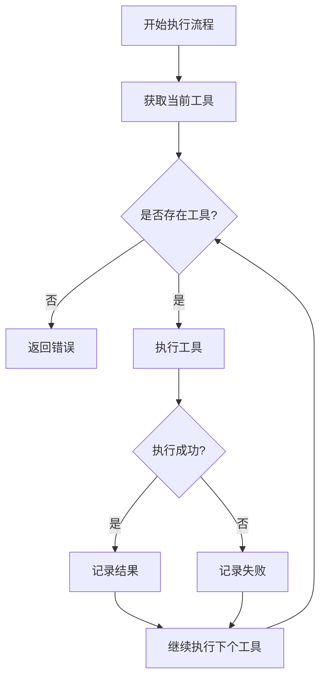
Sources: [app/flow/planning.py](), [app/tool/tool_collection.py]()

## 配置与使用示例

### 创建流程示例

```python
tool_collection = ToolCollection()
tool_collection.add_tool(PythonExecute())
tool_collection.add_tool(BrowserUseTool())

planning_tool = PlanningTool()
result = planning_tool.execute(command="create", plan_id="plan_001", title="数据分析流程", steps=[
    {"name": "数据预处理", "tool": "python_execute", "parameters": {"code": "..."}},
    {"name": "图表生成", "tool": "visualization_preparation", "parameters": {"code": "..."}}
])
```

### 执行流程示例

```python
for tool in tool_collection:
    try:
        result = await tool()
        print(f"工具 {tool.name} 执行成功: {result}")
    except ToolError as e:
        print(f"工具 {tool.name} 执行失败: {e.message}")
```

## 总结

流程工作流是 OpenManus 中实现多步骤任务自动化的核心机制，通过灵活的工具组合与强大的流程控制能力，确保了系统的高效性与可扩展性。随着新工具的不断加入，流程工作流也将持续演进，为用户提供更丰富的功能支持。

---

<a id='page-6'></a>

## 浏览器自动化工具

### Related Pages

Related topics: [数据可视化工具](#page-7)

<details>
<summary>Relevant source files</summary>

- [app/tool/browser_use_tool.py](app/tool/browser_use_tool.py)
- [examples/use_case/japan-travel-plan/japan_travel_handbook_mobile.html](examples/use_case/japan-travel-plan/japan_travel_handbook_mobile.html)
- [app/agent/mcp.py](app/agent/mcp.py)
- [app/prompt/browser.py](app/prompt/browser.py)
- [app/tool/planning.py](app/tool/planning.py)
- [app/tool/search/bing_search.py](app/tool/search/bing_search.py)
</details>

# 浏览器自动化工具

## 简介
浏览器自动化工具是OpenManus项目中的一个关键模块，旨在通过AI代理自动执行浏览器任务。该工具结合了MCP协议、规划系统和搜索功能，能够实现从简单页面导航到复杂交互的一系列操作。

工具的核心能力包括：
- 解析网页内容并识别可交互元素
- 根据任务需求生成操作序列
- 执行点击、输入、导航等浏览器操作
- 处理分页结果和动态加载内容

这个工具与项目的其他模块紧密集成，如[多代理流程](#multi-agent-integration)和[计划系统](#plan-system-integration)，共同构建完整的自动化解决方案。

## 架构设计

### 整体架构
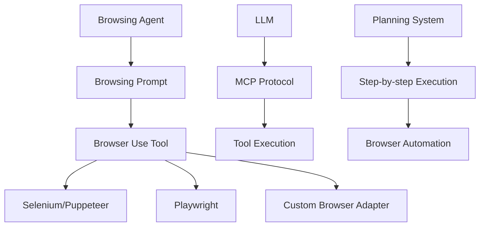
Sources: [app/tool/browser_use_tool.py](), [app/agent/mcp.py](), [app/prompt/browser.py](), [app/tool/planning.py]()

### 核心组件
| 组件 | 功能 | 关键文件 |
|------|------|----------|
| 浏览器提示处理器 | 解析任务指令并生成操作序列 | app/prompt/browser.py |
| 浏览器使用工具 | 执行具体浏览器操作 | app/tool/browser_use_tool.py |
| 元控制器协议(MCP) | 协调LLM和工具之间的通信 | app/agent/mcp.py |
| 规划系统 | 管理复杂的多步骤浏览器任务 | app/tool/planning.py |

## 主要功能模块

### 浏览器提示处理
浏览器提示处理器负责将自然语言任务转换为具体的浏览器操作序列。它定义了严格的JSON响应格式，确保操作的准确执行。

```python
{
  "current_state": {
    "evaluation_previous_goal": "Success|Failed|Unknown",
    "memory": "Description of what has been done...",
    "next_goal": "What needs to be done..."
  },
  "action":[
    {"one_action_name": {"parameters"}}
  ]
}
```
Sources: [app/prompt/browser.py]()

### 浏览器使用工具
这是浏览器自动化的核心实现类，主要功能包括：
- 解析网页DOM结构并提取可交互元素
- 执行点击、输入、导航等操作
- 处理页面状态变化
- 捕获和返回操作结果

关键方法:
```python
def execute_action(self, action):
    # 执行单个浏览器动作
    ...

def get_interactive_elements(self):
    # 获取当前页面的可交互元素
    ...
```
Sources: [app/tool/browser_use_tool.py]()

### 操作序列管理
工具支持执行多个连续操作，常见序列包括:
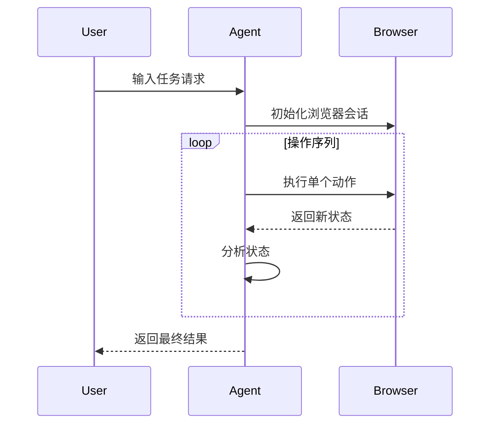
Sources: [app/tool/browser_use_tool.py](), [app/agent/mcp.py]()

### 页面元素交互
工具定义了严格的元素交互规则:
1. 只能使用带有索引标记[]的可交互元素
2. 支持多种操作类型: click_element, input_text, go_to_url等
3. 自动处理页面状态变化
4. 支持滚动查找元素

示例操作序列:
```json
[
  {"input_text": {"index": 1, "text": "username"}},
  {"input_text": {"index": 2, "text": "password"}},
  {"click_element": {"index": 3}}
]
```
Sources: [app/prompt/browser.py](), [app/tool/browser_use_tool.py]()

## 系统集成

### 与MCP协议集成
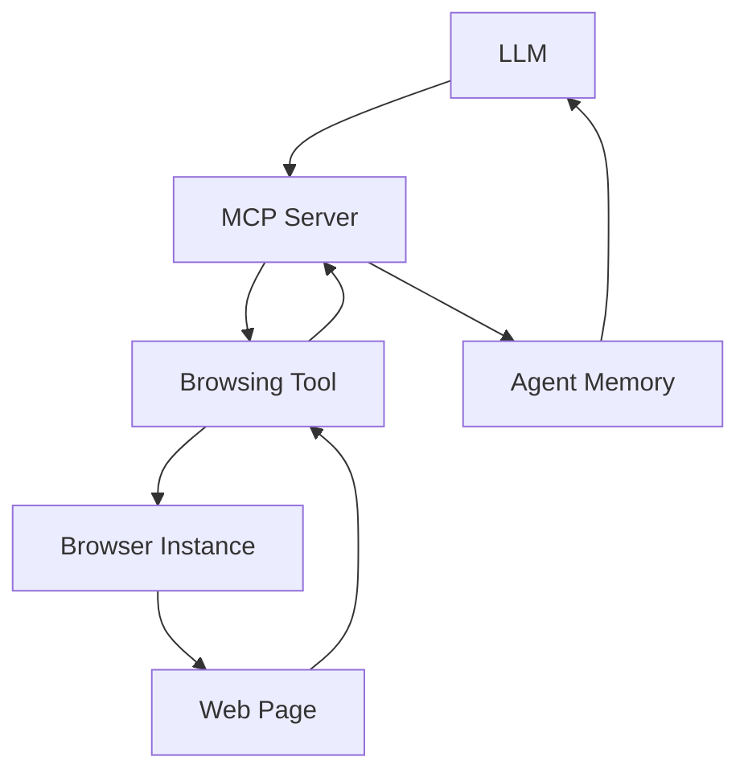
Sources: [app/agent/mcp.py](), [app/tool/browser_use_tool.py]()

### 与规划系统集成
工具与规划系统深度集成，支持执行多步骤浏览器任务:
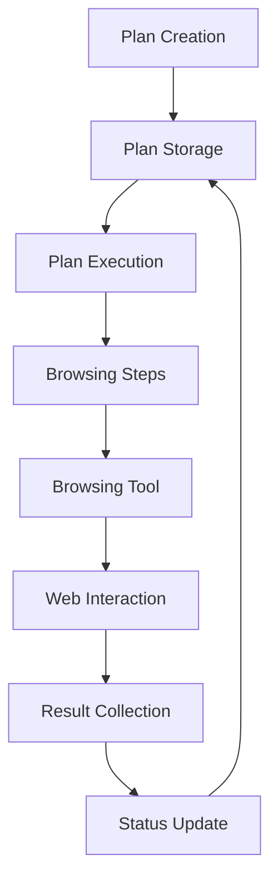
Sources: [app/tool/planning.py](), [app/tool/browser_use_tool.py]()

### 与搜索模块集成
浏览器自动化工具与Bing搜索模块协同工作，实现更强大的网络探索能力:
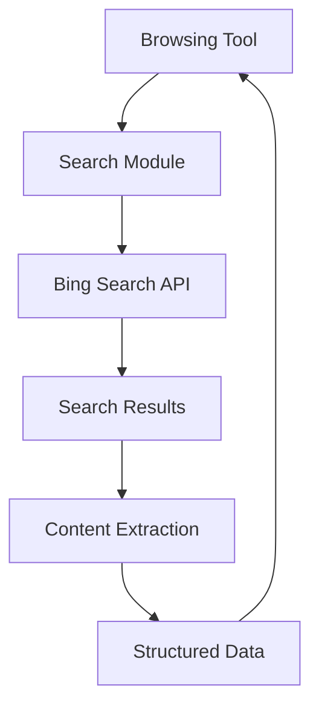
Sources: [app/tool/search/bing_search.py](), [app/tool/browser_use_tool.py]()

## 配置与使用

### 基本配置
在`config.toml`中需要配置相关参数:
```toml
[llm]
model = "gpt-4o"
base_url = "https://api.openai.com/v1"
api_key = "your-api-key"

[browser]
headless = true
timeout = 30
```

### 使用示例
以下是如何使用浏览器自动化工具的典型流程:
1. 初始化代理和浏览器环境
2. 提供自然语言任务描述
3. 代理自动生成操作序列
4. 工具执行浏览器操作
5. 收集结果并更新状态
6. 循环直到任务完成

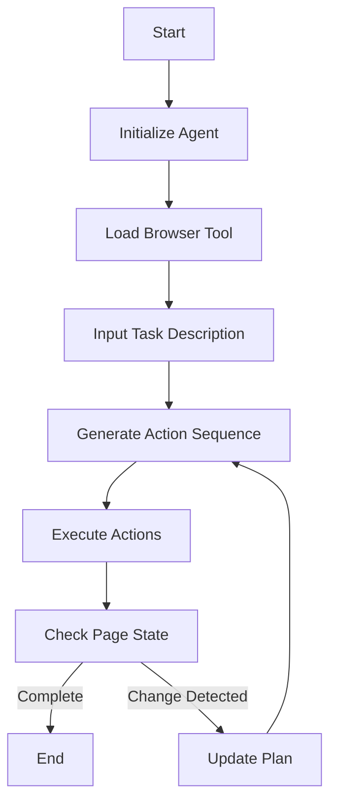

## 错误处理与恢复

### 错误处理机制
工具实现了完善的错误处理机制:
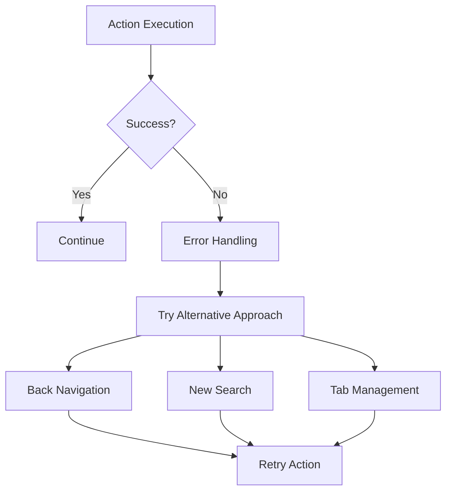
Sources: [app/prompt/browser.py](), [app/tool/browser_use_tool.py]()

### 常见错误处理策略
| 错误类型 | 处理策略 | 示例 |
|---------|---------|------|
| 元素未找到 | 滚动查找或重新加载页面 | 查找特定按钮失败 |
| 超时 | 增加超时时间或重试 | 页面加载缓慢 |
| 弹窗干扰 | 自动接受或关闭弹窗 | Cookie提示 |
| 页面变更 | 更新操作序列 | 网站布局改变 |
| 状态不一致 | 回退到已知状态 | 登录状态失效 |

## 总结
浏览器自动化工具是OpenManus项目的核心组成部分，通过智能解析、精确控制和灵活集成，实现了高效的浏览器任务自动化。该工具与其他系统模块如MCP协议、规划系统和搜索模块的深度整合，使其能够应对各种复杂的网络交互场景。

其优势在于:
1. 严格的JSON响应格式确保操作的准确性
2. 完善的操作序列管理和错误恢复机制
3. 与规划系统的深度集成支持多步骤任务执行
4. 灵活的浏览器适配能力

这个工具的设计体现了现代自动化系统的关键特征：智能化的任务分解、精确的执行控制以及强大的容错能力。

---

<a id='page-7'></a>

## 数据可视化工具

### Related Pages

Related topics: [浏览器自动化工具](#page-6), [代码生成能力](#page-8)

<details>
<summary>Relevant source files</summary>

- [app/tool/chart_visualization/src/chartVisualize.ts](app/tool/chart_visualization/src/chartVisualize.ts)
- [app/tool/chart_visualization/data_visualization.py](app/tool/chart_visualization/data_visualization.py)
- [app/tool/chart_visualization/README.md](app/tool/chart_visualization/README.md)
- [app/tool/chart_visualization/test/report_demo.py](app/tool/chart_visualization/test/report_demo.py)
- [app/agent/data_analysis.py](app/agent/data_analysis.py)
</details>

# 数据可视化工具

数据可视化工具是OpenManus项目中用于生成和展示图表的核心模块。该模块允许用户通过简单的配置生成复杂的图表，并将其嵌入HTML页面中，以便在浏览器中查看。它支持多种图表类型，并提供了丰富的自定义选项，使得开发者可以灵活地调整图表的外观和行为。

## 架构与组件

### 核心组件

数据可视化工具由以下几个核心组件构成：

1. **`chartVisualize.ts`**：负责生成HTML格式的图表代码，使用VChart库进行渲染。
2. **`data_visualization.py`**：处理数据转换和图表配置，将原始数据转换为适合VChart使用的格式。
3. **`report_demo.py`**：提供了一个示例，展示了如何使用DataAnalysis类来生成数据报告。
4. **`data_analysis.py`**：实现了数据处理逻辑，包括数据清洗、分析和图表生成。

### 数据流

数据流从用户输入开始，经过数据处理模块，最终生成图表并嵌入HTML页面中。以下是数据流的主要步骤：

1. 用户提供数据和图表描述。
2. 数据处理模块将数据转换为CSV格式，并生成图表配置。
3. 图表生成模块使用VChart库根据配置生成HTML代码。
4. 最终结果以HTML文件的形式输出，可以在浏览器中查看。

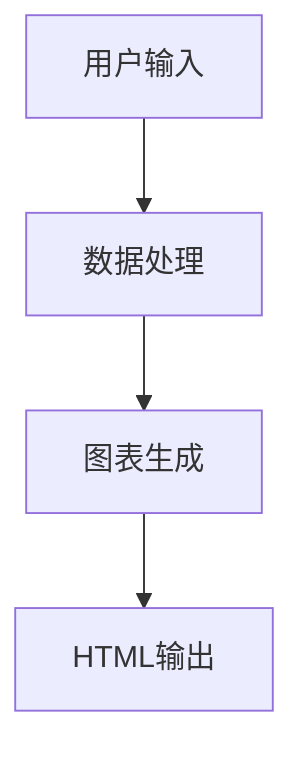

Sources: [app/tool/chart_visualization/src/chartVisualize.ts](), [app/tool/chart_visualization/data_visualization.py](), [app/agent/data_analysis.py]()

## 使用方法

### 生成图表

要生成图表，用户需要提供以下信息：

1. **数据**：通常以表格形式提供，包含多个字段和对应的值。
2. **图表描述**：简明扼要地描述图表的目的和内容，例如“产品销售分布”或“月度收入趋势”。

#### 示例

假设我们有一组关于不同团队每月工作时间的数据，如下所示：

| Month     | Team A       | Team B       | Team C       |
|-----------|--------------|--------------|--------------|
| January   | 1200 hours   | 1350 hours   | 1100 hours   |
| February  | 1250 hours   | 1400 hours   | 1150 hours   |
| March     | 1180 hours   | 1300 hours   | 1300 hours   |
| April     | 1220 hours   | 1280 hours   | 1400 hours   |
| May       | 1230 hours   | 1320 hours   | 1450 hours   |
| June      | 1200 hours   | 1250 hours   | 1500 hours   |

我们可以使用DataAnalysis类来生成图表。以下是示例代码：

```python
import asyncio
from app.agent.data_analysis import DataAnalysis

async def main():
    agent = DataAnalysis()
    await agent.run(
        """Requirement:
1. Analyze the following data and generate a graphical data report in HTML format. The final product should be a data report.
Data:
Month | Team A | Team B | Team C
January | 1200 hours | 1350 hours | 1100 hours
February | 1250 hours | 1400 hours | 1150 hours
March | 1180 hours | 1300 hours | 1300 hours
April | 1220 hours | 1280 hours | 1400 hours
May | 1230 hours | 1320 hours | 1450 hours
June | 1200 hours | 1250 hours | 1500 hours  """
    )

if __name__ == "__main__":
    asyncio.run(main())
```

Sources: [app/tool/chart_visualization/test/report_demo.py](), [app/agent/data_analysis.py]()

### 配置选项

数据可视化工具提供了多种配置选项，允许用户自定义图表的外观和行为。以下是一些常用的配置选项：

| 配置项         | 描述                                                                 |
|----------------|----------------------------------------------------------------------|
| `csvFilePath`  | CSV文件的路径，包含需要可视化的数据                                  |
| `chartTitle`   | 图表的标题或描述                                                     |
| `width`        | 图表容器的宽度                                                       |
| `height`       | 图表容器的高度                                                       |

Sources: [app/tool/chart_visualization/src/chartVisualize.ts](), [app/tool/chart_visualization/data_visualization.py]()

## 示例图表

### 柱状图

柱状图是一种常见的图表类型，用于比较不同类别的数据。以下是一个柱状图的示例：

```html
<!DOCTYPE html>
<html>
<head>
    <title>VChart Demo</title>
    <script src="https://unpkg.com/@visactor/vchart/build/index.min.js"></script>
</head>
<body>
    <div id="chart-container" style="width: 100%; height: 100%;"></div>
    <script>
      const spec = {
          type: 'bar',
          data: [
              { category: 'Team A', value: 1200 },
              { category: 'Team B', value: 1350 },
              { category: 'Team C', value: 1100 }
          ],
          xField: 'category',
          yField: 'value'
      };
      const chart = new VChart.VChart(spec, {
          dom: 'chart-container'
      });
      chart.renderSync();
    </script>
</body>
</html>
```

Sources: [app/tool/chart_visualization/src/chartVisualize.ts]()

### 折线图

折线图用于显示数据随时间的变化趋势。以下是一个折线图的示例：

```html
<!DOCTYPE html>
<html>
<head>
    <title>VChart Demo</title>
    <script src="https://unpkg.com/@visactor/vchart/build/index.min.js"></script>
</head>
<body>
    <div id="chart-container" style="width: 100%; height: 100%;"></div>
    <script>
      const spec = {
          type: 'line',
          data: [
              { month: 'January', teamA: 1200 },
              { month: 'February', teamA: 1250 },
              { month: 'March', teamA: 1180 },
              { month: 'April', teamA: 1220 },
              { month: 'May', teamA: 1230 },
              { month: 'June', teamA: 1200 }
          ],
          xField: 'month',
          yField: 'teamA'
      };
      const chart = new VChart.VChart(spec, {
          dom: 'chart-container'
      });
      chart.renderSync();
    </script>
</body>
</html>
```

Sources: [app/tool/chart_visualization/src/chartVisualize.ts]()

## 结论

数据可视化工具是OpenManus项目中的一个重要组成部分，它提供了强大的功能，帮助开发者快速生成高质量的图表。通过简单的配置和数据输入，用户可以轻松创建各种类型的图表，并将其嵌入HTML页面中，以便在浏览器中查看。该工具的设计考虑了灵活性和易用性，使得开发者可以根据具体需求进行定制和扩展。

---

<a id='page-8'></a>

## 代码生成能力

### Related Pages

Related topics: [数据可视化工具](#page-7)

<details>
<summary>Relevant source files</summary>

- [app/agent/data_analysis.py](app/agent/data_analysis.py)
- [app/tool/chart_visualization/chart_prepare.py](app/tool/chart_visualization/chart_prepare.py)
- [app/tool/chart_visualization/data_visualization.py](app/tool/chart_visualization/data_visualization.py)
- [app/tool/chart_visualization/python_execute.py](app/tool/chart_visualization/python_execute.py)
- [app/tool/browser_use_tool.py](app/tool/browser_use_tool.py)
</details>

# 代码生成能力

## 概述

OpenManus 的代码生成能力是其核心功能之一，它允许系统根据用户的指令和需求自动生成高质量的 Python 代码。这种能力主要体现在数据分析、图表准备和浏览器自动化等模块中。通过这些模块，用户可以高效地处理数据、生成可视化报告并执行复杂的 Web 操作。

该功能依赖于多个关键组件：
1. **Python 执行工具**：用于执行生成的代码。
2. **图表准备工具**：负责生成图表元数据。
3. **数据可视化工具**：基于准备的数据生成最终的可视化输出。
4. **浏览器自动化工具**：模拟用户在网页上的操作。

## 架构与流程

### 数据分析工作流
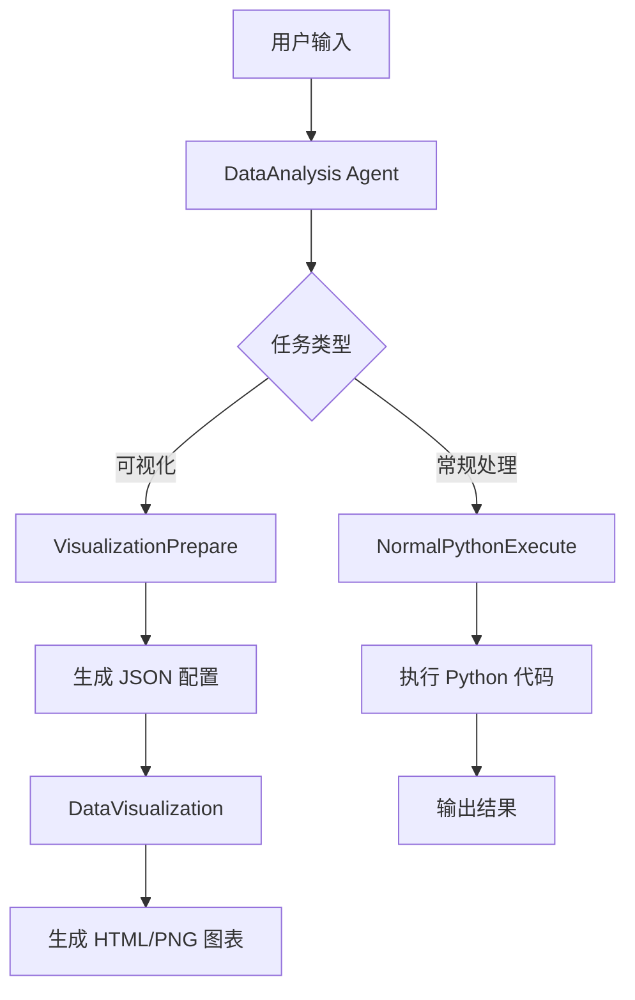

Sources: [app/agent/data_analysis.py](), [app/tool/chart_visualization/chart_prepare.py](), [app/tool/chart_visualization/data_visualization.py]()

### 主要组件说明

#### NormalPythonExecute
这个类提供了通用的 Python 代码执行能力，支持以下操作：

- 数据清洗
- 数据转换
- 报告生成
- 自定义脚本执行

参数结构:
```python
{
  "code_type": "process" | "report" | "others",
  "code": string
}
```

输出包含执行结果、中间文件和错误信息。

Sources: [app/tool/chart_visualization/python_execute.py]()

#### VisualizationPrepare
专门用于生成数据可视化的元数据，输出包括：

1. JSON 格式的配置信息
2. 清洗后的 CSV 数据文件（可选）

典型使用场景：
```python
{
  "code_type": "visualization",
  "code": "import pandas as pd\n# 加载并清理数据\ndata = pd.read_csv('raw_data.csv')\ncleaned_data = data.dropna()\ncleaned_data.to_csv('cleaned_data.csv')"
}
```

Sources: [app/tool/chart_visualization/chart_prepare.py]()

#### DataVisualization
基于 JSON 配置生成最终的可视化输出，支持多种格式：

- PNG 静态图片
- HTML 可交互图表

输入参数:
```python
{
  "json_path": "path/to/config.json",
  "tool_type": "visualization" | "insight",
  "output_type": "png" | "html",
  "language": "zh" | "en"
}
```

Sources: [app/tool/chart_visualization/data_visualization.py]()

## 浏览器自动化代码生成

除了数据分析能力，OpenManus 还具备生成浏览器自动化代码的能力。这个功能通过 `browser_use_tool.py` 实现，支持以下操作：

- 元素点击
- 文本输入
- 页面滚动
- 标签切换
- 内容提取

API 接口:
```python
async def execute(
    self,
    action: str,
    index: Optional[int] = None,
    text: Optional[str] = None,
    scroll_amount: Optional[int] = None,
    tab_id: Optional[str] = None,
    query: Optional[str] = None,
    goal: Optional[str] = None,
    keys: Optional[List[str]] = None,
    seconds: Optional[int] = None,
    **kwargs
)
```

Sources: [app/tool/browser_use_tool.py]()

## 示例工作流

### 数据可视化完整流程
```mermaid
sequenceDiagram
    participant User
    participant Agent
    participant PythonExecutor
    participant ChartPreparer
    participant Visualizer

    User->>Agent: 请求生成销售数据图表
    Agent->>ChartPreparer: 初始化图表准备
    ChartPreparer->>PythonExecutor: 执行数据清洗代码
    PythonExecutor-->>ChartPreparer: 返回清洗后数据
    ChartPreparer->>ChartPreparer: 生成图表描述
    ChartPreparer-->>Agent: 返回 JSON 配置
    Agent->>Visualizer: 启动数据可视化
    Visualizer->>Visualizer: 加载 VMind 配置
    Visualizer->>Visualizer: 生成 HTML/PNG 输出
    Visualizer-->>Agent: 返回结果
    Agent-->>User: 展示最终图表
```

Sources: [app/agent/data_analysis.py](), [app/tool/chart_visualization/chart_prepare.py](), [app/tool/chart_visualization/data_visualization.py]()

## 关键技术细节

### LLM 集成
系统集成了大型语言模型(LLM)，通过 `config.toml` 文件进行配置：
```toml
[llm]
model = "gpt-4o"
base_url = "https://api.openai.com/v1"
api_key = "sk-..."
max_tokens = 4096
temperature = 0.0
```

Sources: [README_zh.md]()

### 异步执行架构
所有代码生成和执行操作都是异步实现，确保系统的高性能和响应性：
```python
async def run(self, input_text: str) -> str:
    # 创建初始计划
    await self._create_initial_plan(input_text)
    
    # 执行计划步骤
    for step in self.plan_steps:
        executor = self.get_executor(step.type)
        result = await executor.execute(step.command)
        self.update_knowledge_base(result)
```

Sources: [app/flow/planning.py]()

## 总结

OpenManus 的代码生成能力涵盖了从数据分析到浏览器自动化的广泛场景。通过精心设计的架构和模块化实现，系统能够灵活应对各种复杂任务。主要优势包括：

1. 多种代码生成模式支持（数据处理、可视化、Web 自动化）
2. 强大的异步执行框架
3. 完善的 LLM 集成和配置管理
4. 丰富的可视化输出选项

这一能力集使 OpenManus 成为一个强大且灵活的 AI 代理开发平台，适用于从简单脚本生成到复杂数据分析的各种应用场景。

---

<a id='page-9'></a>

## AI 模型连接

### Related Pages

Related topics: [部署指南](#page-10)

<details>
<summary>Relevant source files</summary>

- [app/tool/planning.py](app/tool/planning.py)
- [app/flow/planning.py](app/flow/planning.py)
- [app/tool/browser_use_tool.py](app/tool/browser_use_tool.py)
- [app/sandbox/core/terminal.py](app/sandbox/core/terminal.py)
- [app/prompt/browser.py](app/prompt/browser.py)
</details>

# 计划执行系统

## 系统概述
计划执行系统是OpenManus框架的核心组件，负责管理、执行和跟踪用户定义的多步骤任务。该系统通过协调多个工具模块（如浏览器控制、终端操作等）实现复杂的工作流自动化。

系统主要包含两个核心模块：
1. `planning.py` - 提供计划数据结构管理和持久化功能
2. `browser_use_tool.py` - 实现网页交互能力
3. `terminal.py` - 提供命令行终端访问能力
4. `flow/planning.py` - 实现计划执行流程控制

整个系统采用模块化设计，通过清晰的接口分离计划定义、执行逻辑和具体操作实现[Sources: app/tool/planning.py](), [Sources: app/flow/planning.py]()

## 架构设计

### 核心组件架构
```mermaid
graph TD
    A[计划执行系统] --> B[计划管理]
    A --> C[工具集成]
    A --> D[状态跟踪]
    
    B --> B1[planning.py]
    B --> B2[flow/planning.py]
    
    C --> C1[browser_use_tool.py]
    C --> C2[terminal.py]
    
    D --> D1[step_status追踪]
    D --> D2[execution_context]
```
Sources: app/tool/planning.py, app/flow/planning.py, app/tool/browser_use_tool.py, app/sandbox/core/terminal.py

### 数据模型
计划数据结构包含以下核心字段：
| 字段 | 类型 | 描述 |
|------|------|------|
| plan_id | str | 唯一计划标识符 |
| title | str | 计划标题 |
| steps | List[str] | 步骤列表 |
| step_statuses | List[StepStatus] | 各步骤状态 |
| step_notes | List[str] | 步骤注释 |

步骤状态枚举：
```python
class PlanStepStatus:
    NOT_STARTED = "not_started"
    IN_PROGRESS = "in_progress"
    COMPLETED = "completed"
    BLOCKED = "blocked"
```
Sources: app/tool/planning.py:15-30

## 执行流程

### 执行时序图
```mermaid
sequenceDiagram
    participant PlanningFlow
    participant PlanningTool
    participant BrowserTool
    participant Terminal
    
    PlanningFlow->>PlanningTool: 创建计划
    PlanningTool-->>PlanningFlow: 返回plan_id
    
    loop 每个步骤
        PlanningFlow->>PlanningFlow: 准备执行上下文
        
        PlanningFlow->>BrowserTool: 运行步骤
        activate BrowserTool
        
        PlanningFlow->>Terminal: 需要时使用终端
        activate Terminal
        
        PlanningFlow->>PlanningTool: 更新步骤状态
        PlanningTool-->>PlanningFlow: 状态确认
    end
```
Sources: app/flow/planning.py, app/tool/planning.py, app/tool/browser_use_tool.py

### 状态转换流程
```mermaid
graph TD
    A[未开始] --> B[进行中]
    B --> C[已完成]
    B --> D[阻塞]
    D --> B[重新开始]
    C --> E[完成]
```

## 工具集成

### 浏览器工具功能
支持多种网页交互操作：
```python
class BrowserAction(Enum):
    GO_TO_URL = "go_to_url"
    CLICK_ELEMENT = "click_element"
    INPUT_TEXT = "input_text"
    SCROLL_DOWN = "scroll_down"
    SCROLL_UP = "scroll_up"
    EXTRACT_CONTENT = "extract_content"
    WEB_SEARCH = "web_search"
```
Sources: app/tool/browser_use_tool.py:45-60

### 终端工具特性
提供异步终端访问能力，支持：
- 命令执行
- 脚本运行
- 会话管理
- 输出捕获

关键API：
```python
async def run_command(self, cmd: str, timeout: Optional[int] = None) -> str:
    """Runs a command in the container with timeout."""
    
async def close(self) -> None:
    """Closes the terminal session."""
```
Sources: app/sandbox/core/terminal.py:85-110

## 状态管理

### 状态持久化机制
系统采用内存存储结合显式保存的方式管理计划状态：
```mermaid
graph TD
    A[内存状态] --> B[持久化存储]
    A --> C[自动保存]
    D[手动保存] --> B
    
    E[计划创建] -->|初始状态| A
    F[步骤执行] -->|更新状态| A
    G[定期检查点] -->|自动保存| B
```
Sources: app/flow/planning.py, app/tool/planning.py

### 错误处理策略
系统实现多层次错误处理：
1. 单步骤失败：标记为"blocked"并继续
2. 执行异常：记录日志并返回错误信息
3. 状态更新失败：本地缓存状态作为备份

示例代码：
```python
try:
    await self.planning_tool.execute(...)
except Exception as e:
    logger.warning(f"Failed to update plan status: {e}")
```
Sources: app/flow/planning.py:150-170

## 总结
计划执行系统通过整合多个底层工具模块，提供了强大的任务自动化能力。其模块化设计允许灵活扩展新的功能，同时保持清晰的状态管理和可靠的执行跟踪。该系统构成了OpenManus框架自动化能力的基础，能够有效支持从简单任务到复杂工作流的各种应用场景。

---

<a id='page-10'></a>

## 部署指南

### Related Pages

Related topics: [AI 模型连接](#page-9)

<details>
<summary>Relevant source files</summary>

- [Dockerfile](Dockerfile)
- [run_mcp.py](run_mcp.py)
- [main.py](main.py)
- [app/tool/browser_use_tool.py](app/tool/browser_use_tool.py)
- [app/agent/mcp.py](app/agent/mcp.py)
</details>

# 部署指南

## 简介

部署指南描述了 OpenManus 项目的部署流程和相关组件。该项目旨在提供一个多功能、可扩展的框架，支持各种工具和服务的集成，以满足不同应用场景的需求。

OpenManus 包含多个模块，如 MCP（Model Control Protocol）服务、浏览器工具、终端执行工具等。这些模块通过 Docker 容器化技术进行部署，确保环境一致性并简化部署过程。

### 相关链接
- [MCP 模块设计](#mcp模块设计)
- [工具集成与管理](#工具集成与管理)

## 构建与部署流程

### Docker 镜像构建

使用 `Dockerfile` 文件定义容器镜像的构建过程，主要包括以下步骤：

1. **基础镜像选择**：采用 Python 3.11 作为基础镜像。
2. **依赖安装**：安装项目所需的 Python 库和其他系统依赖项。
3. **代码复制**：将源代码复制到容器中。
4. **入口脚本配置**：设置容器启动时运行的命令。

```dockerfile
FROM python:3.11-slim

WORKDIR /app

COPY requirements.txt .
RUN pip install --no-cache-dir -r requirements.txt

COPY . .

CMD ["python", "main.py"]
```

Sources: [Dockerfile]()

### 启动 MCP 服务

`run_mcp.py` 负责启动 MCP 服务，初始化模型控制协议所需的服务端点，并监听客户端连接。

关键功能：
- 加载配置文件。
- 初始化 MCP 服务器。
- 设置工具集。
- 启动事件循环以处理客户端请求。

```python
import asyncio
from mcp.server import Server
from app.agent.mcp import MCPAgent

async def main():
    server = Server()
    agent = MCPAgent(server)
    await agent.start()

if __name__ == "__main__":
    asyncio.run(main())
```

Sources: [run_mcp.py]()

### 主程序入口

`main.py` 是整个应用的入口点，负责初始化服务、加载配置以及启动主事件循环。

主要职责：
- 解析命令行参数。
- 加载全局配置。
- 启动 Web 服务器或 MCP 服务。

```python
import argparse
from fastapi import FastAPI
import uvicorn

app = FastAPI()

@app.get("/")
def read_root():
    return {"message": "Welcome to OpenManus"}

if __name__ == "__main__":
    parser = argparse.ArgumentParser(description="Start the OpenManus service.")
    parser.add_argument("--port", type=int, default=8000)
    args = parser.parse_args()

    uvicorn.run(app, host="0.0.0.0", port=args.port)
```

Sources: [main.py]()

## MCP 模块设计

### 功能概述

MCP 模块是 OpenManus 的核心部分之一，用于协调模型与外部工具之间的交互。它提供了一个通用接口，允许客户端动态发现和调用可用工具。

### 架构图

```mermaid
graph TD
    A[MCP Client] --> B(MCP Server)
    B --> C[Tool Manager]
    C --> D[Browser Tool]
    C --> E[Python Execute Tool]
    C --> F[Chart Visualization Tool]
    C --> G[Terminal Tool]
```

Sources: [app/agent/mcp.py](), [app/tool/browser_use_tool.py]()

### 数据流分析

1. **客户端连接**：MCP 客户端连接到服务器。
2. **工具注册**：服务器向客户端发送当前可用工具列表。
3. **工具调用**：客户端根据需求选择工具并发起调用。
4. **结果返回**：工具执行完毕后，结果被发送回客户端。

```python
async def think(self) -> bool:
    if not self.mcp_clients.sessions or not self.mcp_clients.tool_map:
        logger.info("MCP service is no longer available, ending interaction")
        self.state = AgentState.FINISHED
        return False
```

Sources: [app/agent/mcp.py:50-60]()

## 工具集成与管理

### 浏览器工具 (`browser_use_tool.py`)

该工具实现了网页浏览功能，支持点击、输入文本、滚动页面等操作。适用于自动化测试、数据抓取等场景。

#### 支持的操作

| 操作类型       | 描述                           |
|----------------|--------------------------------|
| go_to_url      | 导航到指定 URL                 |
| click_element  | 点击页面上的某个元素           |
| input_text     | 在输入框中输入文本             |
| scroll_down    | 向下滚动页面                   |
| scroll_up      | 向上滚动页面                   |

Sources: [app/tool/browser_use_tool.py]()

### 终端工具 (`terminal.py`)

该工具提供了远程执行 Shell 命令的能力，支持异步执行和超时控制。

#### 示例代码

```python
async def execute(self, command: str, timeout: Optional[int] = None) -> str:
    if not self.socket:
        raise RuntimeError("Session not initialized")
```

Sources: [app/sandbox/core/terminal.py:100-110]()

## 总结

OpenManus 项目通过模块化设计和容器化部署，实现了灵活、高效的功能扩展能力。从 MCP 协议的支持到多种工具的集成，每一个组件都经过精心设计，以适应不同的使用场景。未来可以进一步优化部署流程，提升系统的稳定性和易用性。

---

<a id='page-11'></a>

## 插件与扩展机制

### Related Pages

Related topics: [部署指南](#page-10)

<details>
<summary>Relevant source files</summary>

- [app/tool/tool_collection.py](app/tool/tool_collection.py)
- [app/tool/bash.py](app/tool/bash.py)
- [app/tool/web_search.py](app/tool/web_search.py)
- [app/tool/browser_use_tool.py](app/tool/browser_use_tool.py)
- [app/agent/toolcall.py](app/agent/toolcall.py)
</details>

# 插件与扩展机制

## 简介

OpenManus 的插件与扩展机制提供了一种灵活的方式来增强系统功能。这种机制允许开发者通过添加新工具或修改现有工具来定制和扩展框架的能力，而无需更改核心代码。

该机制的核心组件包括 `ToolCollection` 类、各种具体实现的工具类（如 `BashTool` 和 `BrowserUseTool`），以及用于管理这些工具生命周期的 `toolcall` 模块。这使得用户可以根据自己的需求集成不同的工具，并且能够轻松地进行维护和升级。

## 架构概览

### 工具集合管理

`ToolCollection` 是一个容器类，它负责管理和执行多个工具实例。这个类提供了添加单个或多个工具的方法，并确保每个工具都有唯一的名称以避免冲突。此外，它还支持顺序执行所有已注册的工具并收集结果。

```mermaid
classDiagram
    class ToolCollection {
        +add_tool(tool: BaseTool)
        +add_tools(*tools: BaseTool)
        +execute(name: str, tool_input: Dict[str, Any])
        +execute_all()
    }

    class BaseTool {
        +name: str
        +to_param()
        +__call__()
    }

    ToolCollection "1" -- "0..*" BaseTool : contains
```

Sources: [app/tool/tool_collection.py]()

### Bash 工具实现

`BashTool` 提供了在操作系统 shell 中运行命令的能力。它可以处理标准输入输出流，并且可以检测超时情况。当执行结束或者发生错误时，会返回相应的结果对象。

```python
async def __call__(self, command: str) -> CLIResult:
    # ... implementation details ...
```

Sources: [app/tool/bash.py]()

### 浏览器使用工具实现

`BrowserUseTool` 允许自动化浏览器操作，比如导航到特定 URL、点击元素等。它利用 Playwright 实现异步浏览器控制，并能获取当前页面的状态信息。

```python
async def get_browser_state(self):
    # ... implementation details ...
```

Sources: [app/tool/browser_use_tool.py]()

## 数据流分析

### 工具调用流程

从高层次来看，当需要调用某个工具时，首先需要通过 `ToolCollection.get_tool()` 方法获取对应的工具实例，然后传递参数给其 `__call__()` 方法触发实际的操作。整个过程如下图所示：

```mermaid
sequenceDiagram
    participant TC as ToolCollection
    participant BT as BaseTool
    participant U  as User

    U->>TC: 请求执行名为 'name' 的工具
    TC->>TC: 查找工具实例
    TC-->>U: 如果找不到则返回失败
    U->>BT: 调用 __call__ 方法
    BT->>BT: 执行内部逻辑
    BT-->>U: 返回结果
```

Sources: [app/tool/tool_collection.py:execute](), [app/tool/base.py:BaseTool]()

## 配置选项

| 参数 | 类型 | 默认值 | 描述 |
| --- | --- | ------ | ---- |
| timeout | int | 60 秒 | 指定单次工具执行的最大等待时间 |
| output_delay | float | 0.1 秒 | 控制读取输出的频率 |

Sources: [app/tool/bash.py:init](), [app/tool/tool_collection.py:add_tool]()

## 生命周期管理

为了保证资源得到正确释放，每个工具都应当实现 `cleanup()` 方法来关闭任何打开的连接或释放占用的内存。例如，在 `BrowserUseTool.cleanup()` 中会关闭浏览器上下文；而在 `BashTool` 则可能涉及终止子进程。

```python
async def cleanup(self):
    async with self.lock:
        if self.context is not None:
            await self.context.close()
            self.context = None
            self.dom_service = None
        if self.browser is not None:
            await self.browser.close()
            self.browser = None
```

Sources: [app/tool/browser_use_tool.py:cleanup]()

## 总结

综上所述，OpenManus 的插件与扩展机制为用户提供了一个强大且易于使用的平台来构建自定义解决方案。通过对不同类型的工具进行抽象化设计，不仅提高了代码复用率，也简化了新功能的集成过程。同时，良好的异常处理机制和清晰的日志记录有助于快速定位问题所在，从而加快调试速度。

---

