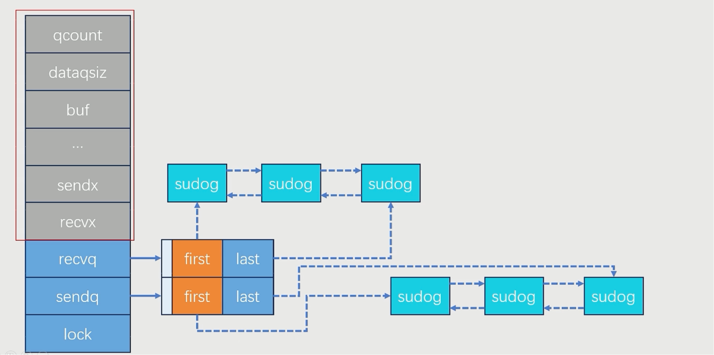
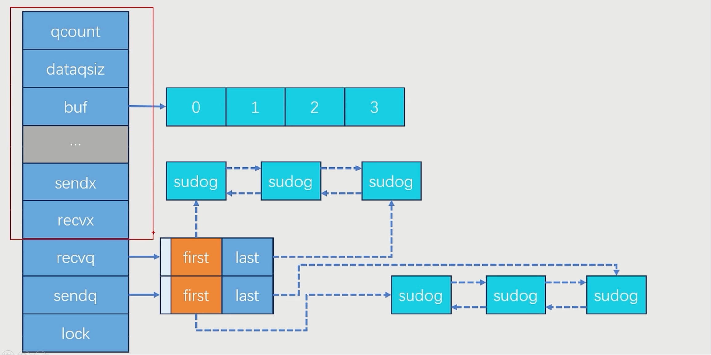

# 面试技术问题补充

## MySQL和Redis的范围查询分别如何实现，有什么区别？

### MySQL的范围查询

MySQL 作为关系型数据库，天然支持范围查询。常用的SQL语法如下：

```sql
SELECT * FROM table WHERE column BETWEEN value1 AND value2;
SELECT * FROM table WHERE column >= value1 AND column <= value2;
SELECT * FROM table WHERE column > value1 AND column < value2;
```

**特点：**

- 支持多条件复合范围查询。
- 可以利用索引（如BTree索引）加速范围查询。
- 查询结果有排序、分页等功能。
- 适合数据量大、复杂条件的检索。

### Redis的范围查询

- Sorted Set (zset) 范围查询

```shell
ZRANGEBYSCORE key min max [WITHSCORES] [LIMIT offset count]
```

- List 范围查询(按下标)

```shell
LRANGE key start stop
```
**特点：**

- 依赖数据结构（如zset的分数score）。
- 查询效率高（内存操作，适合小范围、实时性高的场景）。
- 不支持复杂多条件的范围查询。
- 结果通常无分页/排序（zset有序，list有序）。
- 适合排行榜、消息队列、缓存等实时性需求高的场景。

**总结：**

| 项目     | MySQL                          | Redis（主要指zset）      |
| -------- | ------------------------------ | ------------------------ |
| 数据结构 | 行、表、字段（关系型）         | 键、值、集合（非关系型） |
| 索引支持 | 支持多种索引（BTree等）        | zset分数为索引           |
| 查询能力 | 复杂多条件，支持排序、分页     | 单条件、按score或排序    |
| 查询效率 | 取决于索引和数据量（磁盘为主） | 高效（内存操作）         |
| 适合场景 | 复杂业务查询、数据分析         | 排行榜、缓存、实时查询   |
| 数据结构 | B+树                           | 跳表                     |

## 如何实现一个RPC框架

### RPC框架是什么？

RPC框架的核心作用是：

- 屏蔽网络通信细节，简化分布式系统开发。
- 提供透明的远程过程调用能力。
- 实现客户端和服务器之间的序列化、传输、反序列化、调用和响应返回等流程。

常见的RPC框架有：`gRPC`、`Dubbo`、`Thrift`、`Hessian`等。

### 如何实现一个RPC框架

通常，一个完整的 RPC 框架包含以下几个核心部分：

- 服务端（Server）

    实际提供服务的业务实现方，监听并处理来自客户端的远程调用请求

- 服务桩（Server Stub）

    服务端的代理对象，负责将具体的业务服务包装成可以通过网络传输的数据格式（如序列化），并反序列化客户端传来的调用参数。
    
- 客户端（Client）

    发起远程服务调用请求的应用方。

- 客户桩（Client Stub/Proxy）

    客户端的代理对象，封装了网络通信细节，负责将本地方法调用转化为网络请求，再把远程返回值转换为本地对象返回。

- 通信模块（Transport Layer）

    具体负责网络间数据传输，如基于TCP/HTTP等的请求发送与响应接收。

- 序列化/反序列化（Serialization/Deserialization）

    负责将方法调用的参数、返回值等对象转化为可在网络上传输的二进制或文本格式，以及反向过程。

- 注册中心（可选，Registry）

    用于服务注册与发现，客户端可以动态获取服务端的可用地址。

- 协议层（Protocol Layer）

    规定数据包的格式、编码方式、请求响应的组织结构等。

图示结构：

```
Client --- Client Stub --- [网络通信] --- Server Stub --- Server
```

## Java与GO语言在各方面有什么差别？选型时如何考虑选择Java还是GO?

| 方面     | Java                           | Go (Golang)                                |
| :------- | :----------------------------- | ------------------------------------------ |
| 运行环境 | JVM（跨平台）                  | 编译为本地机器码（跨平台，依赖二进制）     |
| 语法风格 | 面向对象，语法较繁琐           | 简洁、易读，面向过程为主，支持简单面向对象 |
| 并发支持 | 多线程，依赖JVM线程模型        | 原生goroutine（轻量级线程），channel通信   |
| 执行效率 | 启动慢，JIT优化后运行效率高    | 编译后启动快，运行效率高，延迟低           |
| 内存管理 | 自动GC（垃圾回收），成熟但复杂 | 自动GC，延迟更低，GC简单                   |
| 泛型支持 | JDK1.5后支持泛型               | 1.18版本后支持泛型，之前无泛型             |
| 依赖管理 | Maven、Gradle等生态成熟        | Go Modules，简单直接                       |
| 构建部署 | 需JRE/JDK环境，部署包大        | 生成单一二进制文件，部署方便               |
| 库和生态 | 丰富、成熟、文档多、社区活跃   | 现代、增长快，云原生、微服务库多           |
| 错误处理 | 异常机制（try-catch）          | error值返回，显式处理，减少隐藏错误        |
| 跨平台   | 写一次到处运行，依赖JVM        | 编译为各平台二进制，跨平台简单             |
| 适合新人 | 学习曲线相对陡峭，体系庞大     | 语法简单，容易上手                         |

- Java 优势场景：

  - 企业级应用、大型后台系统（如金融、电商、ERP等）
  - 高并发、高可靠性要求的系统
  - 需要丰富生态和框架支持（如Spring、Hibernate等）
  - 跨平台且对JVM有依赖的项目

- Go 优势场景：

  - 云原生、微服务、容器化应用（Kubernetes、Docker等多用Go编写）
  - 网络服务、高性能API网关、分布式系统
  - 需要高并发、低延迟的后台服务
  - 需要简单部署和运维的场合
  - 命令行工具、轻量级应用
## 设计一个自己的配置中心

1. 服务端推模式

    - 客户端与配置中心建立长连接（如 WebSocket/SSE），服务端配置变更时主动推送。

    - 优点：实时性高，配置变更可秒级同步到所有客户端。

    - 缺点：连接数多时服务端压力大，对连接管理要求高；客户端网络不稳定时易断开。

2. 客户端长轮询+事件驱动拉模式

    - 客户端周期性向配置中心发起请求，询问是否有新配置（可通过版本号、etag等）。有变更时拉取，否则等待一段时间重试（长轮询可用 Comet/polling/HTTP2）。

    - 优点：实现简单，服务端压力小。

    - 缺点：变更的实时性受轮询间隔影响，延迟可能较大。

3. 推拉结合模式

    - 根据订阅者数量和性质区分使用推拉模式
    - 优点：兼顾实时性和可用性，提升系统健壮性。
    - 缺点：设计复杂

## 使用双buffer设计一个无锁的高效并发系统

### 基本原理

- 维护两个缓冲区（BufferA, BufferB）。

- 写线程只写其中一个buffer（如 BufferA），读线程只读另一个buffer（BufferB）。

- 当写满或到达条件时，交换两个buffer的角色（交换指针或引用，原子性操作），实现数据无锁切换。

- 交换后，写线程继续写新buffer，读线程处理旧buffer的数据。

- 数据交换可以用CAS原子操作、volatile变量或内存屏障保证可见性。

### 要点

- 为什么高效？

    读写完全隔离，无需加锁，避免了锁竞争和上下文切换。

    只在切换时做原子操作，切换代价极小。

- 如何实现？

    两个指针/引用分别指向当前读buffer和写buffer。
    
    切换时用CAS交换指针，保证只有一个线程能完成切换。
    
    切换后，通知读线程可以处理新数据。

- 适用场景

    实时日志收集/刷盘
    
    高吞吐量监控数据采集
    
    单生产者多消费者模型

- 注意事项

    可以引入“定时交换”机制：即使写buffer没满，到达某个时间阈值也强制交换，以兼顾时延和吞吐。

## Golang Channel 底层实现

### 应用场景

- 输出数据给其它使用方(携程间通讯)

- 组合多个逻辑(channel + select 实现组合逻辑),例如:
  
    ```go

    func timeoutExample() {
        // 1. 创建一个字符串类型的channel
        dataCh := make(chan string)
        
        // 2. 启动goroutine执行耗时操作
        go func() {
            time.Sleep(2 * time.Second) // 模拟2秒的耗时操作
            dataCh <- "数据处理完成"      // 操作完成后向channel发送数据
        }()
        
        // 3. 使用select实现超时控制
        select {
        case data := <-dataCh:                    // 情况1：从dataCh接收到数据
            fmt.Println("收到数据:", data)
        case <-time.After(1 * time.Second):      // 情况2：1秒后超时
            fmt.Println("操作超时!")
        }
    }

    ```

### 数据结构

``` go

// hchan channel的实现
type hchan struct{
    qcount uint             // 队列中的数据总数
    dataqsiz uint           // 环形队列的size
    buf unsafe.Pointer      // 指向 dataqsiz场地的数据 (环形队列)
    elemsize uint16         // 元素大小
    closed uint32           // 关闭
    elemtype *_type         // 元素类型
    sendx uint              // 已发送的元素在环形队列中的位置
    recvx uint              // 已接收的元素在环形队列中的位置
    recvq waitq             // 接受者的等待队列
    sendq waitq             // 发送者的等待队列
    lock mutex              // 锁
}

// recvq 和 sendq是等待队列， waitq 是一个双向链表
type waitq struct{
    first *sudog
    last *sudog
}

type sudog struct{
    g *g                    // 指向一个 goroutine 的指针
    next *sudog             // 指向下一个 sudog 的指针，用于构建双向链表
    prev *sudog             // 指向上一个 sudog 的指针，用于构建双向链表
    elem unsafe.Pointer     // 指向数据元素 (可能指向栈)
    acuiretime int64        // 获取时间
    releasetime int64       // 释放时间
    ticket uint32           // 用于在某些同步操作中实现公平性和有序性
    isSelect bool           // 表示相关的 goroutine 是否正在参与一个select语句
    success bool            // 表示通过通道的通信是否成功
    parent *sudog           // 指向一个父 sudog 的指针，用于构建二叉树
    waitlink *sudog         // 用于连接等待同一个通道的sudog
    waittail *sudog         // 指向二叉树中最后一个sudog
    c *hchan                // 通道的指针
}

```

- `buf` 指针指向一个连续空间的顺序表，它在逻辑上是一个ring buffer

- `sudog` 定义了一个双向链表， `elem` 字段存储了 Goroutine发送/接收的数据

### Channel 是如何保证线程安全的

`hchan` 中的 `lock` 字段保证了 `Channel` 的线程安全性，在

- `Channel Send`
- `Channel Receive`
- `Channel Close`

时都需要先加锁，处理后再释放锁。

### 有缓冲区和无缓冲区的区别

- 无缓冲区的 `Channel`

    因为没有缓冲区，所以所有与环形队列相关的字段都不需要用。

    

    有同步发送/阻塞发送，同步接收/阻塞接收，主要是看先发送还是先接收

- 有缓冲区的 `Channel`

    与环形队列相关的字段被用上了

    

    - 发送时，有接收者在等待，那么就直接讲消息发给接收者，否则发给缓冲区

    - 接收时，如果有发送者在等待，那么直接接收其消息，否则从缓冲区中接收消息

### `Channel` 的 `Close()` 如何实现广播

1. 加锁
2. 改变状态，将 `closed` 置为1
3. 遍历接收者队列，元素赋空并 `push` 到 `list` 中
4. 遍历所有发送者，元素赋空
5. 释放锁

## go语言的协程与java的线程相比，为什么更加轻量级？

- `Goroutine` 创建和销毁开销更小

    - `Goroutine`：创建一个 `Goroutine` 只需几KB的栈空间，随着运行可以动态扩展。底层是由Go运行时调度管理的，不直接映射到操作系统线程。
    
    - Java线程：创建一个线程通常需要**分配较大的栈空间**（默认一般在1MB左右），并且每个线程都映射到操作系统线程，创建/销毁成本高。

- 调度机制不同

    - `Goroutine`：由Go运行时（runtime）调度，称为M:N模型（多个 `Goroutine` 映射到少量的操作系统线程），不需要操作系统参与上下文切换，切换速度快。
    
    - Java线程：每个线程都由操作系统调度，线程切换涉及内核态和用户态切换，成本高。

- 内存占用

    - `Goroutine`：初始栈很小（通常2KB），并且可以按需自动扩展。
    
    - Java线程：初始栈较大，且固定分配，导致内存浪费。
  
## go语言中，我如果在一个 `go func(){}()` 的协程中出现了 `panic` ，那么主协程可以捕获这个 `panic` 吗？

如果你在一个匿名函数 `go func(){}()` 启动的协程（goroutine）中发生了 panic，主协程是**无法直接捕获这个 `panic` **的。

具体原因如下：

- 每个 `goroutine` 都有自己独立的执行栈。

- 如果某个 `goroutine` 发生了 panic，并且这个 `panic` 没有在该 `goroutine` 内部被 `recover()` 捕获，那么这个 `goroutine` 会终止，但不会影响其它 `goroutine`（包括主协程）。

- 主协程无法通过 `defer recover()` 捕获其它 `goroutine` 的 `panic`（只能捕获本 `goroutine` 的 `panic`）。

例如：

```go

package main

import (
    "fmt"
    "time"
)

func main() {
    go func() {
        panic("goroutine panic")
    }()
    time.Sleep(time.Second)
    fmt.Println("main done")
}

```

运行结果为:

```code

panic: goroutine panic
main done

```

`panic` 信息只会打印到控制台，并不会被主协程捕获。

如果想要捕获 `goroutine` 的 `panic`，需要在 `goroutine` 内部用 `defer recover()`：

```go

go func() {
    defer func() {
        if r := recover(); r != nil {
            fmt.Println("Recovered in goroutine:", r)
        }
    }()
    panic("goroutine panic")
}()

```

在 `defer` 语句中使用 `recover()` 方法可以捕获 `panic` ，避免其向上传递。